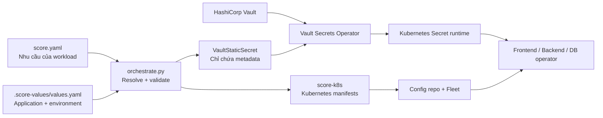

# Kế hoạch triển khai Environment Values, Vault Secret và App Onboarding

Ngày chốt kế hoạch: 2026-08-10
Phạm vi: `idp-platform`, workflow GitHub, Fleet, Score, Vault, Vault Secrets Operator và golden path tạo ứng dụng mới.

---

## 0. Chỉ thị thực thi dành cho AI

Phần này biến tài liệu thành master execution plan. Một AI coding agent được giao file này phải tự đọc toàn bộ file, kiểm tra repository và thực hiện tuần tự đến khi hoàn thành mọi việc có thể kiểm chứng trên harness local. Không yêu cầu người dùng nhắc lại từng phase.

### 0.1. Context bắt buộc phải giữ

- Đây là nâng cấp brownfield cho một platform đang chạy, không phải dự án viết lại.
- Code hiện tại đã deploy thành công ứng dụng lên staging trong công ty.
- Người dùng phát triển bên ngoài công ty bằng harness WSL2 đã có Kubernetes, Harbor, Fleet và GitHub; Vault/VSO local có thể chưa được dựng.
- Trong công ty đã có Kubernetes, Rancher/Fleet và Vault. Việc mang code vào công ty phải chỉ cần checkout cùng commit, sửa cấu hình môi trường, cung cấp credential bên ngoài Git và cài prerequisite còn thiếu; không sửa Python, provisioner, workflow hoặc stack template.
- AI chỉ được cài đặt/thay đổi hạ tầng trong harness local khi được chạy ở môi trường ngoài công ty. Không tự truy cập hoặc thay đổi hạ tầng công ty.
- Các file audit hoặc thay đổi chưa commit không liên quan thuộc về người dùng; phải giữ nguyên.

### 0.2. Mục tiêu portability không được thỏa hiệp

Acceptance criterion cao nhất:

> Cùng một commit platform phải được thiết kế để chạy trên WSL2 và trong công ty. AI chỉ xác minh commit đó trên harness WSL2; việc chạy thật trong công ty do người dùng thực hiện sau. Khác biệt môi trường chỉ được nằm trong `platform.env*.yaml`, credential ngoài Git và prerequisite đã được tài liệu hóa.

Không được hardcode hoặc branch code theo `local/company` cho:

- Registry/Harbor host và project.
- GitHub/GHES host, organization và runner label.
- Kubernetes API, namespace, StorageClass và cluster domain.
- Fleet namespace, branch và GitRepo configuration.
- Gateway name, namespace và public domain.
- Vault address, namespace, KV mount, auth mount, role hoặc auth reference.
- Database provider, storage, resource, HA hoặc backup profile.

### 0.3. Cách AI phải làm việc

Khi bắt đầu hoặc tiếp tục task:

1. Đọc toàn bộ file này.
2. Đọc `git status`; không ghi đè thay đổi không thuộc task.
3. Thực hiện Git workflow ở mục 0.3.1 trước khi sửa code.
4. Inventory read-only repository và harness trước khi thay đổi.
5. Chạy test/baseline hiện có và ghi lại kết quả.
6. Thực hiện từng phase theo thứ tự ở mục 14.
7. Sau mỗi phase: chạy gate của phase, regression test app legacy và smoke test liên quan.
8. Cập nhật bảng trạng thái ở mục 0.5 và ghi ngắn gọn test/evidence.
9. Commit riêng phase đã pass theo quy tắc ở mục 0.3.2, rồi tự chuyển sang phase kế tiếp.
10. Khi context bị rút gọn hoặc task được tiếp tục ở phiên khác, mở lại file này, bảng trạng thái, branch hiện tại và `git diff` trước khi làm tiếp.
11. Không push, tạo PR hoặc merge vào `main` cho đến khi đạt điều kiện ở mục 0.3.3 và được người dùng yêu cầu riêng. Không truy cập hoặc thay đổi môi trường công ty trong task này.

AI có thể dùng tác vụ/agent song song cho phần độc lập như Vault harness, stack fixtures hoặc review. Một agent chính phải sở hữu `orchestrate.py` và workflow chính để tránh hai implementation xung đột.

#### 0.3.1. Tự tạo và bảo vệ development branch

Branch mặc định của toàn bộ chương trình thay đổi này:

```text
feature/secret-onboarding
```

AI phải thực hiện:

1. Ghi lại branch và commit ban đầu:

   ```bash
   git branch --show-current
   git rev-parse HEAD
   git status --short
   ```

2. Xem commit `HEAD` lúc bắt đầu là baseline đang chạy tốt, trừ khi repository có record rõ ràng chỉ tới một deployed commit khác. Không tự `git pull`, rebase hoặc đổi baseline sang `origin/main`, vì việc đó có thể đưa code chưa được kiểm chứng vào phạm vi thay đổi.

3. Nếu đang ở `feature/secret-onboarding`, tiếp tục trên branch đó.

4. Nếu branch chưa tồn tại, tạo từ đúng `HEAD` hiện tại:

   ```bash
   git switch -c feature/secret-onboarding
   ```

5. Nếu branch đã tồn tại nhưng chưa checkout:

   - Chỉ switch khi các thay đổi hiện tại có thể được giữ an toàn.
   - Không stash, reset, clean hoặc checkout bỏ thay đổi của người dùng.
   - Nếu tracked changes chồng với branch và không thể switch an toàn, áp dụng stop condition thay vì cưỡng ép.

6. Sau khi switch, xác nhận:

   ```bash
   test "$(git branch --show-current)" = "feature/secret-onboarding"
   ```

7. Ghi baseline SHA vào cột Evidence của Phase 0. Không tạo hoặc di chuyển tag nếu người dùng chưa yêu cầu.

Các điều cấm:

- Không sửa code trực tiếp trên `main`/`master`.
- Không dùng `git reset --hard`, `git clean`, `git checkout --` hoặc lệnh xóa thay đổi.
- Không tự merge/rebase `main` vào development branch trong khi đang triển khai.
- Không đổi branch name giữa các phase.
- Không tạo một branch cho mỗi phase nếu chỉ có một agent chính làm tuần tự.

Nếu dùng agent song song, agent phụ phải dùng worktree/branch con riêng và không cùng sửa `orchestrate.py` hoặc workflow chính. Agent chính chịu trách nhiệm review/cherry-pick thay đổi về `feature/secret-onboarding`.

#### 0.3.2. Commit discipline trên development branch

AI được phép tự commit trên `feature/secret-onboarding` sau khi phase tương ứng pass gate.

Quy tắc:

- Một phase có thể có một hoặc vài commit nhỏ, nhưng không trộn phase chưa pass vào commit của phase đã pass.
- Chỉ stage đường dẫn cụ thể do AI tạo/sửa; không dùng `git add .` hoặc `git add -A`.
- Không stage hai file audit chưa được track hoặc bất kỳ file người dùng nào không thuộc phase.
- Trước commit phải chạy `git diff --check`, test của phase và regression test legacy.
- Nếu test fail, không tạo commit đánh dấu phase hoàn thành.
- Không amend/rewrite commit thuộc về người dùng.
- Không đưa secret, kubeconfig, Vault token, unseal key, `.env`, `.score-compose/state.yaml` hoặc manifest chứa secret value vào commit.

Commit message đề xuất:

```text
test: capture legacy platform baseline
feat: add application values and promotion guard
feat: integrate vault secrets operator resources
feat: add postgres application profiles
feat: add node fullstack golden path
feat: add idempotent onboarding workflow
docs: add company deployment handoff runbook
```

Sau mỗi commit, bảng trạng thái phải ghi short SHA và các test đã pass.

#### 0.3.3. Điều kiện chuẩn bị merge vào `main`

AI không tự merge. Khi tất cả phần có thể kiểm chứng local đã hoàn thành, AI phải chuẩn bị một merge-readiness report gồm:

```bash
git log --oneline <baseline-sha>..feature/secret-onboarding
git diff --stat <baseline-sha>...feature/secret-onboarding
git status --short
```

Điều kiện để đề xuất merge/PR:

- Tất cả phase local ở mục 0.5 là `Done`.
- Full unit/integration/smoke suite pass.
- Legacy regression pass khi feature flags tắt.
- Không có secret hoặc local credential trong Git diff/history.
- Có migration, configuration và rollback checklist.
- Có checklist bàn giao để người dùng tự chạy thử trong công ty theo mục 0.7.
- Development branch không chứa file audit/thay đổi không thuộc chương trình này.

Sau đó AI dừng ở trạng thái `Ready for review` và cung cấp một trong hai phương án, tùy workflow repository:

1. Push branch và mở PR vào `main` nếu người dùng yêu cầu và remote cho phép.
2. Đưa lệnh review/merge thủ công nếu không được phép push.

Không merge vào `main` trước khi người dùng review và yêu cầu rõ ràng. Nếu `main` đã thay đổi trong thời gian phát triển, fetch/merge/rebase và xử lý conflict là một task riêng; không tự làm trong bước hoàn tất này.

#### 0.3.4. Verification phải thực sự dùng code trên feature branch

Repository hiện có hai hành vi cố ý dùng default branch:

- GitHub chạy workflow `repository_dispatch` của platform từ default branch `main`.
- App CI templates checkout platform code bằng `ref: main` để image planning và renderer không lệch phiên bản.

Vì vậy một deploy-request thành công không chứng minh code mới trên `feature/secret-onboarding` đã được chạy. Trong thời gian phát triển, AI phải verify bằng source đang checkout trên harness WSL2:

```text
git branch --show-current phải là feature/secret-onboarding
→ gọi trực tiếp orchestrate.py từ working tree hiện tại
→ render bằng config local
→ apply/để Fleet reconcile vào namespace fixture local
→ chạy verify và smoke tests local
```

Trước mỗi integration/E2E run, log ít nhất:

```bash
git branch --show-current
git rev-parse HEAD
```

Evidence phải ghi branch và SHA đã được test. Không được dùng kết quả của một workflow chạy `main` làm evidence cho feature branch.

Nếu dùng GitHub Actions để test, chỉ dùng `workflow_dispatch` và chọn rõ ref `feature/secret-onboarding`; job đầu tiên phải in/xác nhận `github.ref` và commit SHA. `repository_dispatch` vẫn được giữ nguyên để bảo vệ luồng đang chạy trên `main`.

Không sửa tạm app templates từ `ref: main` sang feature branch rồi commit thay đổi đó. Nếu thật sự cần một workflow test branch, tạo test harness/workflow opt-in tách biệt và không ảnh hưởng app hiện tại.

GitHub repository/organization Secrets không cần và không được copy giữa các branch. Secret chỉ có thể không được inject vì scope repository, GitHub Environment protection, fork PR hoặc reusable-workflow forwarding; đó là cấu hình GitHub, không phải dữ liệu thuộc branch.

Phase 0 phải kiểm tra `.gitignore` và bổ sung tối thiểu các local artifact có thể chứa credential nếu chưa có:

```text
.env
.env.*
!.env.example
.score-compose/
.score-k8s/
kubeconfig-*
```

Vault root token, unseal key, bootstrap output và Helm-generated credential phải được lưu ngoài repository hoặc trong đường dẫn local đã ignore. Test chỉ được kiểm tra tên secret/config key và quyền truy cập; không in giá trị vào log/evidence.

### 0.4. Compatibility và rollout rules

- Mọi tính năng mới phải opt-in và/hoặc nằm sau feature flag.
- Mặc định ban đầu:

  ```yaml
  features:
    application_values: false
    vault_secrets: false
    postgres_application: false
    stack_onboarding: false
  ```

- App không có `.score-values/values.yaml` phải giữ hành vi cũ.
- `type: secret` và `type: postgres` cũ không được âm thầm đổi semantics.
- Provider PostgreSQL mới dùng class riêng, ví dụ `postgres.application`; implementation cũ chỉ phục vụ compatibility/development và bị chặn ở prod khi dùng class development.
- Trước thay đổi lớn phải có fixture từ một app legacy đã chạy thành công; regression test phải chứng minh render/output quan trọng không đổi khi feature flags tắt.
- Không xóa resource hoặc state để làm test pass. Lifecycle/destructive test chỉ chạy trên target local được tạo riêng và đã xác nhận.

### 0.5. Trạng thái thực thi

Harness WSL2 là môi trường verification duy nhất của AI trong kế hoạch này. Một phase chỉ được đánh dấu `Done` khi test/gate tương ứng đã thực sự chạy và pass trên máy người dùng. Không được suy luận rằng code đúng mà bỏ qua lệnh test, deploy hoặc smoke test có thể chạy được.

AI phải cập nhật bảng này trong quá trình làm. `Blocked` chỉ dùng khi gặp stop condition local ở mục 0.6; thiếu việc hoặc test chưa chạy vẫn là `In progress`.

| Phase | Trạng thái | Evidence/ghi chú |
|---|---|---|
| 0 — ADR, baseline, portability và toolchain | Done | Xem "Nhật ký Phase 0" bên dưới |
| 1 — Environment Values, ConfigMap và promotion guard | Done | Xem "Nhật ký Phase 1" bên dưới |
| 2 — Vault/VSO foundation trên harness | Done | Xem "Nhật ký Phase 2" bên dưới |
| 3 — App secret integration | Not started | |
| 4 — PostgreSQL capability/profile | Not started | |
| 5 — Stack catalog và `score-compose` | Not started | |
| 6 — Onboarding workflow/state machine | Not started | |
| 7 — Pilot, migration và hardening local | Not started | |

Giá trị trạng thái hợp lệ: `Not started`, `In progress`, `Done`, `Blocked`.

#### Nhật ký Phase 0

Branch `feature/secret-onboarding`, baseline SHA `36372b9`.

Harness đã xác minh: WSL2, Python 3.14.4 + pyyaml 6.0.3, pytest 9.0.2, score-k8s 0.15.0,
score-compose 0.43.0, kubectl v1.36.1, cụm kind `kind-staging` (k8s v1.36.1) đang chạy
Fleet và các app legacy (`sample-nginx-staging`, `sample-pg-staging`, `boutique-staging`…).

Test đã chạy thật trên working tree của feature branch:

| Lệnh | Kết quả |
|---|---|
| `python3 -m pytest test_orchestrate.py -q` (baseline, trước thay đổi) | 80 passed |
| `python3 -m pytest test_orchestrate.py -q` (sau Phase 0) | **117 passed** |
| `orchestrate.py --env-config platform.env.yaml preflight` | OK, khớp phiên bản đã ghim |
| `preflight --require-score-compose` | OK, score-compose 0.43.0 khớp |
| `preflight` với pin sai (9.9.9) | Fail đúng như thiết kế, exit 1 |

Ba gate của Phase 0:

1. **Binary sai version fail trước render** — `test_render_refuses_a_mismatched_binary_before_touching_the_catalog` khẳng định `manifests.yaml` không được tạo ra.
2. **Hai render cùng input/state deterministic** — `test_two_renders_of_one_input_are_byte_identical` so sánh nguyên file output, không chỉ tên tài nguyên.
3. **Placeholder trong `resources.*.params`** — `test_placeholders_resolve_inside_resource_params` xác nhận score-k8s 0.15.0 thật sự nội suy `${resources.hostname.host}` vào `params.host` của route. Golden path same-origin phụ thuộc vào điều này.

File đã thay đổi: `.gitignore`, `platform.env.yaml`, `platform.env.company.yaml`,
`orchestrate.py`, `test_orchestrate.py`, `docs/adr/*` (7 file mới).

Config key mới: `ci.score_k8s_version`, `ci.score_compose_version`, `vault.*`,
`database_profiles.*`, `features.*` (bốn cờ, tất cả `false`).

Migration: không có. Mọi key mới đều có mặc định giữ nguyên hành vi cũ; chuỗi rỗng ở
`ci.*_version` tắt kiểm tra phiên bản.
Rollback: xoá khối `ci.score_*_version` (hoặc đặt rỗng) là quay lại hành vi trước.

Hạn chế còn lại: `vault.operator_version: 1.5.0` mới chỉ là ghim trên giấy — chưa cài VSO
lên harness, sẽ xác minh ở Phase 2. `database_profiles` chưa có provisioner tiêu thụ nó
(Phase 4).

Người dùng phải xác nhận lại khi mang vào công ty: phiên bản score-k8s/score-compose trên
runner `platform-orchestrator`; tên KV mount và kv v1/v2 của Vault công ty; phiên bản VSO
được duyệt; profile prod (instances/storage/retention) do DBA chốt.

#### Nhật ký Phase 1

Branch `feature/secret-onboarding`, verify từ working tree tại SHA `3713b36` (Phase 0).

Unit + integration: `python3 -m pytest test_orchestrate.py -q` → **180 passed**
(117 → 180, thêm 63 test). Không có test nào bị skip.

**Deploy và smoke test thật trên cụm `kind-staging`**, render bằng
`python3 orchestrate.py` gọi trực tiếp từ working tree của feature branch — không dùng
`repository_dispatch`, không dùng workflow chạy `main`. Namespace fixture riêng
`valuesdemo-staging` / `valuesdemo-prod`, đã xoá sau khi đo xong:

| Kiểm chứng | Kết quả đo được trong pod đang chạy |
|---|---|
| staging từ `score.yaml` chung | `LOG_LEVEL=debug FEATURE_X=true GREETING=shared` |
| prod từ **cùng** `score.yaml` | `LOG_LEVEL=info FEATURE_X=false GREETING=prod-only` |
| file cấu hình literal | mount từ ConfigMap `valuesdemo-app-file-…`, nội dung `level=debug feature=true`, phục vụ được qua HTTP |
| không rò bí mật | `kubectl get secrets` trong namespace: rỗng |
| rollout | staging 1/1, prod 3/3 (đúng `replicas` theo môi trường) |

Promotion guard đo qua CLI thật:

| Tình huống | Kết quả |
|---|---|
| `tag-only`, values không đổi | cho qua, retag 1 ảnh |
| `tag-only`, sửa khối `prod` | **chặn**, exit 1, in digest cũ/mới và bảo dùng `re-render` |
| `tag-only`, chỉ sửa khối `staging` | cho qua — guard không kêu oan |

**Regression app legacy** (bằng chứng mạnh nhất của lời hứa brownfield): render
`examples/simple-nginx` và `examples/app-with-postgres` ở cả `staging` và `prod`, một lần
bằng worktree tại baseline `36372b9`, một lần bằng HEAD, dùng chung state file. Cả 4 cặp
**giống nhau từng byte**.

File đã thay đổi: `orchestrate.py`, `test_orchestrate.py`,
`HUONG-DAN-CAU-HINH-UNG-DUNG.md` (mới).

Config key mới: không có ngoài Phase 0. Tính năng bật bằng
`features.application_values: true`.

Migration: app hiện có không cần làm gì. Opt-in bằng cách thêm
`.score-values/values.yaml` và một resource `type: environment`.
Rollback: đặt `features.application_values: false`. App đã opt-in sẽ fail rõ ràng
("features.application_values is off") chứ không deploy thiếu biến — có chủ ý.

Hạn chế còn lại: `secretRef` mới được validate đầy đủ (schema, tính nhất quán loại, quy
tắc file) nhưng chưa sinh output — render fail rõ ràng với "features.vault_secrets is off".
Phase 3 nối phần này vào VSO. Scanner defense-in-depth theo entropy ở mục 6 chưa làm; hiện
mới có allowlist theo vị trí và kiểm tra typed.

Người dùng phải xác nhận lại khi mang vào công ty: không có gì thêm — Phase 1 không chạm
tới giá trị hạ tầng nào.

#### Nhật ký Phase 2

Branch `feature/secret-onboarding`, verify từ working tree tại SHA `a3a81cb` (sau Phase 1).

Unit + integration: `python3 -m pytest test_orchestrate.py -q` → **220 passed**
(180 → 220, thêm 40 test). Không có test nào bị skip.

**Hạ tầng đã dựng thật trên cụm `kind-staging`** (probe trước khi làm xác nhận cả
`kind-staging` lẫn `kind-prod` đều CHƯA có gì: không CRD `secrets.hashicorp.com`, không
namespace Vault):

| Thành phần | Phiên bản | Ghi chú |
|---|---|---|
| Vault (dev mode) | chart 0.34.0, Vault 2.0.3 | ns `vault`, KV v2 ở `kv`, kubernetes auth, audit device bật |
| Vault Secrets Operator | 1.5.0 — đúng bản đã ghim | ns `vault-secrets-operator-system` |
| VaultConnection + VaultAuthGlobal | sinh từ `platform.env.yaml` | `orchestrate.py vault-foundation --apply` |

Dựng lại được bằng một lệnh: `./tools/dung-vault-harness.sh --context kind-staging`
(idempotent, mọi toạ độ đọc từ config, tự kiểm bằng `preflight` ở bước cuối).

**Ba gate của Phase 2, đo trên cụm sống** (app fixture `vaultdemo`, namespace
`vaultdemo-staging`, đã xoá sau khi đo):

| Gate | Cách đo | Kết quả |
|---|---|---|
| VSO đọc đúng tiền tố app/env | `VaultStaticSecret` → `apps/vaultdemo/staging/demo` | `Synced`, Secret đích `vaultdemo-demo` xuất hiện, owner là VaultStaticSecret |
| …và **bị từ chối** ở tiền tố app khác | cùng `VaultAuth`, path `apps/otherapp/staging/demo` | **HTTP 403 permission denied**, không có Secret nào được tạo |
| CI/verify không đọc được Kubernetes Secret | kubeconfig của SA do `verify-rbac` sinh | `can-i get/list secrets` → **no**; `get secret vaultdemo-demo` → **Forbidden** |
| …nhưng verify được auth/status | cùng kubeconfig | `VaultAuth.Ready=True`, `VaultStaticSecret` reason `Synced` đọc được |
| verify không nhìn sang namespace khác | `get pods -n sample-nginx-staging` | **Forbidden** (Role, không phải ClusterRole) |
| CI không cầm Vault token | `vault-onboard` in runbook | output không chứa `VAULT_TOKEN`; công cụ không đọc biến này |
| Giá trị bí mật không lọt vào output platform | grep giá trị thật trong mọi manifest sinh ra | **0 lần xuất hiện**; giá trị chỉ nằm trong Secret runtime do VSO sở hữu |

`preflight --require-cluster --require-vault` chạy trên cụm thật: fail đúng chỗ khi thiếu
`VaultConnection`, pass sau khi apply foundation, và phát hiện lệch phiên bản VSO.

**Regression app legacy**: render `examples/simple-nginx` và `examples/app-with-postgres` ở
cả `staging` và `prod`, một lần bằng worktree tại baseline `36372b9`, một lần bằng HEAD,
dùng chung state file. Cả 4 cặp **giống nhau từng byte**.

**Một lỗi thật bắt được nhờ chạy trên cụm, không phải nhờ đọc tài liệu**: `vaultConnectionRef`
không kèm namespace bị VSO 1.5.0 phân giải theo namespace của resource ĐANG THAM CHIẾU
(namespace app), nên mọi `VaultAuth` fail với `VaultConnection "default" not found` — chỉ
hiện trong log controller, `kubectl apply` vẫn xanh. Platform nay luôn sinh dạng đầy đủ
`<operator-ns>/<connection-name>`, có test ghim lại.

File đã thay đổi: `orchestrate.py`, `test_orchestrate.py`, `platform.env.yaml`,
`platform.env.company.yaml`, `tools/dung-vault-harness.sh` (mới),
`docs/adr/0007-topo-vso-va-danh-tinh-verify.md` (mới), `docs/adr/README.md`,
`HUONG-DAN-KIEM-THU.md`.

Config key mới (đều dưới `vault.`): `address`, `namespace`, `skip_tls_verify`,
`ca_cert_secret`, `tls_server_name`, `auth_mount`, `auth_audience`, `auth_role_template`,
`policy_template`, `service_account_template`, `token_ttl`, `operator_namespace`,
`connection_name`, `auth_global_name`, `allowed_namespaces`.
Lệnh mới: `vault-foundation`, `vault-onboard`, `verify-rbac`, và cờ `preflight --require-vault`.

Migration: không có. Không lệnh nào trong luồng deploy hiện tại gọi code mới; `features.
vault_secrets` vẫn `false`.
Rollback: các object nền tảng xoá được độc lập (`kubectl delete vaultauthglobal/vaultconnection`),
app đang chạy không phụ thuộc chúng chừng nào chưa bật `features.vault_secrets`.

Hạn chế còn lại: `VaultStaticSecret` trong gate là viết tay — **Phase 3** mới sinh nó từ
`secretRef`, kèm `rolloutRestartTargets`, HMAC rotation và `verify` đọc condition của VSO.
Vault trên harness là **dev mode** (in-memory, unseal sẵn, HTTP): mất dữ liệu khi pod
restart, và `skip_tls_verify: true` chỉ đúng cho harness. TLS/HA/backup/unseal là
prerequisite hạ tầng theo mục 7.5, không phải việc của platform. `kind-prod` chưa cài VSO —
chưa cần, vì fixture prod của Phase 1 cũng chạy trên `kind-staging`.

Người dùng phải xác nhận lại khi mang vào công ty: `vault.address` (bắt buộc, không có mặc
định) và `skip_tls_verify: false` + `ca_cert_secret`; tên KV mount và v1/v2; tên
`auth_mount` kubernetes của ĐÚNG cụm đó và `auth_audience` khớp role; quy ước đặt tên
role/policy của Vault Ops (`auth_role_template`, `policy_template`); ai được cấp policy
GHI cho `prod`; namespace của VSO nếu công ty cài chỗ khác; `allowed_namespaces` nếu nhiều
đội dùng chung cụm.

### 0.6. Stop conditions

AI chỉ dừng và hỏi người dùng khi gặp một trong các trường hợp:

- Cần credential/quyền mới để tiếp tục trên harness local mà AI không thể tạo hoặc người dùng chưa cho phép.
- Cần thực hiện thao tác destructive trên dữ liệu/resource không phải fixture local.
- Có thay đổi chưa commit của người dùng chồng trực tiếp với file cần sửa và không thể merge an toàn.
- Không thể chọn hoặc cài database provider cho harness local sau khi đã inventory và thử các lựa chọn an toàn trong phạm vi kế hoạch.
- Không thể pin hoặc chạy VSO/Score candidate trên harness local.
- Một gate bắt buộc fail lặp lại và không thể tiếp tục an toàn mà không thay đổi contract đã chốt.

Không phải stop condition:

- Công việc lớn hoặc mất nhiều bước.
- Một phase chưa hoàn thành.
- Có thể tự kiểm tra thông tin trong repository/harness.
- Cần viết thêm test, fixture, script cài local hoặc tài liệu.
- Chưa biết phiên bản/cấu hình thật trong công ty.
- Chưa thể xác minh database provider, Vault policy, Rancher/Fleet hoặc runner của công ty.

Với thông tin chỉ tồn tại trong công ty, AI phải tạo config key, validation/preflight và checklist cần kiểm tra, sau đó tiếp tục hoàn thành toàn bộ implementation và verification local. Không đánh dấu phần công ty là đã pass, nhưng cũng không dùng nó để chặn phase local.

### 0.7. Output sau mỗi phase và khi hoàn thành

Sau mỗi phase, AI phải lưu trong bảng/evidence hoặc báo cáo cuối:

- File đã thay đổi.
- Test và smoke test đã chạy, kèm kết quả.
- Feature flag/config key mới.
- Migration và rollback path.
- Hạn chế còn lại.
- Giả định/cấu hình nào người dùng phải xác nhận lại khi mang code vào công ty.

Khi hoàn thành mọi phần local, AI phải tạo checklist bàn giao để người dùng tự thử trong công ty. AI không chạy các bước này trong task local:

1. Checkout đúng tag/commit đã pass harness.
2. Điền `platform.env.company.yaml`, không sửa source.
3. Chạy preflight/version/RBAC check.
4. Render dry-run app legacy và so với baseline.
5. Deploy platform với feature flags mới vẫn tắt.
6. Xác minh app legacy staging.
7. Bật từng feature cho một app pilot.
8. Có rollback bằng feature flag hoặc platform tag cũ.

---

## 1. Mục tiêu

Kế hoạch này giải quyết đồng thời các vấn đề sau:

1. Ứng dụng tham chiếu Kubernetes Secret chưa tồn tại nên pod kẹt ở `CreateContainerConfigError`.
2. Biến môi trường của ứng dụng không thể khác nhau giữa `staging` và `prod`.
3. Ứng dụng thiếu đường chuẩn để khai báo cấu hình phi bí mật và file cấu hình.
4. Secret của ứng dụng phải được lưu duy nhất trong Vault, không nằm trong Git, manifest hoặc Score state.
5. Developer cần một luồng self-service để tạo ứng dụng từ stack phổ biến.
6. Golden path đầu tiên cần cung cấp frontend, backend và PostgreSQL, chạy được từ local đến production.
7. Staging và production phải dùng cùng capability database; chỉ khác profile tài nguyên, dung lượng, HA và retention.

Kết quả mong muốn:

- Developer chọn stack và cung cấp khoảng 5–8 trường thông tin.
- Platform tạo repository, namespace, Vault auth, database, pipeline và staging deployment.
- Một `score.yaml` dùng được cho cả `staging` và `prod`.
- Secret không đi qua CI và không xuất hiện trong Git.
- Staging chạy được mà không cần Ops tạo Secret thủ công.
- Production được kích hoạt bằng một luồng có approval và dùng đúng image đã được xác minh ở staging.

---

## 2. Các quyết định kiến trúc đã chốt

| Chủ đề | Quyết định |
|---|---|
| Tên môi trường | Dùng `staging` và `prod`; không dùng alias `production` |
| Secret store | Chỉ dùng HashiCorp Vault |
| Đồng bộ Vault → Kubernetes | HashiCorp Vault Secrets Operator (VSO) |
| Secret syntax của app | `secretRef: {name, key}`; không có `store: vault` |
| Cấu hình theo môi trường | `ApplicationValues v1`, precedence `application < environments.<env>` |
| Resource trong Score | Một resource `type: environment` cho mỗi workload; alias tùy ý |
| Cấu hình file | Dùng `containers.*.files`; `score-k8s` sinh ConfigMap cho nội dung thường |
| Secret file | Chỉ chấp nhận toàn bộ nội dung là đúng một secret reference |
| VSO auth | `VaultStaticSecret → VaultAuth theo namespace → VaultAuthGlobal dùng chung` |
| Promotion không render | Chặn bằng digest của values `prod` đã resolve |
| Database | Cùng contract/provider cho staging và prod, khác platform profile |
| Database credential | Platform sinh và ghi trực tiếp vào Vault; CI không nhìn thấy |
| PostgreSQL hiện tại | Không dùng provisioner StatefulSet hiện tại cho golden path production |
| Frontend gọi backend | Cùng origin: frontend `/`, backend `/api` |
| Local development | Sinh `compose.yaml` từ Score bằng `score-compose` |
| Monorepo image tag | `tag_strategy: commit` cho golden path đầu tiên |
| Stack metadata | `.idp/stack.yaml`; không dùng `.platform/` trong app repo |
| Stack version | Độc lập với `platform.lock` |
| Onboarding execution | State machine idempotent; bọc script hiện tại, không viết lại từ đầu |

---

## 3. Kiến trúc đích



Nguyên tắc bảo mật:

- Git chứa literal config và metadata `secretRef`, không chứa secret value.
- CI/orchestrator không có Vault token đọc secret.
- Kubernetes Secret chỉ là bản sao runtime do VSO quản lý.
- Vault policy giới hạn theo application và environment.
- Production credential tách hoàn toàn khỏi staging credential.

---

## 4. Contract `ApplicationValues v1`

### 4.1. Score của workload

Alias resource không bị cố định là `env`:

```yaml
apiVersion: score.dev/v1b1

metadata:
  name: payment-api

resources:
  app-config:
    type: environment

containers:
  app:
    image: .
    variables:
      LOG_LEVEL: "${resources.app-config.LOG_LEVEL}"
      FEATURE_X: "${resources.app-config.FEATURE_X}"
      STRIPE_KEY: "${resources.app-config.STRIPE_KEY}"
```

Quy tắc:

- Một workload được có 0 hoặc 1 resource `type: environment`.
- Có từ 2 resource `environment` trở lên thì fail sớm.
- Renderer phải tìm alias từ resource map, không hardcode `env`.
- App chưa có `.score-values/values.yaml` tiếp tục chạy theo cơ chế cũ.

### 4.2. Values theo môi trường

File duy nhất ở root app repo:

```text
.score-values/values.yaml
```

Ví dụ:

```yaml
apiVersion: idp.company/v1
kind: ApplicationValues

spec:
  application:
    LOG_LEVEL: info
    FEATURE_X: "false"

  environments:
    staging:
      LOG_LEVEL: debug
      FEATURE_X: "true"
      PUBLIC_HOST: payment-api.staging.company.internal
      STRIPE_KEY:
        secretRef:
          name: stripe
          key: api_key

    prod:
      PUBLIC_HOST: payment-api.company.internal
      STRIPE_KEY:
        secretRef:
          name: stripe
          key: api_key
```

Precedence:

```text
spec.application < spec.environments.<target-env>
```

Validation bắt buộc:

- Chỉ chấp nhận `staging` và `prod`.
- Literal phải là string; YAML boolean/number không được tự động ép kiểu.
- Các giá trị như `yes`, `no`, `on`, `off` phải được quote nếu muốn dùng như string.
- Một key phải giữ cùng loại `literal` hoặc `secretRef` ở mọi environment.
- Key được Score tham chiếu nhưng thiếu sau resolve phải fail.
- Field lạ trong `secretRef` phải fail.
- Không cho app khai Vault mount hoặc path trực tiếp.
- Có thể cảnh báo key không được workload nào sử dụng.

### 4.3. Vault path

Platform tự derive:

```text
<kv-mount>/apps/<application>/<environment>/<secret-name>
```

Ví dụ:

```text
kv/apps/payment-api/staging/stripe
kv/apps/payment-api/prod/stripe
```

Schema app chỉ chứa:

```yaml
secretRef:
  name: stripe
  key: api_key
```

`name` phải theo chuẩn DNS-like được platform quy định; không cho `/`, `..` hoặc ký tự có thể thay đổi path.

---

## 5. Cấu hình thường và ConfigMap

Không cần yêu cầu developer tự tạo ConfigMap.

### 5.1. Cấu hình dạng environment variable

Khai trong `ApplicationValues`, tham chiếu qua resource `environment`:

```yaml
containers:
  app:
    variables:
      LOG_LEVEL: "${resources.config.LOG_LEVEL}"
```

Giá trị literal được render thành `env.value` và có thể review trong config repo.

### 5.2. Cấu hình dạng file

Khai trực tiếp bằng Score:

```yaml
containers:
  app:
    files:
      /etc/app/application.yaml:
        content: |-
          logLevel: ${resources.config.LOG_LEVEL}
          featureX: ${resources.config.FEATURE_X}
```

Với nội dung phi bí mật, `score-k8s` sinh ConfigMap và mount vào workload.

Có thể dùng `source` để đọc file từ app repo; renderer phải scan nội dung file sau khi đọc. `binaryContent` và file có `noExpand: true` không thực hiện placeholder substitution.

### 5.3. Secret trong file

Hợp lệ:

```yaml
content: "${resources.config.PRIVATE_KEY}"
```

Hoặc:

```yaml
content: |-
  ${resources.config.PRIVATE_KEY}
```

Không hợp lệ vì `|` thêm newline cuối:

```yaml
content: |
  ${resources.config.PRIVATE_KEY}
```

Không hợp lệ vì trộn secret và literal:

```yaml
content: |-
  username=admin
  password=${resources.config.PASSWORD}
```

Renderer phải báo lỗi thân thiện trước khi gọi `score-k8s`.

---

## 6. Placeholder scanner

Scanner dùng allowlist, không dùng blacklist vài field cụ thể.

Các vị trí có substitution:

1. `containers.*.variables`
2. Nội dung hiệu lực của `containers.*.files.*`
3. `containers.*.volumes.*.source`
4. `resources.*.params`

`${resources.` xuất hiện ở vị trí khác như `command`, `args`, image, probe hoặc annotation không được hỗ trợ thì fail sớm. `score-k8s` hiện chuyển thẳng `command`, `args` và probe sang manifest, không resolve placeholder.

Ma trận cho kiểu giá trị:

| Vị trí | Literal | SecretRef |
|---|---:|---:|
| `variables` | Cho phép | Cho phép |
| Nội dung file | Cho phép | Chỉ đúng một secret nguyên khối |
| `volumes.source` | Chỉ resource UID hợp lệ | Cấm |
| `resources.*.params` | Cho phép | Cấm trong v1 |
| Vị trí khác | Cấm placeholder | Cấm placeholder |

Ngoài typed validation, thêm defense-in-depth scanner trước khi ghi manifest công khai:

- Hard-fail ở mọi environment với private key hoặc token prefix đã biết.
- Ban đầu cảnh báo đối với heuristic tên biến nhạy cảm + entropy cao ở staging, fail ở prod.
- Sau khi dọn baseline, chuyển sang fail cả staging và prod.
- Escape hatch phải nằm trong allowlist được review ở platform config, không cho app tự bypass.
- Scanner không bao giờ in toàn bộ giá trị nghi là secret.

---

## 7. Vault Secrets Operator

### 7.1. Object model

```text
VaultStaticSecret
    └── spec.vaultAuthRef: app-vault
            └── VaultAuth trong namespace app
                    └── spec.vaultAuthGlobalRef
                            └── VaultAuthGlobal dùng chung
```

Platform config:

```yaml
vault:
  operator_version: "<exact-validated-version>"
  kv_mount: kv
  kv_type: kv-v2
  path_template: "apps/{application}/{environment}/{name}"
  auth_ref: app-vault
  refresh_after: 5m
  initial_sync_timeout_seconds: 60

ci:
  score_k8s_version: "<exact-validated-version>"
  score_compose_version: "<exact-validated-version>"
```

Không dùng `auth_global_ref` trong `VaultStaticSecret`; object này phải trỏ tới `VaultAuth`.

### 7.2. Resource generation

Với app secret, renderer:

1. Resolve environment values.
2. Xác định secret thực sự được từng workload sử dụng.
3. Group theo `(workload, secretRef.name)`.
4. Sinh một `VaultStaticSecret` và destination Secret cho từng group.
5. Lọc chỉ các Vault key mà workload cần.
6. Trả output bằng `encodeSecretRef(destinationSecret, vaultKey)`.

Tên resource:

- DNS-safe.
- Không dài quá 63 ký tự để dùng an toàn trong label.
- Truncate có kiểm soát.
- Suffix bằng SHA-256 rút gọn trên tuple ổn định.
- Không dùng `hash()` của Python.

Ví dụ:

```text
idp-payment-api-staging-web-stripe-a31f92c8
```

VSO CR nằm trong manifest do Fleet quản lý. Destination Kubernetes Secret là runtime object do VSO quản lý và không đi qua `split_manifests/apply-secrets`.

### 7.3. Rotation

Sinh tường minh:

```yaml
spec:
  hmacSecretData: true
  refreshAfter: 5m
  rolloutRestartTargets:
    - kind: Deployment
      name: payment-api
```

Yêu cầu:

- `hmacSecretData: true`; nếu false, VSO bỏ qua restart targets.
- Test 30 phút không đổi secret: số rollout do VSO kích hoạt phải bằng 0.
- Đổi secret một lần: destination Secret cập nhật và workload restart đúng một lần.
- Restart VSO controller khi secret không đổi: workload không restart.
- Pin operator và CRD cùng phiên bản; upgrade đồng bộ.
- Kiểm tra Fleet có hoàn tác annotation `vso.secrets.hashicorp.com/restartedAt` hay không; cấu hình ignore drift nếu cần.

### 7.4. Verify và RBAC

Verify theo thứ tự:

1. `VaultAuth` Available.
2. `VaultStaticSecret` Ready.
3. Database capability Ready nếu có.
4. Migration Job Complete.
5. Deployment rollout.
6. HTTPRoute Accepted.
7. Synthetic HTTP health check.

Kubeconfig verify cần `get/list/watch` trên:

- `vaultstaticsecrets.secrets.hashicorp.com`
- `vaultauths.secrets.hashicorp.com`
- database CR của provider
- Deployments, Pods, Jobs, HTTPRoutes và Events

Không cấp `get/list/watch` trên Kubernetes Secrets cho CI. Kubernetes RBAC không có quyền chỉ xem metadata/key mà che value.

`CreateContainerConfigError` có thể xuất hiện tạm thời khi Fleet apply Deployment và VSO CR cùng lúc. DoD là workload tự hội tụ trong SLO, không phải tuyệt đối không xuất hiện trạng thái này.

Thông báo lỗi không in secret value, nhưng phải có:

```text
application, environment, workload, logical secret,
derived Vault path, VSO condition và reason
```

### 7.5. Vault ownership và policy

- Developer/team được ghi secret app-scoped cho staging.
- Quyền ghi prod phải theo approval/chính sách công ty.
- VSO role chỉ đọc prefix của đúng app/environment.
- App CI không có Vault token.
- Vault audit log được bật.
- TLS, HA, backup và unseal là prerequisite hạ tầng.

CLI self-service:

```text
idp-secret set \
  --app payment-api \
  --env staging \
  --name stripe \
  --key api_key
```

Secret value phải đi qua hidden prompt hoặc stdin, không nằm trong command argument, history, log hoặc file tạm.

---

## 8. Promotion guard và reproducibility

### 8.1. Values digest

Sau mỗi lần render `prod`, ghi vào config repo:

```text
.platform/prod.values.sha256
```

Digest được tính từ canonical JSON của:

```text
spec.application + spec.environments.prod
```

Quy tắc:

- Sort key ổn định.
- Bao gồm metadata `secretRef`, không có secret value.
- Không hash raw YAML; thay đổi comment/thứ tự key không làm đổi digest.
- Thay đổi riêng staging không làm đổi prod digest.

`tag-only` và `from-staging` phải nhận `--app-dir`, resolve values tại tag đang promote và so digest. Thiếu record hoặc digest khác thì fail, yêu cầu dùng `re-render`.

### 8.2. Toolchain pin

- Khai phiên bản chính xác của `score-k8s` và `score-compose`.
- `cmd_preflight` gọi `--version` và fail nếu mismatch.
- CI integration test chạy binary thật đã pin.
- Re-render checkout app đúng tag/SHA và catalog đúng `platform.lock` tại commit đó.
- Hai lần render cùng input/state phải sinh output byte-stable hoặc semantic-stable đã định nghĩa.

### 8.3. Tương thích resource cũ

- Giữ nguyên hành vi `type: secret` hiện tại trong thời gian migration.
- Không âm thầm đổi resource cũ thành Vault resource.
- App mới dùng `ApplicationValues` + VSO.
- App cũ opt-in bằng việc thêm `.score-values/values.yaml`.
- Provisioner PostgreSQL cũ được chuyển sang class `development` hoặc tên rõ ràng và bị chặn ở prod.

---

## 9. Mô hình stack onboarding

Không tạo một template cho mọi tổ hợp. Dùng ba lớp:

```text
Archetype × Runtime × Capability
```

### 9.1. Archetype

- `web-api`
- `worker`
- `scheduled-job`
- `static-frontend`

### 9.2. Runtime ban đầu

MVP tập trung Node.js/TypeScript:

- Express backend.
- React + Vite frontend.
- Node.js worker.

Runtime khác chỉ thêm sau khi golden path đầu tiên ổn định.

### 9.3. Capability

- PostgreSQL.
- Vault secret.
- Public/private route.
- Environment values.
- Config file.
- Redis/Kafka bổ sung ở phase sau.

Các stack nhìn thấy bởi developer:

1. `node-fullstack`: frontend + API + PostgreSQL.
2. `node-api`: Express API.
3. `node-worker`: Node worker.
4. `static-frontend`: React/Vite + Nginx.

Nội bộ:

```text
node-fullstack = static-frontend + node-api + postgres
```

### 9.4. Stack metadata

App repo lưu:

```text
.idp/stack.yaml
```

Ví dụ:

```yaml
apiVersion: idp.company/v1
kind: StackInstance

metadata:
  application: order-management
  owner: team-order

spec:
  stack:
    id: node-fullstack
    version: 1.0.0

  tagStrategy: commit

  capabilities:
    database:
      type: postgres
      class: application
```

Phân biệt:

- `.idp/stack.yaml`: stack và onboarding desired state.
- `.score-values/values.yaml`: app/environment config.
- `platform.lock`: catalog version.
- `.platform/`: deployment bookkeeping trong config repo.

Upgrade stack tạo PR có diff; không tự sửa repo app.

---

## 10. Golden path `node-fullstack`

### 10.1. Repository layout

```text
order-management/
├── frontend/
│   ├── src/
│   ├── Dockerfile
│   └── score.yaml
├── backend/
│   ├── src/
│   ├── migrations/
│   ├── Dockerfile
│   └── score.yaml
├── .idp/stack.yaml
├── .score-values/values.yaml
├── platform.lock
├── Makefile
├── .env.example
└── README.md
```

### 10.2. Frontend và backend cùng origin

Browser không dùng được Kubernetes service DNS và runtime env của Nginx không sửa được JavaScript bundle đã build.

Routing chuẩn:

```text
https://order.example.com/       → frontend
https://order.example.com/api/*  → backend
```

Frontend gọi relative URL:

```javascript
fetch("/api/orders")
```

Backend Express mount API tại `/api`; route provisioner hiện không strip prefix.

Backend Score:

```yaml
resources:
  config:
    type: environment
  route:
    type: route
    params:
      host: "${resources.config.PUBLIC_HOST}"
      port: 8080
      path: /api
```

Frontend Score:

```yaml
resources:
  config:
    type: environment
  route:
    type: route
    params:
      host: "${resources.config.PUBLIC_HOST}"
      port: 80
      path: /
```

Integration test cho placeholder trong `resources.*.params` phải pass với binary `score-k8s` đã pin trước khi template được phát hành.

### 10.3. Monorepo image strategy

Golden path dùng:

```yaml
tagStrategy: commit
```

Không dùng `content` trong MVP vì hash thư mục `frontend/` hoặc `backend/` không đổi khi package dùng chung ngoài thư mục thay đổi. Sau này chỉ bật content tagging khi image planner có dependency graph rõ ràng.

README của stack phải ghi quyết định này.

---

## 11. PostgreSQL cho staging và prod

### 11.1. Cùng contract, khác profile

Score chỉ khai:

```yaml
resources:
  db:
    type: postgres
    class: application
```

App nhận cùng output ở mọi environment:

```yaml
containers:
  backend:
    variables:
      PGHOST: "${resources.db.host}"
      PGPORT: "${resources.db.port}"
      PGDATABASE: "${resources.db.database}"
      PGUSER: "${resources.db.username}"
      PGPASSWORD: "${resources.db.password}"
```

Profile do platform quản lý:

```yaml
database_profiles:
  staging:
    application:
      engine_version: "17"
      instances: 1
      storage: 10Gi
      cpu_request: 250m
      memory_request: 512Mi
      high_availability: false
      backup:
        enabled: true
        retention_days: 3

  prod:
    application:
      engine_version: "17"
      instances: 3
      storage: 100Gi
      cpu_request: "1"
      memory_request: 2Gi
      high_availability: true
      backup:
        enabled: true
        retention_days: 30
        point_in_time_recovery: true
```

Giống nhau giữa staging và prod:

- PostgreSQL major version.
- Extension và schema convention.
- Authentication/Vault flow.
- TLS/network policy.
- Migration mechanism.
- Resource outputs.

Được khác:

- Instance count.
- CPU/RAM/storage.
- HA.
- Backup retention/PITR.
- Monitoring và SLO.

### 11.2. Provider mới

Provisioner `postgres` hiện tại tạo StatefulSet 1 replica, PVC 1Gi, không HA/backup và lưu password trong Score state. Không dùng implementation đó cho class `application`.

Implementation mới phải dùng database provider/operator production-grade hoặc dịch vụ DBA, đồng thời:

- Lấy profile theo environment từ platform config.
- Credential được platform onboarding sinh và ghi trực tiếp vào Vault.
- VSO tạo destination Secret cho database provider và application.
- Output `password` là encoded Kubernetes secret reference, không phải plaintext.
- Có condition Ready để `verify` chờ.
- Có backup/restore contract và lifecycle rõ ràng.

Provisioner cũ chỉ được giữ dưới class `development` và phải fail nếu render `prod`.

### 11.3. Credential database

Luồng tự động:

```text
Onboarding service
  → sinh username/password
  → ghi thẳng Vault
  → VSO sync ra Kubernetes Secret
  → DB provider tạo database/user
  → backend đọc cùng credential contract
```

Path:

```text
kv/apps/order-management/staging/database
kv/apps/order-management/prod/database
```

Không cần `WAITING_FOR_USER_SECRETS` cho database do platform quản. Trạng thái này chỉ dành cho Stripe/API token hoặc secret bên thứ ba do developer sở hữu.

---

## 12. Local development bằng `score-compose`

`score.yaml` là nguồn topology duy nhất. Không commit một `compose.yaml` viết tay song song.

```text
score.yaml             commit
compose.yaml           generate, gitignore
.score-compose/        local state, gitignore
.env                    local secret, gitignore
.env.example            commit
```

`make dev`:

```text
score-compose init với provisioner đã pin
score-compose generate nhiều Score file
docker compose up --build
```

Cần custom/local provisioner tương đương cho:

- `environment`: đọc `.env` hoặc local values.
- `postgres.application`: tạo PostgreSQL local.
- `route`: tạo same-origin routing hoặc local reverse proxy.

Local PostgreSQL có thể dùng random password trong `.score-compose/state.yaml`; state này chỉ dùng local, không commit và không tái sử dụng cho staging/prod.

CI của stack phải chạy `score-compose generate` để bảo đảm Score local vẫn hợp lệ.

---

## 13. Luồng onboarding thực tế

### 13.1. Input

```yaml
application:
  name: order-management
  owner: team-order
  description: Quản lý đơn hàng

stack:
  id: node-fullstack
  version: 1.0.0

database:
  enabled: true
  profile: application

routing:
  visibility: internal

environments:
  staging: true
  prod: true
```

Không hỏi namespace, Vault path, Secret name, StorageClass, Harbor URL hoặc DB resources thô.

### 13.2. State machine

```text
REQUESTED
→ VALIDATING
→ SCAFFOLDING_REPOSITORY
→ BOOTSTRAPPING_PLATFORM
→ CONFIGURING_VAULT
→ PROVISIONING_DATABASE
→ BUILDING_IMAGES
→ DEPLOYING_STAGING
→ VERIFYING_STAGING
→ STAGING_READY
→ PENDING_PROD_ACTIVATION
→ PROVISIONING_PROD
→ PENDING_PROD_APPROVAL
→ VERIFYING_PROD
→ READY
```

Nhánh tùy chọn:

```text
WAITING_FOR_USER_SECRETS
PARTIALLY_READY
FAILED_RETRYABLE
```

### 13.3. Các bước

1. Validate tên app, owner, stack version, hostname và quyền người dùng.
2. Tạo request ID và idempotency key.
3. Tạo app repo từ stack version đã chọn.
4. Bọc `tools/tao-app-moi.sh` để tạo config repo, nhánh `dev/main`, Fleet skeleton và verify workflow.
5. Tạo namespace, service account, `VaultAuth`, Vault role/policy và registry resources.
6. Sinh DB credential và ghi trực tiếp vào Vault.
7. Commit scaffold; CI build frontend/backend image theo commit SHA.
8. Render staging; ghi manifest vào config repo nhánh `dev`.
9. Fleet apply VSO CR, database CR, workloads, Services và HTTPRoutes.
10. Verify Vault, database, migration, deployments, routes và HTTP endpoints.
11. Trả repo URL, staging URL, trạng thái DB và hướng dẫn secret còn thiếu.
12. Khi người dùng kích hoạt prod: tạo prod DB/Vault resources, render prod, mở PR, chờ approval, apply và verify.

Không nên provision production database ngay khi app vừa được tạo nếu ứng dụng chưa được kích hoạt production; chỉ chuẩn bị contract và quyền cần thiết. Khi activate prod, dùng cùng provider với profile prod.

### 13.4. Idempotency và recovery

- Mỗi bước kiểm tra resource hiện có trước khi tạo.
- Resource có label `application`, `environment`, `stack-version`, `onboarding-request-id`.
- Retry tiếp tục từ bước lỗi; không tạo bản sao thứ hai.
- Không rollback bằng cách xóa toàn bộ resource đã tạo.
- App dở dang mang trạng thái `PARTIALLY_READY` và có thể resume.
- Delete app là workflow riêng có preview, approval và lifecycle policy.

### 13.5. Quyền khi onboarding

Giữ script hiện tại làm implementation idempotent, nhưng tách quyền:

- GitHub repo operations chạy bằng danh tính người dùng hoặc OAuth delegation phù hợp.
- Quyền tạo Vault policy không được suy ra từ quyền tạo GitHub repo.
- Script có thể là entrypoint nhưng gọi một Vault onboarding API/tool với quyền app-scoped.
- Không đưa Vault admin token hoặc GitHub org-admin token vào app workflow.

MVP có thể dùng GitHub `repository_dispatch` làm execution engine. Khi cần theo dõi/retry tốt hơn, chuyển state machine sang onboarding service/worker; contract không đổi.

---

## 14. Kế hoạch triển khai theo phase

### Phase 0 — ADR, schema và toolchain

Deliverables:

- ADR `ApplicationValues v1`, Vault-only, `prod`, placeholder matrix và database profile.
- Pin `score-k8s`, `score-compose`, VSO chart/image/CRD.
- Bổ sung version check vào preflight.
- Chốt naming, Vault path, generated resource name và stack metadata.
- Fixture integration cho multi-workload.

Gate:

- Binary sai version fail trước render.
- Hai render cùng input/state cho kết quả deterministic.
- Integration test xác nhận placeholder trong `resources.*.params`.

### Phase 1 — Environment Values và ConfigMap

Thay đổi chính:

- Load/validate/resolve `.score-values/values.yaml` trong `orchestrate.py`.
- Tìm alias `type: environment` theo từng workload.
- Sinh provisioner environment tạm thời.
- Hỗ trợ literal config theo `staging`/`prod`.
- Scanner allowlist và file-content checks.
- Test ConfigMap từ `containers.files`.
- Prod values digest guard cho promotion.
- Tài liệu cho developer.

Gate:

- Cùng Score cho ra `LOG_LEVEL=debug` ở staging và `info` ở prod.
- Literal file được mount từ ConfigMap.
- `|` với secret fail và gợi ý `|-`.
- Placeholder ở command/args/probe fail sớm.
- `tag-only/from-staging` fail khi prod values đổi.

### Phase 2 — Vault/VSO foundation

Platform/Vault Ops:

- Cài VSO phiên bản đã pin.
- Tạo `VaultConnection`, `VaultAuthGlobal` và policy template.
- Xây Vault onboarding API/tool app-scoped.
- Tạo `VaultAuth` theo namespace.
- Hoàn thiện audit log, TLS, backup và monitoring.
- RBAC tối thiểu cho verify.

Gate:

- VSO đọc được đúng app/env prefix và bị từ chối ở prefix app khác.
- CI không có quyền đọc Kubernetes Secret hoặc Vault value.
- Auth/status có thể được verify bằng kubeconfig giới hạn.

### Phase 3 — App secret integration

- Parse `secretRef`.
- Derive Vault path.
- Sinh VSO manifests và encoded secret outputs theo workload.
- Rotation target với HMAC.
- CLI `idp-secret set`.
- Verify VSO conditions và diagnostics.
- Lifecycle tests: source missing, permission denied, delete CR/app, Vault outage.

Gate:

- Secret không xuất hiện trong Git/log/state.
- Pod tự hội tụ trong sync SLO.
- Rotation đúng một lần; không có restart loop.

### Phase 4 — PostgreSQL capability mới

- Chọn/cài database provider production-grade.
- Tạo class `postgres.application` dùng profile theo env.
- Kết nối credential Vault/VSO.
- Implement Ready condition, backup/restore, migration contract.
- Chuyển provisioner hiện tại thành `development` và chặn prod.

Gate:

- Staging/prod dùng cùng contract và engine version.
- Khác nhau đúng profile tài nguyên/HA/retention.
- Credential không nằm trong Score state.
- Restore test và rotation test pass trước production.

### Phase 5 — Stack catalog và local development

- Xây component generator cho frontend, node-api, worker, postgres capability.
- Phát hành `node-fullstack v1.0.0`.
- Thêm `.idp/stack.yaml` và upgrade-by-PR.
- Pin/tích hợp `score-compose`.
- Same-origin routing `/` và `/api`.
- `tag_strategy: commit` cho monorepo.

Gate:

- `make dev` chạy từ Score mà không cần compose viết tay.
- Frontend gọi `/api` không cần CORS hoặc runtime bundle injection.
- Shared package change rebuild cả frontend/backend.

### Phase 6 — Onboarding workflow

- Xây form/API hoặc CLI wizard.
- Bọc `tao-app-moi.sh` thành các step idempotent.
- Lưu request state và audit.
- Tích hợp GitHub, Vault, registry, Fleet và DB provider.
- Hiển thị progress, retry, secret actions và output URLs.
- Prod activation + PR approval.

Gate:

- Từ form đến `STAGING_READY` không cần Ops thao tác từng resource.
- Secret bên thứ ba thiếu dẫn tới `WAITING_FOR_USER_SECRETS`, không báo READY sai.
- Retry không tạo duplicate.
- Prod chỉ chạy sau approval và dùng image đã verify ở staging.

### Phase 7 — Pilot, migration và hardening

- Pilot một app demo, sau đó một team thật.
- Chạy disaster/lifecycle/rotation tests.
- Quan sát VSO, DB, Fleet và onboarding metrics.
- Migrate app cũ opt-in.
- Công bố deprecation sau ít nhất một chu kỳ ổn định.

---

## 15. Bản đồ thay đổi theo file và ownership

| Khu vực | Thay đổi chính | Owner chính |
|---|---|---|
| `orchestrate.py` | Values loader/resolver, alias discovery, placeholder scanner, VSO generation, version check, prod digest guard, verify mở rộng | Platform Engineering |
| `test_orchestrate.py` | Unit/integration fixtures cho values, secret, files, multi-workload, promotion và determinism | Platform Engineering |
| `platform.env.yaml` | Vault config, pinned versions, DB profiles, timeout/SLO và security allowlist | Platform Engineering + Ops |
| `platform.env.company.yaml` | Giá trị thật theo hạ tầng công ty; không chứa secret value | Platform Ops |
| `provisioners/` | Environment provisioner được sinh/materialize; `postgres.application`; hạ class provisioner demo | Platform Engineering + DBA |
| `.github/workflows/orchestrator.yaml` | Truyền `--app-dir` cho promotion, pinned tools, onboarding event, verify permissions | Platform Engineering |
| `tools/tao-app-moi.sh` | Tách thành các step có thể gọi lại; giữ tương thích CLI hiện tại | Platform Engineering |
| `tools/idp-secret` | Hidden input/stdin, Vault path derivation, OIDC auth và thông báo an toàn | Platform Security |
| `templates/stacks/` | Component templates và stack manifests có version | Developer Experience |
| `templates/score-compose/` | Provisioner local cho environment, route và PostgreSQL | Developer Experience |
| `HUONG-DAN-TAO-APP-MOI.md` | Cập nhật golden path, trạng thái onboarding và troubleshooting | Developer Experience |
| Tài liệu secret mới | Cách khai values, ghi/rotate secret và policy ownership | Platform Security |
| Vault/VSO | Operator, CRD, global auth, policy template, audit và monitoring | Vault/Platform Ops |
| Database provider | PostgreSQL profiles, backup/restore, HA, migration và Ready condition | DBA/Database Platform |

Ranh giới trách nhiệm:

- App team sở hữu source code, Score, application values literal và secret bên thứ ba của app.
- Platform team sở hữu renderer, stack contract, namespace, routing, VSO manifests và onboarding workflow.
- Vault Ops sở hữu Vault availability, auth backend, policy framework, audit và backup.
- DBA/Database Platform sở hữu database provider, profile, backup/restore và production SLO.
- Không chuyển quyền quản trị Vault hoặc cluster vào workflow của app để giảm số bước onboarding.

---

## 16. Test matrix bắt buộc

### Unit

- Values precedence và schema.
- `prod`/`staging` validation.
- YAML boolean/numeric literal.
- Literal/secret type consistency.
- Alias environment 0/1/2 resource.
- Missing/unused keys.
- Vault path derivation.
- DNS-safe truncate + stable hash.
- Canonical prod digest.
- Deterministic generation.

### Integration với binary thật

- Literal env staging/prod.
- Whole secret env.
- Mixed secret trong environment variable.
- Quoted secret file và `|-`.
- `|` newline fail.
- Mixed secret/literal file fail.
- File `source`, `noExpand`, `binaryContent`.
- Literal trong `resources.*.params`.
- Secret trong params/volume source fail.
- Placeholder ở command/args/probe fail.
- Multi-workload và resource alias khác nhau.
- Render tag/SHA cũ dùng đúng values cũ.
- `score-compose generate` cho toàn stack.

### End-to-end cluster

- Vault secret tồn tại/missing/permission denied.
- VSO auth/sync/rotation/controller restart.
- Không restart nếu secret không đổi trong 30 phút.
- Fleet drift với restart annotation.
- Destination Secret lifecycle khi VSS/app bị xóa.
- Vault outage và recovery.
- PostgreSQL staging/prod profile.
- Backup/restore/PITR theo profile.
- Migration success/failure.
- Frontend `/`, backend `/api/health`, DB query.
- Promotion digest guard và prod activation approval.
- Onboarding retry từ từng bước.

### Security

- Known token/private key bị chặn trước Git.
- CI không có quyền đọc Vault/Kubernetes Secret.
- Developer app A không đọc/ghi app B.
- Staging identity không đọc prod.
- Log/artifact không chứa secret.
- CLI secret input không vào history/process arguments.

---

## 17. Observability và vận hành

Dashboard/alert tối thiểu:

- Onboarding request duration và failure theo step.
- VSO `Ready=False`, auth error, sync error và last successful sync age.
- Vault audit/auth failures.
- Database Ready, storage usage, replication, backup age và restore result.
- Fleet Bundle NotReady.
- Deployment rollout timeout.
- Restart count bất thường sau secret refresh.

Log phải có request ID, app, env và resource logical name; không có secret value.

Runbook:

- Missing Vault secret.
- Vault permission denied.
- VSO auth invalid.
- Database provisioning/backup failure.
- Fleet drift/reconciliation.
- Onboarding partial state và retry.
- Stack upgrade rollback.
- App deletion và data retention.

---

## 18. Definition of Done tổng thể

### Environment và secret

- Một Score render được staging/prod với literal khác nhau.
- Non-secret file được sinh/mount bằng ConfigMap.
- App secret chỉ tồn tại trong Vault và Kubernetes runtime Secret.
- CI, Git và Score state không chứa secret value.
- VSO sync và rotation đáp ứng SLO, không restart loop.
- Workload tự hội tụ sau trạng thái thiếu Secret tạm thời mà không cần can thiệp.
- Promotion không thể âm thầm bỏ qua prod values đã thay đổi.
- Re-render SHA cũ tái tạo đúng cấu hình lịch sử.

### Database

- Staging và prod dùng cùng `postgres.application` contract/provider.
- Profile khác nhau đúng ở capacity, HA, backup và retention.
- Credential của cả hai môi trường nằm trong Vault và tách biệt.
- Production có backup/restore được kiểm chứng.
- Provisioner StatefulSet demo cũ không thể được dùng nhầm ở prod.

### Onboarding

- Developer chọn `node-fullstack` và nhận app repo cùng staging URL hoạt động.
- Frontend gọi backend bằng `/api` cùng origin.
- Local chạy từ Score qua `score-compose`.
- Repository, Vault, DB, Fleet và deployment được tạo idempotent.
- Secret bên thứ ba thiếu được hiển thị là action cụ thể.
- Retry không tạo duplicate và không cần xóa tay.
- Production có activation/approval riêng và dùng image đã verify ở staging.
- Stack version và catalog version được pin độc lập.

---

## 19. Thứ tự ưu tiên bắt đầu

Không bắt đầu bằng UI onboarding. Thứ tự đúng:

1. Phase 0: chốt contract và pin toolchain.
2. Phase 1: environment values, ConfigMap, scanner và promotion guard.
3. Phase 2–3: Vault/VSO và app secret.
4. Phase 4: database capability production-grade dùng Vault.
5. Phase 5: phát hành `node-fullstack` và `score-compose`.
6. Phase 6: bọc toàn bộ bằng onboarding state machine/UI.
7. Phase 7: pilot và migration.

Lý do: onboarding chỉ tự động hóa những capability đã đáng tin cậy. Nếu dựng UI trước khi secret, database và verify có contract ổn định, hệ thống chỉ tự động tạo ra ứng dụng ở trạng thái lỗi nhanh hơn.
