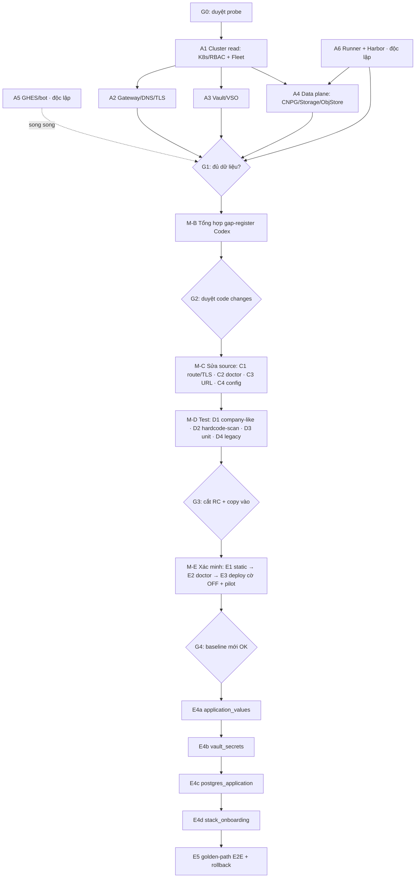

# PLAN — Đưa idp-platform chạy được cả trên harness lẫn hạ tầng công ty

> Tài liệu LẬP KẾ HOẠCH. Không sửa code, không deploy, không đụng hạ tầng trong session tạo ra nó.
> Mục tiêu: ngày mai giao được từng task cho nhiều session AI mà không phải giải thích lại.

---

## 1. Executive summary

Nền tảng đã được thiết kế đúng theo luật số 1 của repo — *toạ độ ở config, không ở code*. Đo trên
mã thật: workflow đã GHES-aware (dùng `GITHUB_SERVER_URL`/`GH_ENTERPRISE_TOKEN`, tự ký JWT thay cho
`actions/create-github-app-token`), catalog gần như sạch hard-code (route/gateway đọc
`%%ingress.*%%`, registry/storageclass/vault đều qua placeholder), và đã có sẵn `platform.env.company.yaml`
liệt kê gần đủ các ẩn số theo từng miền hạ tầng. Vì vậy **vấn đề còn lại KHÔNG phải là port code, mà
là đo sự thật hạ tầng công ty rồi bịt một số ít khe hở portability còn sót**.

Cách làm: hai loại agent, hai vai trò tách bạch.
- **Agent nội bộ công ty** — *đo* hạ tầng (read-only), sinh hai contract: `INTERNAL-*` (đầy đủ, ở lại
  trong công ty) và `EXTERNAL-*` (đã khử danh tính, đưa ra ngoài).
- **Codex bên ngoài** — nhận các `EXTERNAL-*`, tổng hợp portability gap, sửa **source chung** trên
  `pr3s3nt/idp-platform`, thêm config/capability/preflight/test cho cả hai profile.

Kết quả mong muốn: **một source tree, hai môi trường**, khác biệt chỉ nằm ở `platform.env.yaml` +
variables/secrets GHES + prerequisite hạ tầng. Không fork source trong công ty.

Đòn bẩy lớn nhất để giảm số vòng "mang vào – mang ra": **làm giàu `preflight` thành một "doctor"
read-only** kiểm mọi capability công ty (gateway tồn tại, storageclass tồn tại, CNPG/VSO operator
đúng version, registry kéo được ảnh, object store tới được, Vault foundation) **trước khi render** —
để lệch hạ tầng nổ ra ở bước preflight ngay tại công ty, không phải sau khi Fleet đã apply.

- **Verified source HEAD** (`feature/secret-onboarding`): `64713441c4faaef16ec7f5b437448dbe3774b3c2`
- Baseline công ty đang chạy: `42b8437` (2026-08-05) — nhánh feature đi trước **31 commit**.
- **Số việc: 10** — **6 discovery** (A1–A6, chỉ đây mới là việc phát cho nhiều session *ngày mai*) +
  **4 milestone** (M-B tổng hợp · M-C code · M-D test · M-E xác minh). Milestone **chỉ elaborate
  thành card session khi tới cổng của nó** — tránh viết chi tiết đoán mò khi chưa có dữ liệu discovery.

---

## 2. Problem statement

**Cái KHÔNG phải trọng tâm:** chuyển file từ repo ngoài vào repo công ty (đã làm bằng copy-paste,
người dùng tự lo, không sợ sót file). Đồng bộ repo không nằm trong critical path của kế hoạch này.

**Cái LÀ trọng tâm:** *portability*. Cùng một source tree phải chạy được:

```
source code + env harness  → chạy trên harness bên ngoài
source code + env công ty  → chạy trong công ty
```

Harness bên ngoài (github.com + GHCR + Vault dev + kind + Traefik HTTP…) khác hạ tầng công ty
(GHES + Harbor + Vault thật có TLS + cụm doanh nghiệp + Gateway TLS + CNPG + object store + proxy/CA).
Rủi ro: code chạy đúng trên harness nhưng hỏng ở công ty vì **giả định hạ tầng còn ẩn trong source,
workflow, template hoặc provisioner**. Vòng lặp cần tránh: sửa ngoài → copy vào → chạy → phát hiện lệch
→ ra ngoài sửa → copy lại → lặp.

**Phân vai:**
- Agent nội bộ = *đo sự thật hạ tầng* công ty (read-only), không thiết kế/sửa source lớn.
- Codex ngoài = *sửa sản phẩm* để đỡ được cả hai môi trường, không biết secret/thông tin nội bộ.

**Cam kết thành thật:** không thể bảo đảm tuyệt đối không còn runtime surprise. Nhưng phải **bắt hết
các contract nền tảng trước khi sửa code**, và làm cho phần dư (nếu có) nổ ra ở preflight/test chứ
không phải giữa production — đó là cách *giảm tối đa* số vòng lặp, không phải hứa "đúng một lần".

---

## 3. Current-state facts (đã xác minh từ repo thật)

| Sự thật | Bằng chứng |
|---|---|
| `feature/secret-onboarding` HEAD = `6471344…` | `git rev-parse origin/feature/secret-onboarding` |
| `main` HEAD = `18be8a1…` = feature + 1 commit "bật 4 cờ" | feature là ancestor của main; distance 42b8437..main = 32 |
| Baseline công ty `42b8437` (2026-08-05) | feature đi trước 31 commit |
| Thay đổi lớn nằm ở `idpctl` (+6619 dòng), `test_engine.py` (+3877), catalog + docs | `git diff --stat 42b8437..feature` |
| Subsystem mới (phase 0–7): toolchain pinning + naming contract; **ApplicationValues/ConfigMap**; **Vault/VSO** danh tính-theo-app; **secretRef→VaultStaticSecret**; **postgres class application (CNPG)** + credential qua Vault; golden path `node-fullstack` + `score-compose` local; **onboarding state machine** + duyệt prod; offboard; rotate-db-credential; backup/restore | commit log phase-0..phase-7 |
| 4 cờ tính năng, **mặc định OFF**: `application_values`, `vault_secrets`, `postgres_application`, `stack_onboarding` | `idpctl:155` + `features:` trong `platform.env.yaml` |
| Config là nguồn toạ độ DUY NHẤT; `--registry`/`--image` không default; `deploy.yaml` ghi "NO INFRASTRUCTURE VALUES HERE" | `platform.env.yaml`, workflow header |
| Workflow đã GHES-aware | `GITHUB_SERVER_URL`, `GH_ENTERPRISE_TOKEN`, `tools/mint-app-token.sh` đọc `GITHUB_API_URL`, né `create-github-app-token` |
| Đã có `platform.env.company.yaml` liệt kê ẩn số theo miền (`❓`) và mục đã xác nhận (`✅`) | ~30 dòng `❓/✅`, giá trị tạm dạng `*.invalid` để hỏng-là-rõ |
| Đã có probe read-only sẵn: `tools/thu-thap-ha-tang.sh`, `tools/kiem-suc-khoe.sh` | `git ls-tree tools/` |
| Catalog route dùng Gateway API, `parentRefs` đọc `%%ingress.gateway_name/namespace%%` | `provisioners/local.provisioners.yaml` route-traefik |
| `preflight` hiện chỉ kiểm: tool tồn tại + version pin + cluster reachable + (tùy chọn) Vault foundation | `idpctl:5944` |
| 373 test, tất cả nạp **duy nhất** `platform.env.yaml` harness làm `orc.CONFIG` | `test_engine.py:28`; **không** có profile công ty trong test |
| Trạng thái nhánh: `Ready for review`, chưa merge upstream | `BAO-CAO-SAN-SANG-MERGE.md:3` |

### Khe hở portability **ứng viên** đã thấy trong code (Codex xác nhận & phân loại ở M-B)

| # | Vị trí | Mô tả | Phân loại dự kiến |
|---|---|---|---|
| PG-1 | route provisioner (`parentRefs`) | Chỉ set `name`/`namespace`, **không có `sectionName`** (chọn listener) và **không xử lý scheme TLS**. Gateway Traefik công ty có thể có nhiều listener + `allowedRoutes` giới hạn namespace/hostname → HTTPRoute không attach vào đúng listener HTTPS. | `PORTABILITY_CODE_GAP` (cần key config `ingress.listener_name`/`ingress.route_scheme`) |
| PG-2 | `idpctl:5413/5538` `stagingUrls/prodUrls` | In URL cứng `http://` | `PORTABILITY_CODE_GAP` (thấp) — scheme nên theo config gateway |
| PG-3 | `idpctl:5770` `onboarding_config_repo_url` | Cứng `https://github.com/...`, sai host trên GHES (cosmetic, chỉ để in) | `PORTABILITY_CODE_GAP` (thấp) — dùng `GITHUB_SERVER_URL` |
| PG-4 | `preflight` | Không kiểm gateway/storageclass/CNPG/registry-pull/object-store/GHES-scope trước render | `PORTABILITY_CODE_GAP` (đòn bẩy chính giảm vòng lặp) |
| PG-5 | test suite | Chỉ có harness profile; không có company-like profile matrix, không có hardcode-scan test | thiếu test bảo vệ portability |

---

## 4. Assumptions & unknowns

**Giả định (cần discovery xác nhận, không được tin mù):**
- Cụm công ty có Gateway API + một Gateway đã chạy (env công ty ghi `traefik-gateway`/`traefik`).
- Có Fleet/Rancher đang đồng bộ GitRepo trong cụm.
- Vault công ty tồn tại nhưng chưa chốt KV version/mount/auth/namespace/policy ownership/TLS-CA.
- Runner công ty có (hoặc cài được) `score-k8s 0.15.0`, `score-compose 0.43.0`, `kubectl`, `gh`, `python3+pyyaml`, `openssl`.
- Harbor nội bộ tồn tại; cụm on-prem **không ra internet** ⇒ mọi ảnh phải mirror.

**Ẩn số lớn (được gom vào 6 việc discovery A1–A6):** phiên bản K8s/API/RBAC bot; Fleet namespace +
git credential + CA; branch protection/ruleset & quyền tạo repo của bot trên GHES; proxy/DNS/custom CA
của runner & cụm; StorageClass thật + object store (S3/MinIO) cho backup prod; VSO/CNPG operator
version thực; DNS wildcard + TLS cho domain staging/prod; listener/allowedRoutes của Gateway.

---

## 5. Kiến trúc quy trình phối hợp hai agent

```
        CÔNG TY (kín)                         │        BÊN NGOÀI (pr3s3nt/idp-platform)
────────────────────────────────────────────┼──────────────────────────────────────────────
 Agent nội bộ  ── đo read-only ──► INTERNAL-* │
        │  (ở lại công ty, có tên thật)       │
        └──────── khử danh tính ──► EXTERNAL-*├──►  Codex: tổng hợp gap ──► sửa source chung
                                              │        (config/capability/preflight/test)
                                              │                    │
 Agent nội bộ  ◄──── copy-paste source mới ───┼────────────────────┘
        │                                     │
        └─ static validation → preflight/doctor read-only → deploy (flags OFF)
           → bật từng feature → E2E → rollback
```

**Ranh giới dữ liệu (bất biến):**
- `INTERNAL-*` **được** chứa tên resource/namespace/endpoint thật; **không bao giờ** chứa secret value,
  token, private key, kubeconfig.
- `EXTERNAL-*` đã thay hostname/domain/repo/username/IP/tên đội bằng placeholder; **giữ nguyên cấu trúc
  kỹ thuật** (version, kv_type, có/không proxy, có/không TLS, số listener…) đủ để Codex sửa code.
- Codex **không bao giờ** nhận secret/kubeconfig/thông tin nội bộ không cần thiết.

**Trả lời nhanh 12 câu hỏi bắt buộc:**
1. *Agent nội bộ đo gì?* → 8 miền hạ tầng, gói trong **6 việc discovery A1–A6**: Cluster+Fleet, Gateway/DNS/TLS, Vault/VSO, Data plane (CNPG/Storage/object-store), GHES/bot, Runner+Harbor.
2. *Kết quả nào an toàn ra ngoài?* → chỉ `EXTERNAL-*` (đã sanitize, không secret).
3. *Codex cần gì?* → cấu trúc kỹ thuật đã khử danh tính: version, capability, kiểu mount, có proxy/CA/TLS không, số listener, có object-store không — đủ để biểu diễn contract trong code + config.
4. *Phân biệt lỗi config vs lỗi thiết kế code?* → theo bảng phân loại ở §6: nếu code đã có key/nhánh xử lý → `CONFIG_ONLY`; nếu code **không có cách biểu diễn** contract → `PORTABILITY_CODE_GAP`.
5. *Khi nào đủ dữ liệu để sửa code?* → khi mọi discovery blocker của các miền chạm tới code (Gateway, Vault, Harbor, Storage/object-store, Runner) đã PASS hoặc được phân loại rõ (Gate **G1**).
6. *Task chạy song song?* → **A5, A6 độc lập chạy ngay**; **A2, A3, A4 sau A1**; các card con trong M-C/M-D song song. Chuỗi E4* thì tuần tự.
7. *Cổng con người?* → G0..G6 (§8).
8. *Chứng minh không phá app legacy?* → D4 (render flags-OFF byte-identical baseline) + E3 (pilot app cũ trên cụm thật).
9. *Thử company-like ngoài?* → D1 fixture `platform.env.company-like.yaml` + parametrized render matrix + doctor dry-run trên fixture.
10. *Nếu vào rồi vẫn lộ code gap?* → không fork: ghi finding `PORTABILITY_CODE_GAP` mới → agent nội bộ sinh `EXTERNAL-*` bổ sung → Codex sửa ngoài → copy lại (vòng ngắn, có preflight chặn sớm).
11. *Khi nào bật Vault/DB/onboarding?* → theo thứ tự rollout §10, mỗi cái sau một Gate riêng + prerequisite + pilot + rollback.
12. *GO / GO-WITH-EXCEPTIONS / NO-GO?* → §12.

---

## 6. Phân loại finding (bắt buộc, mọi mismatch phải rơi vào đúng một loại)

| Loại | Nghĩa | Ai xử lý |
|---|---|---|
| `CONFIG_ONLY` | Code đã hỗ trợ, chỉ cần điền giá trị env vào `platform.env.yaml` | Agent nội bộ (điền config) |
| `SECRET_OR_VARIABLE` | Cần khai credential/variable trên GHES (secret/vars) | Agent nội bộ + Infra |
| `INFRA_PREREQUISITE` | Cần đội hạ tầng cung cấp/đổi (tạo namespace, storageclass, mở firewall, cấp policy…) | Đội hạ tầng công ty |
| `PORTABILITY_CODE_GAP` | Source chung **chưa biểu diễn được** contract công ty | Codex ngoài |
| `UNKNOWN` | Thiếu bằng chứng → cần task probe bổ sung | Agent nội bộ |

**Cấm** loại "sửa tạm trong repo công ty" (fork). Mọi thay đổi code chỉ xảy ra ở `pr3s3nt/idp-platform`.

---

## 7. Contract schemas

### 7.1 Contract ngoài (`EXTERNAL-*.yaml`) — đưa cho Codex

```yaml
contract_version: 1
domain: "kubernetes | fleet | gateway | ghes | runner | registry | vault | database"
generated_by: "internal-agent"
generated_at: "YYYY-MM-DD"          # không kèm giờ/định danh máy
sanitized: true                      # cam kết đã khử danh tính

# Code HIỆN TẠI kỳ vọng gì (đọc từ platform.env.yaml + hình dạng manifest sinh ra)
expected_by_current_code:
  keys: {}                           # ví dụ: vault.kv_type: kv-v2
  shape: []                          # ví dụ: "HTTPRoute.parentRefs không set sectionName"

# Công ty THỰC SỰ có gì (đã khử danh tính)
actual_company_capabilities:
  version: {}                        # ví dụ: kubernetes: "1.2x", VSO: "1.x", CNPG: "0.x"
  topology: {}                       # ví dụ: gateway.listeners: 2 (một http, một https+TLS)
  constraints: []                    # ví dụ: "runner qua proxy", "cụm không ra internet", "custom CA"

findings:
  - id: "GATEWAY-01"
    classification: "CONFIG_ONLY | SECRET_OR_VARIABLE | INFRA_PREREQUISITE | PORTABILITY_CODE_GAP | UNKNOWN"
    severity: "blocker | high | medium | low"
    sanitized_description: "..."     # KHÔNG hostname/IP/tên đội thật
    required_capability: "..."       # code cần biểu diễn được điều gì
    proposed_config_key: "..."       # nếu CONFIG_ONLY / gap → tên key đề xuất
    evidence_type: "kubectl get … (đã lược) | version string | http status | policy shape"
    blocks_feature: "application_values | vault_secrets | postgres_application | stack_onboarding | none"
```

### 7.2 Contract nội bộ (`INTERNAL-*.md/yaml`) — ở lại công ty

Giống schema trên **nhưng**: được phép ghi tên/namespace/endpoint thật, kèm phần `raw_evidence`
(output lệnh read-only, đã cắt bỏ mọi token/secret/kubeconfig). Có bảng ánh xạ
`placeholder → giá trị thật` để sau này điền `platform.env.company.yaml`. **Tuyệt đối không** dán
secret value, `data:` của Secret, `.kube/config`, private key.

### 7.3 Quy ước sanitize (áp cho mọi EXTERNAL-*)

`org→<ORG>`, host GHES→`<GHES_HOST>`, Harbor→`<REGISTRY_HOST>`, domain→`<STG_DOMAIN>/<PROD_DOMAIN>`,
Vault addr→`<VAULT_ADDR>`, IP→`<IP-N>`, tên đội/người→`<TEAM-N>`, tên app thật→`<APP-N>`. Giữ nguyên:
con số version, kv_type, boolean (có TLS? có proxy? ra internet?), số lượng (listener, storageclass),
tên **kiểu** resource (StorageClass, GatewayClass) nhưng thay tên **thực thể**.

---

## 8. Human decision gates

| Gate | Sau khi | Con người quyết định | Tiêu chí |
|---|---|---|---|
| **G0** | Trước A | Cho phép agent nội bộ probe read-only trên cụm/GHES | Có kênh nhận `EXTERNAL-*` ra ngoài đúng chính sách |
| **G1** | Hết discovery (A1–A6) | "Đã đủ dữ liệu để bắt đầu sửa code" | Không còn `UNKNOWN` mức blocker ở Gateway/Vault/Harbor/Storage/Runner |
| **G2** | M-B | Duyệt bảng phân loại + danh sách code change | Mỗi gap có loại rõ, không có "fork tạm" |
| **G3** | M-C + M-D xanh | Cắt release candidate + cho phép copy vào công ty | pytest xanh, hardcode-scan xanh, company-like matrix xanh |
| **G4** | E1–E3 | Cho phép deploy code mới (flags OFF) coi như baseline mới | E3 chứng minh app legacy không đổi hành vi |
| **G5** | Mỗi feature | Bật `application_values`→`vault_secrets`→`postgres_application`→`stack_onboarding` | prerequisite + pilot + evidence + rollback của bước đó đạt |
| **G6** | Prod DB/onboarding | Cho phép chạm production (backup bắt buộc, duyệt PR) | render prod không bị chặn (đã khai backup), có DBA ký |

**Khi nào NGƯNG discovery:** khi mọi finding còn lại là `INFRA_PREREQUISITE` (chờ đội khác) hoặc `low`
severity — không probe thêm để "cho chắc". Đủ để phân loại là đủ để đi tiếp.

---

## 9. Dependency graph



- **Critical path:** `G0 → A1 → {A2, A3, A4←A6} → G1 → M-B → G2 → M-C → M-D → G3 → M-E(E1→E2→E3) → G4 → E4a → E4b → E4c → E4d → E5`.
- **Song song được:** A5 và A6 độc lập, chạy song song ngay từ đầu (không cần A1); A2/A3/A4 chạy song song sau A1; các card con của M-C (C1–C4) và M-D (D1–D4) song song; chuỗi E4* **tuần tự** (mỗi feature một gate).
- **Phải chờ:** M-B chờ hết discovery (G1); M-C chờ G2; G3 chờ M-C+M-D xanh; E4* chờ E3 + G4.
- Khi được **tạo release candidate:** tại G3. Khi được **mang code vào công ty:** ngay sau G3. Khi
  được **bật từng feature:** tại G5 cho mỗi E4*.

---

## 10. Rollout plan (thứ tự bật feature)

Thứ tự suy ra từ phụ thuộc trong code: `application_values` (chỉ ConfigMap, ít phụ thuộc hạ tầng nhất)
→ `vault_secrets` (cần Vault+VSO foundation) → `postgres_application` (cần CNPG + storageclass + object
store cho backup prod, **và** dùng Vault để cấp credential DB ⇒ phải sau `vault_secrets`) →
`stack_onboarding` (cần tất cả + quyền tạo repo + golden path đầy đủ).

| Bước | Prerequisite | App pilot | Evidence | Rollback | KHÔNG tiếp tục nếu |
|---|---|---|---|---|---|
| **0. Code mới, mọi cờ OFF** | copy source; pytest xanh; doctor xanh | 1 app legacy đang chạy | render staging **byte-identical** baseline; `kubectl rollout` OK; `curl` 200 | trả về commit baseline `42b8437` ở repo công ty | render lệch baseline bất kỳ chỗ nào |
| **1. `application_values`** | không thêm hạ tầng | app có `.score-values/values.yaml` | ConfigMap sinh đúng; promotion bị chặn khi values đổi (đúng ý) | tắt cờ; app không có values file không đổi | ConfigMap sai / app không-values đổi hành vi |
| **2. `vault_secrets`** | VSO đúng version; Vault addr+TLS+CA; auth mount+audience+policy ownership do Vault Ops cấp | app có `secretRef` | VaultStaticSecret Ready; Secret đổ đúng; app A **không** đọc được prefix app B | tắt cờ; xoá VaultStaticSecret; app dùng Secret thủ công | policy prefix rò rỉ chéo app; VSO không Ready |
| **3. `postgres_application`** | CNPG đúng version; storageclass; **object store cho backup prod** (render prod bị CHẶN nếu rỗng) | app `type: postgres, class: application` | Cluster Ready; base backup đầu tiên xong; restore drill thử được | tắt cờ; giữ PVC cũ (đổi class KHÔNG di chuyển dữ liệu) | backup chỉ có WAL không có base; PVC Pending |
| **4. `stack_onboarding`** | 1–3 xong; bot/người tạo được repo; golden path node images mirror | app onboard mới qua state machine | state machine chạy lại được; prod qua duyệt PR | offboard workflow; giữ dữ liệu | onboarding dở dang không resume được |

Mỗi bước bật **cho từng app**, tắt lại được **không cần rollback platform** (đúng thiết kế cờ).

---

## 11. Risk register

| ID | Rủi ro | Khả năng | Tác động | Giảm thiểu |
|---|---|---|---|---|
| R1 | HTTPRoute không attach vì sai listener/allowedRoutes (lỗi im lặng) | Cao | Cao | A2 đo listener/sectionName/TLS; C1 thêm key; doctor kiểm gateway tồn tại |
| R2 | Vault policy ownership do Vault Ops giữ → không tự tạo được | TB | Blocker feature 2 | A3 hỏi đúng 4 điều KV/auth/namespace/policy; phân loại `INFRA_PREREQUISITE` |
| R3 | Cụm không ra internet → ảnh (node/nginx/postgres/cnpg) không kéo được | Cao | Cao | A6 xác nhận mirror; điền `images.*` + `database.image_repository`; doctor thử pull |
| R4 | Runner thiếu score-k8s/score-compose đúng version → render lệch | TB | Cao | A6 đo; version pin đã có; preflight chặn khi lệch |
| R5 | Proxy/DNS/custom CA chặn gh/git/Vault TLS | TB | Cao | A6 đo proxy+CA; `vault.ca_cert_secret`; `skip_tls_verify=false` |
| R6 | GHES branch protection/ruleset chặn bot push/PR | TB | TB | A5 đo; workflow đã đọc branch protection thật |
| R7 | Backup prod chỉ WAL, không base → "phục hồi được đúng không gì cả" | TB | Rất cao | render prod đã CHẶN khi thiếu; E4c bắt buộc restore drill (G6) |
| R8 | Đổi class postgres không di chuyển dữ liệu | TB | Cao | `--accept-empty-database` tường minh; runbook có sẵn |
| R9 | Vào rồi mới lộ code gap → cám dỗ fork | TB | Cao | Cấm fork (§6); vòng ngắn EXTERNAL-* bổ sung → Codex |
| R10 | Contract rò rỉ secret ra ngoài | Thấp | Rất cao | Tách INTERNAL/EXTERNAL; checklist sanitize; con người duyệt trước khi gửi |
| R11 | Test chỉ có harness profile → gap không bị bắt | (đang xảy ra) | Cao | D1 company-like matrix + D2 hardcode-scan |
| R12 | Milestone elaborate sai vì đọc thiếu artifact giai đoạn trước | TB | TB | Mỗi milestone bắt buộc đọc GAP-REGISTER / EXTERNAL-* trước khi tách card; DoD ghi rõ |

---

## 12. GO / NO-GO criteria

**GO** (được bật feature / lên prod) khi TẤT CẢ:
- pytest 373+ xanh; hardcode-scan xanh; company-like matrix xanh (G3).
- doctor read-only tại công ty xanh cho feature đang xét.
- Không còn finding `blocker` chưa xử lý ở miền của feature.
- Có evidence pilot (rollout thật + `curl` 200/`kubectl` Ready) + rollback đã thử.

**GO WITH EXCEPTIONS** khi:
- Còn finding `medium/low` **không thuộc** feature đang bật, đã ghi vào risk register với chủ sở hữu +
  hạn xử lý; **hoặc** một miền chưa dùng tới (vd chưa bật onboarding) còn `UNKNOWN` không chặn bước hiện tại.
- Bắt buộc: mọi ngoại lệ được con người ký ở gate tương ứng.

**NO-GO** khi bất kỳ:
- Còn `UNKNOWN`/`blocker` ở đúng miền của feature đang định bật.
- Có dấu hiệu phải sửa code ngay trong repo công ty (fork).
- Render prod bị chặn vì thiếu backup, hoặc doctor báo gateway/storageclass/operator không khớp.
- Test đỏ mà chưa hiểu vì sao (test đỏ = một hành vi thật vừa đổi).

---

## 13. Task cards

> **Discovery = việc phát ngay (A1–A6).** Mỗi việc sinh contract theo miền `INTERNAL-<domain>.md` +
> `EXTERNAL-<domain>.yaml` (schema §7). Một việc có thể gộp 2 miền dùng chung một kiểu truy cập
> (vd cùng kubeconfig) mà vẫn gọn trong một session. "Read-only" = chỉ
> `get/describe/version/list/api-resources/auth can-i`, **không** `apply/create/delete/patch/edit`.
> Ưu tiên tái dùng `tools/thu-thap-ha-tang.sh` và `tools/kiem-suc-khoe.sh`.
>
> **B–E = milestone.** Hình dạng thật của chúng phụ thuộc kết quả discovery + GAP-REGISTER; viết card
> chi tiết bây giờ là đoán mò. Khi cổng của milestone mở, agent phụ trách **đọc artifact giai đoạn
> trước** rồi tách milestone thành các card session (dùng chính mẫu field ở đây). Mỗi milestone bên
> dưới đã liệt kê sẵn các card-con đã biết để bạn không phải nghĩ lại từ đầu.

### Giai đoạn A — Discovery nội bộ (6 việc; A5, A6 chạy ngay, A2–A4 sau A1)

---
```
Task ID: A1 · Cluster read
Gộp miền: Kubernetes/RBAC + Fleet/GitRepo (cùng một kubeconfig ⇒ gọn trong một session)
Agent: internal agent
Mục tiêu:
  (a) K8s server version + API/CRD có sẵn: Gateway API (gateway.networking.k8s.io), CNPG
      (postgresql.cnpg.io), VSO (secrets.hashicorp.com), Fleet (fleet.cattle.io) + version CRD.
  (b) RBAC danh tính deploy: tạo được namespace state (cluster-state)? get/create ở app ns?
  (c) Fleet: fleet_namespace thật (fleet-local vs fleet-default), cách GitRepo hiện có xác thực tới
      git (TÊN secret, không giá trị), có custom CA (caBundle) không.
Nơi chạy: trong công ty, kubeconfig staging (+ prod nếu có).
Quyền: kubectl version/api-resources/api-versions/get/describe/auth can-i; kubectl get gitrepo -A/describe (read-only).
Không: apply/create/delete; đọc `data` Secret; dán kubeconfig/token ra ngoài; sửa GitRepo đội khác.
Đầu vào: kubeconfig; kubernetes.* + git.* trong platform.env.company.yaml. Đọc trước: tools/kiem-suc-khoe.sh; ensure-gitrepo trong idpctl.
Đầu ra: INTERNAL/EXTERNAL-kubernetes + INTERNAL/EXTERNAL-fleet (schema §7).
Bằng chứng: version string; api-resources (đã lược); can-i matrix; `get gitrepo -A` (khử tên đội) + field clientSecret/caBundle (không giá trị).
PASS: xác định version + có/không 4 CRD (+version) + quyền tạo ns/deploy + fleet_namespace + cơ chế credential + có/không CA.
BLOCKED: không có kubeconfig / không kết nối cụm.
Dependency: G0. Mở khóa: A2, A3, A4. Ước lượng: một session. Cổng: G0 trước; báo cáo tự lưu.
```
---
```
Task ID: A2 · Gateway / DNS / TLS
Miền: gateway
Agent: internal agent
Mục tiêu: Gateway đang chạy (tên/namespace); listeners (tên=sectionName, protocol, TLS); allowedRoutes
  (namespaces/hostnames — có chặn ns app không); DNS wildcard *.stg/*.prod resolve về gateway.
Nơi chạy: công ty, kubeconfig; + nslookup/dig từ trong cụm nếu được.
Quyền: kubectl get/describe gateway,gatewayclass,httproute; dig/nslookup (read-only). Không: tạo HTTPRoute thử; sửa Gateway.
Đầu vào: ingress.* + environments.*.domain. Đọc: provisioners/local.provisioners.yaml route-traefik (dùng %%ingress.*%%); PG-1/PG-2 §3.
Đầu ra: INTERNAL/EXTERNAL-gateway — nêu rõ số listener, listener nào TLS, có cần sectionName, scheme http/https.
Bằng chứng: khối listeners (hostname→<STG_DOMAIN>); kết quả resolve (khử IP).
PASS: kết luận ingress.gateway_name/namespace + có/không cần sectionName + scheme + allowedRoutes có chặn không.
BLOCKED: không có Gateway API → INFRA_PREREQUISITE (blocker route).
Dependency: A1. Mở khóa: nuôi M-C/C1; đóng góp G1. Ước lượng: một session. Cổng: không.
```
---
```
Task ID: A3 · Vault / VSO
Miền: vault
Agent: internal agent
Mục tiêu: "4 điều hỏi Vault Ops" (kv_mount; kv_type v1/v2; auth_mount + audience; Enterprise namespace)
  + AI SỞ HỮU policy (tự tạo được hay Vault Ops giữ) + Vault addr/TLS/CA theo góc nhìn CỤM + VSO
  operator version đang chạy.
Nơi chạy: công ty; kubectl đọc VSO + hỏi Vault Ops.
Quyền: kubectl get/describe VSO CRD + operator deploy version; đọc chính sách Vault Ops. Không: đọc secret value; tạo policy/role; in token.
Đầu vào: vault.* ; ADR 0002/0007. Đọc: check_vault_foundation (preflight --require-vault).
Đầu ra: INTERNAL/EXTERNAL-vault (version + kv_type + có TLS/namespace + ai sở hữu policy).
Bằng chứng: VSO version; kv_type; boolean TLS/namespace; câu trả lời chính sách (mount→<KV_MOUNT>).
PASS: đủ 4 điều + policy ownership + TLS/CA để điền vault.* hoặc phân loại INFRA_PREREQUISITE.
BLOCKED: Vault Ops chưa trả lời → UNKNOWN, đánh dấu blocker cho vault_secrets.
Dependency: A1. Mở khóa: gate E4b; đóng góp G1. Ước lượng: một session (trừ khi chờ Vault Ops). Cổng: chờ Vault Ops là INFRA gate thật.
```
---
```
Task ID: A4 · Data plane (CNPG / Storage / Object store / Backup)
Miền: database
Agent: internal agent
Mục tiêu: CNPG operator version/namespace; các StorageClass (default? SSD riêng cho DB?); object store
  cho backup prod (S3/MinIO, endpoint, TÊN credential secret); ảnh postgres/cnpg đã mirror trên Harbor
  chưa (dùng kết quả A6).
Nơi chạy: công ty, kubeconfig + mạng tới object store.
Quyền: kubectl get storageclass/get deploy cnpg/get crd; curl -I object store (status). Không: tạo Cluster/Backup thử; đọc credential secret.
Đầu vào: database.* + database_profiles.* + EXTERNAL-registry (A6). Đọc: provisioners/postgres-application.provisioners.yaml; ADR 0005/0008; runbook database-*.
Đầu ra: INTERNAL/EXTERNAL-database.
Bằng chứng: storageclass (khử tên thực thể); CNPG version; object store http status.
PASS: đủ điền database.* staging + biết prod cần gì (object store cho backup) hoặc phân loại INFRA.
BLOCKED: chưa có CNPG hoặc object store → INFRA_PREREQUISITE (blocker prod).
Dependency: A1, A6. Mở khóa: gate E4c; đóng góp G1. Ước lượng: một session. Cổng: G6 phần prod/backup.
```
---
```
Task ID: A5 · GHES / bot   [ĐỘC LẬP — chạy ngay, không cần A1]
Miền: ghes
Agent: internal agent
Mục tiêu: GHES version; đường xác thực bot (GitHub App APP_ID/KEY hay BOT_TOKEN); bot có bypass branch
  protection + tạo repo trong org không; ruleset ảnh hưởng push thẳng vs PR.
Nơi chạy: công ty, gh CLI trỏ GHES (GH_HOST), token bot (KHÔNG log token).
Quyền: gh api read-only (repos, branch protection, rulesets), gh auth status. Không: tạo repo thật; in token; đẩy commit.
Đầu vào: git.* ; workflow (GH_ENTERPRISE_TOKEN, mint-app-token.sh). Đọc: .github/workflows/deploy.yaml; tools/mint-app-token.sh; tools/tao-app-moi.sh.
Đầu ra: INTERNAL/EXTERNAL-ghes.
Bằng chứng: GHES version; JSON protection (khử tên repo/đội); scope token dạng liệt kê (không giá trị).
PASS: biết đường xác thực + bypass + create-repo policy.
BLOCKED: không có token bot để hỏi.
Dependency: không. Mở khóa: đóng góp G1; gate E4d (tạo repo). Ước lượng: một session. Cổng: không.
```
---
```
Task ID: A6 · Runner + Harbor (supply chain)   [ĐỘC LẬP — chạy ngay, không cần A1]
Miền: runner + registry
Agent: internal agent
Mục tiêu:
  (a) Runner: nhãn self-hosted; version score-k8s/score-compose/kubectl/gh/python/pyyaml/openssl (khớp
      pin 0.15.0 / 0.43.0?); có proxy/custom CA không; runner & cụm có ra internet không.
  (b) Harbor: host/path; robot pull-only; các ảnh nền cần mirror (node:22-alpine, nginx:1-alpine,
      postgres, cnpg postgresql:17) đã có chưa.
Nơi chạy: trên runner công ty (mạng tới Harbor + các endpoint).
Quyền: `--version`; env|grep -i proxy (che giá trị); curl -I harbor/ghes/vault (status); openssl s_client (chain, không key); crane/skopeo inspect read-only. Không: cài đặt gì; push ảnh; in secret.
Đầu vào: ci.* + images.* + registry.* + database.image_repository. Đọc: ADR 0006; check_tool_versions; images: trong platform.env.yaml.
Đầu ra: INTERNAL/EXTERNAL-runner + INTERNAL/EXTERNAL-registry.
Bằng chứng: version strings; http status (khử host); boolean proxy/CA/internet; danh sách ảnh có/thiếu (digest khử host).
PASS: version khớp/không + nhu cầu mirror + proxy/CA + ảnh nào thiếu (→ INFRA mirror).
BLOCKED: không truy cập được runner/Harbor.
Dependency: không. Mở khóa: nuôi A4 (ảnh DB); đóng góp G1. Ước lượng: một session (tách 2 nếu một agent không ôm hết). Cổng: không.
```

### Giai đoạn B–E — Milestone (elaborate thành card session KHI cổng của nó mở)

---
```
Milestone M-B · Tổng hợp portability gap-register   (external Codex) — mở tại G1
Mục tiêu: Ghép mọi EXTERNAL-*.yaml, đối chiếu source, phân loại từng finding (§6) → GAP-REGISTER.md +
  danh sách card cụ thể cho M-C/M-D. Không hard-code công ty; không nhận secret.
Đầu vào: tất cả EXTERNAL-* đã sanitize. Đọc: idpctl, provisioners/, patches/, templates/, workflows, platform.env*.yaml, test_engine.py.
Đầu ra: GAP-REGISTER.md (finding → classification → điểm sửa file:line) + backlog card M-C/M-D.
PASS: mọi finding đúng MỘT loại, không loại "fork"; mỗi PORTABILITY_CODE_GAP kèm file:line.
BLOCKED: thiếu EXTERNAL-* của miền chạm code (Gateway/Vault/Storage/Runner/Harbor).
Đây là 1 việc session. Dependency: G1. Mở khóa: G2 → M-C. Cổng: G2.
```
---
```
Milestone M-C · Sửa source chung   (external Codex) — mở tại G2, các card chạy SONG SONG
Elaborate từ GAP-REGISTER. Card hạt-giống đã biết (chốt lại theo M-B):
  • C1 — Route listener sectionName + scheme TLS qua config (PG-1/2). Mặc định key TRỐNG = manifest cũ y hệt.
  • C2 — preflight → "doctor" read-only: kiểm gateway/storageclass/CNPG-VSO version/registry-pull/object-store
        (PG-4). Đòn bẩy giảm vòng lặp; có cờ để môi trường thiếu quyền vẫn chạy phần khả dụng.
  • C3 — Dọn URL/scheme user-facing dùng GITHUB_SERVER_URL (PG-2/3, nhỏ).
  • C4 — Chuẩn hoá mọi key config mới vào DEFAULTS + platform.env.yaml + platform.env.company.yaml (mẫu *.invalid).
Ràng buộc chung: không hard-code hostname/domain/org; KHÔNG đổi hành vi khi key trống (tương thích ngược).
Mỗi card = một session. Dependency: G2. Mở khóa: M-D. Cổng: G2 trước, G3 sau.
```
---
```
Milestone M-D · Test cho cả hai profile   (external Codex) — mở cùng M-C
  • D1 — Fixture platform.env.company-like.yaml (giá trị GIẢ) + parametrized render matrix: render chỉ
        khác ở TOẠ ĐỘ; prod bị chặn khi thiếu backup; vault TLS+namespace khi khai.
  • D2 — Hardcode-scan test: fail nếu xuất hiện literal hạ tầng ngoài config (github.com/ghcr.io/
        mirror.gcr.io/http:// user-facing…); allowlist tối thiểu có comment.
  • D3 — Unit test doctor (pass/fail giả lập bằng FakeKubectl) + workflow-render (config --get/--export, nhánh GHES).
  • D4 — Legacy regression: 4 cờ OFF → render app "cũ" GIỐNG HỆT baseline 42b8437 (golden, diff rỗng).
Mỗi card = một session. Dependency: (các card M-C tương ứng). Mở khóa: G3. Cổng: G3.
```
---
```
Milestone M-E · Xác minh trong công ty   (internal agent, chạy luồng thật) — mở tại G3, TUẦN TỰ
  • E1 — Static validation sau copy: pytest xanh + config-load hai file + hardcode-scan xanh. (test đỏ → DỪNG, đọc test trước — luật CLAUDE.md.)
  • E2 — doctor read-only trên cụm công ty: gateway/storageclass/operator/registry/object-store khớp config; lệch → phân loại, KHÔNG fork.
  • E3 — Deploy code mới cờ OFF, pilot app legacy: rollout + curl 200 + diff manifest ~ rỗng.  →  Cổng G4 (baseline mới).
  • E4a application_values → E4b vault_secrets → E4c postgres_application (+restore drill) → E4d stack_onboarding
        — bật LẦN LƯỢT, mỗi bước prerequisite + pilot + evidence + rollback (bảng §10), qua Cổng G5;
          phần prod/DB/onboarding qua G6. (E4b cần A3+Vault Ops; E4c cần A4; E4d cần A5 tạo repo + A6 ảnh.)
  • E5 — Golden-path E2E tổng (onboard→staging→promote prod có duyệt→verify→rollback) → tuyên bố GO.
Mỗi bước = 1–2 session. Dependency: G3 (rồi G4, G5 mỗi feature, G6 prod). Cổng: G4, G5, G6.
```

---

## 14. Prompt khởi đầu — Task A1 (copy-paste cho AI agent nội bộ)

```text
Bạn là AI agent NỘI BỘ trong công ty, hỗ trợ đưa nền tảng idp-platform (bản
feature/secret-onboarding của pr3s3nt/idp-platform) chạy được cả trên harness lẫn hạ tầng
công ty. Nguyên tắc thiết kế: "toạ độ ở config, không ở code" — khác biệt giữa hai môi
trường phải nằm ở platform.env.yaml + variables/secrets, KHÔNG sửa code.

Nhiệm vụ tổng thể (để bạn hiểu bối cảnh, KHÔNG làm hết trong session này): đo sự thật hạ
tầng công ty theo từng miền, sinh contract để bên ngoài sửa source chung. Bạn CHỈ làm việc
A1 — "Cluster read" — trong session này.

PHẠM VI DUY NHẤT (gộp 2 miền vì dùng chung một kubeconfig):
  (a) Kubernetes: version + API/CRD + RBAC của danh tính deploy.
  (b) Fleet/GitRepo: namespace, cách xác thực tới git, có custom CA không.

CHỈ ĐỌC (READ-ONLY). Được phép:
  - kubectl version --output=json
  - kubectl api-resources ; kubectl api-versions ; kubectl get crd
  - kubectl get ns
  - kubectl auth can-i --list  (và can-i create namespace / create,get ở một app namespace mẫu)
  - kubectl get/describe (KHÔNG đọc `data` của Secret)
  - kubectl get gitrepo -A ; kubectl describe gitrepo <một cái mẫu>   (đọc field, không đọc secret)
TUYỆT ĐỐI KHÔNG: apply/create/delete/patch/edit; đọc giá trị Secret; in hoặc dán token,
kubeconfig, private key ra bất kỳ đâu; sửa GitRepo của đội khác; giả định giá trị khi thiếu
bằng chứng; tự sửa/tạo tài nguyên hạ tầng.

Cần đọc trước: tools/kiem-suc-khoe.sh (probe read-only có sẵn — ưu tiên tái dùng); hành vi
ensure-gitrepo trong idpctl (liệt-kê-rồi-khớp); khối kubernetes.* và git.* trong
platform.env.yaml và platform.env.company.yaml.

Các bước:
  1) Ghi K8s server version (chuỗi từ `kubectl version`).
  2) Liệt kê api-resources/crd, lọc: Gateway API (gateway.networking.k8s.io), CloudNativePG
     (postgresql.cnpg.io), Vault Secrets Operator (secrets.hashicorp.com), Fleet
     (fleet.cattle.io) — có/không mỗi cái + version CRD.
  3) Xác nhận namespace trạng thái (mặc định `cluster-state`) tồn tại hay tạo được
     (auth can-i create namespace), và namespace_pattern `{app}-{env}` có khớp quy ước
     công ty không.
  4) Ma trận `auth can-i` của danh tính deploy ở một app namespace mẫu (get/create
     deployment, service, configmap, secret, pvc).
  5) Fleet: `kubectl get gitrepo -A` → xác định fleet_namespace thật (fleet-local hay
     fleet-default); `describe` một GitRepo mẫu → TÊN clientSecret và có caBundle (custom CA)
     không. CHỈ ghi tên field, KHÔNG ghi giá trị.

ĐẦU RA BẮT BUỘC — bốn file (hai miền × hai mức):
  A) INTERNAL-kubernetes.md, INTERNAL-fleet.md — được ghi tên/namespace thật; kèm raw
     evidence đã cắt bỏ mọi token/secret; có bảng ánh xạ placeholder→giá trị thật để sau
     điền platform.env.company.yaml.
  B) EXTERNAL-kubernetes.yaml, EXTERNAL-fleet.yaml — ĐÃ KHỬ DANH TÍNH (org→<ORG>,
     host→<GHES_HOST>, IP→<IP-N>, tên đội/app→<TEAM-N>/<APP-N>), GIỮ nguyên con số version +
     boolean có/không CRD/CA + kết quả can-i. Theo schema:
        contract_version: 1
        domain: kubernetes            # hoặc: fleet
        sanitized: true
        expected_by_current_code: { keys: {...}, shape: [...] }
        actual_company_capabilities: { version: {...}, topology: {...}, constraints: [...] }
        findings:
          - id: K8S-01                 # hoặc FLEET-01
            classification: CONFIG_ONLY|SECRET_OR_VARIABLE|INFRA_PREREQUISITE|PORTABILITY_CODE_GAP|UNKNOWN
            severity: blocker|high|medium|low
            sanitized_description: "..."
            required_capability: "..."
            evidence_type: "..."
            blocks_feature: "..."

PHÂN LOẠI mỗi finding vào đúng MỘT loại ở trên. KHÔNG dùng loại "sửa tạm trong repo công ty".

TIÊU CHÍ PASS: xác định được K8s version; có/không Gateway API + CNPG + VSO + Fleet CRD (kèm
version); quyền tạo namespace state + quyền deploy ở app namespace; fleet_namespace thật + cơ
chế git credential + có/không custom CA; đã sinh đủ bốn file, và các EXTERNAL-* không chứa
bất kỳ hostname/IP/tên thật/secret nào.

BÁO BLOCKED (dừng, ghi lý do, không đoán) nếu: không có kubeconfig, không kết nối được cụm,
hoặc thiếu quyền chạy các lệnh read-only trên.

Sau khi PASS, các việc A2 (Gateway), A3 (Vault), A4 (Data plane) được mở khóa. A5 (GHES) và
A6 (Runner+Harbor) độc lập, có thể đã chạy song song. Đừng làm chúng trong session này.
```

---

```text
PLAN RESULT: READY

Verified source HEAD: 64713441c4faaef16ec7f5b437448dbe3774b3c2 (feature/secret-onboarding; main=18be8a1 = feature + commit bật 4 cờ; baseline công ty=42b8437, feature đi trước 31 commit)
Number of proposed tasks: 10 — 6 discovery (A1–A6) + 4 milestone (M-B tổng hợp, M-C code, M-D test, M-E xác minh). M-C/M-D/M-E chỉ elaborate thành card session khi cổng của chúng mở.
Critical path: G0 → A1 → {A2, A3, A4←A6} → G1 → M-B → G2 → M-C → M-D → G3 → M-E(E1→E2→E3) → G4 → E4a → E4b → E4c → E4d → E5
Parallel discovery tasks: A5, A6 (độc lập, chạy ngay); A2, A3, A4 (sau A1)
First internal task: A1 — Cluster read (Kubernetes/RBAC + Fleet) (prompt ở §14)
First external Codex task: M-B — Portability gap-register + phân loại (mở sau G1)
Human decisions required before execution: G0 (duyệt probe read-only + kênh chuyển EXTERNAL-* ra ngoài đúng chính sách)
```
