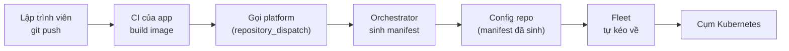

# IDP Orchestrator — Tài liệu dự án

> Môi trường sandbox chạy thật, dựng để kiểm chứng một Internal Developer Platform
> trước khi đụng vào hạ tầng công ty.
>
> Cập nhật: 31/07/2026

---

## 1. Dự án này là gì

Đây là một **Internal Developer Platform (IDP)** — hiểu đơn giản là một lớp trung gian
giữa lập trình viên và hạ tầng Kubernetes.

Vấn đề nó giải quyết: bình thường, để đưa một ứng dụng lên Kubernetes, lập trình viên phải
tự viết một đống file cấu hình hạ tầng (Deployment, Service, Ingress, Secret, PVC…). Mỗi
app một bộ, mỗi môi trường một bản khác. Kết quả là:

- Lập trình viên phải học Kubernetes dù việc chính của họ là viết nghiệp vụ.
- Mỗi team làm một kiểu, không đội nào giống đội nào.
- Muốn đổi một chuẩn chung (ví dụ: từ nay mọi app phải có resource limit) thì phải đi sửa
  hàng chục repo.

Với IDP này, lập trình viên **chỉ khai báo ứng dụng của mình CẦN GÌ**, không nói CÁCH LÀM.
Toàn bộ phần dịch "nhu cầu" thành cấu hình Kubernetes do platform lo.

### Ví dụ cụ thể

Đây là **toàn bộ** những gì một lập trình viên phải viết để có app chạy trên cụm:

```yaml
# score.yaml
apiVersion: score.dev/v1b1
metadata:
  name: helloworld
containers:
  web:
    image: .
service:
  ports:
    http: { port: 80, targetPort: 80 }
resources:
  route:                    # "tôi cần được truy cập từ ngoài"
    type: route
    params: { host: helloworld.example.com, port: 80, path: / }
```

Không có chữ "Deployment", "Service", "Ingress", "HTTPRoute" nào. Platform sinh ra hết.

Nếu app cần cơ sở dữ liệu, lập trình viên chỉ thêm:

```yaml
resources:
  db:
    type: postgres          # "tôi cần một Postgres"
```

Và platform tự lo: tạo StatefulSet, xin ổ đĩa, **sinh mật khẩu ngẫu nhiên**, đưa mật khẩu
vào cụm dưới dạng Secret, nối biến môi trường vào container. Lập trình viên không bao giờ
nhìn thấy mật khẩu đó, và nó **không bao giờ nằm trong Git**.

---

## 2. Cách hoạt động



Diễn giải từng bước:

| # | Bước | Ai làm | Chi tiết |
|---|---|---|---|
| 1 | Lập trình viên `git push` | Người | Chỉ sửa code và `score.yaml` |
| 2 | CI build image | GitHub Actions | Build Docker image, đẩy lên registry |
| 3 | CI "gọi" platform | GitHub Actions | Gửi một tín hiệu kèm tên app + mã commit |
| 4 | Orchestrator sinh manifest | Máy chủ nội bộ | Đọc `score.yaml`, áp chuẩn chung, sinh file cấu hình K8s |
| 5 | Ghi vào config repo | Orchestrator | Commit file đã sinh vào một repo riêng |
| 6 | Fleet kéo về | Fleet (trong cụm) | Cứ 15s kiểm tra config repo, thấy đổi thì apply |
| 7 | App chạy | Kubernetes | |

**Điểm quan trọng cho người đọc không chuyên:** bước 6 là *kéo* chứ không phải *đẩy*.
Cụm Kubernetes tự đi lấy cấu hình về, thay vì CI đẩy vào cụm. Nghĩa là **cụm không cần mở
cổng ra ngoài internet**, và trạng thái thật của cụm luôn khớp với những gì ghi trong Git.
Đây là mô hình gọi là **GitOps**.

---

## 3. Bản đồ hệ thống

### Ba loại repository

Dự án cố tình tách làm 3 loại repo, mỗi loại một chủ sở hữu rõ ràng:

| Loại | Ai sở hữu | Chứa gì | Ví dụ |
|---|---|---|---|
| **Platform** | Đội platform | Bộ não: script sinh manifest, chuẩn chung, thư viện resource | `idp-platform` |
| **App** | Đội sản phẩm | Code + `score.yaml` + Dockerfile | `idp-helloworld` |
| **Config** | Không ai sửa tay | Manifest do máy sinh ra | `idp-helloworld-config` |

Vì sao phải tách 3 chứ không gộp làm 1?

- **App tách khỏi Config**: lập trình viên không bao giờ phải nhìn file Kubernetes. Và khi
  máy ghi đè file cấu hình, không có nguy cơ đè lên code người viết.
- **Config tách khỏi Platform**: mỗi app có lịch sử triển khai riêng, xem được "hôm qua app
  này chạy phiên bản nào" chỉ bằng `git log`. Muốn rollback thì revert một commit.
- **Platform tách riêng**: đổi chuẩn chung một chỗ, áp cho mọi app.

### Các app đang chạy trong sandbox

| App | Mục đích kiểm chứng |
|---|---|
| `sample-nginx` | Luồng cơ bản; tên image **khác** tên app |
| `sample-pg` | App có cơ sở dữ liệu — kiểm mật khẩu và ổ đĩa có bền qua nhiều lần deploy không |
| `sample-boutique` | 11 service phụ thuộc lẫn nhau, dùng image dựng sẵn |
| `helloworld` | App tối giản; tên image **trùng** tên app |
| `boutique` | 11 service, **build thật từ Dockerfile**, 5 ngôn ngữ khác nhau |

---

## 4. Môi trường sandbox: thật ↔ thay thế

Toàn bộ được dựng trên một máy Ubuntu (WSL2), **không đụng gì tới hạ tầng công ty**:

| Thành phần thật | Thay bằng | Vì sao chấp nhận được |
|---|---|---|
| GitHub Enterprise | github.com tài khoản cá nhân | Cùng API, cùng cơ chế Actions |
| Harbor (registry ảnh) | GHCR (GitHub Container Registry) | Cùng chuẩn Docker Registry v2 |
| Cụm Kubernetes on-prem | `kind` (Kubernetes chạy trong Docker) | Cùng API Kubernetes |
| Ceph (ổ đĩa mạng) | `local-path` của kind | Cùng cơ chế PVC/StorageClass |
| Rancher | Không có, Fleet chạy chế độ đơn cụm | Fleet là thành phần thật, chỉ bỏ giao diện quản trị |

Hai cụm được dựng: `staging` và `prod`, để kiểm chứng cả luồng thăng cấp giữa hai môi trường.

---

## 5. Các quyết định kỹ thuật

### 5.1. Vì sao dùng Score làm giao diện cho lập trình viên

Score là một chuẩn mở để mô tả "ứng dụng cần gì" mà không gắn với nền tảng cụ thể. Cùng một
`score.yaml` có thể sinh ra Docker Compose (để chạy máy cá nhân) hoặc Kubernetes (để chạy
thật). Điều này giữ cho **giao diện với lập trình viên ổn định** kể cả khi hạ tầng bên dưới
thay đổi.

### 5.2. Orchestrator viết bằng Python, không phải Bash

Script sinh manifest (`orchestrate.py`) cố tình **không đọc biến môi trường của GitHub**.
Mọi thứ truyền vào qua tham số dòng lệnh.

Lý do: khi một lần triển khai lỗi, kỹ sư có thể copy đúng dòng lệnh đó từ log, chạy lại trên
máy chủ và xem chuyện gì xảy ra. Nếu script đọc biến ngầm từ GitHub thì không tái hiện được.

Bash bị loại vì nó nuốt lỗi quá dễ. Ví dụ đoạn bash cũ xử lý tạo secret dùng
`2>/dev/null || echo "đã tồn tại"` — kiểu viết này nuốt luôn cả lỗi sai mật khẩu, lỗi mất
kết nối cụm, lỗi gõ nhầm tên; báo triển khai thành công trong khi cụm không có gì.

### 5.3. Trạng thái để trong cụm, không để trong Git, không để trên máy chủ CI

Công cụ sinh manifest cần nhớ một số thứ giữa các lần chạy: định danh tài nguyên, và **mật
khẩu nó đã sinh ra**. Nếu quên, mỗi lần deploy sẽ đổi tên StatefulSet và **sinh mật khẩu
Postgres mới** — dẫn tới ổ đĩa cũ bị bỏ rơi và **mất toàn bộ dữ liệu**.

Ba lựa chọn, chọn cái thứ ba:

| Nơi lưu | Vì sao loại |
|---|---|
| Trong Git | Chứa mật khẩu dạng thô — không được phép |
| Trên đĩa máy chủ CI | Sai ngay khi có máy chủ thứ hai nhận việc |
| **Trong cụm, dạng Secret** | ✅ Đúng nơi, đúng quyền, mọi máy chủ CI đều đọc được |

### 5.4. Mật khẩu không bao giờ đi vào Git

Sau khi sinh manifest, orchestrator **tách đôi**:

- File loại `Secret` → áp thẳng vào cụm, không qua Git.
- Mọi thứ còn lại → commit vào config repo.

Manifest trong Git chỉ *tham chiếu* tới secret bằng tên. Ai đọc được config repo cũng không
thấy được mật khẩu.

Thêm một chi tiết: secret được tạo theo kiểu "chưa có thì tạo, có rồi thì để yên" — chứ không
phải ghi đè. Nghĩa là chạy lại một lần deploy **không bao giờ đổi mật khẩu của database đang
sống**.

### 5.5. `platform.lock` — ghim phiên bản chuẩn, nhưng chỉ ghim dữ liệu

Mỗi app giữ một file `platform.lock` trỏ tới một phiên bản của repo platform. Khi triển khai,
orchestrator lấy **thư viện resource và chuẩn chung tại đúng phiên bản app đã ghim**.

Nghĩa là đội platform sửa chuẩn trên nhánh chính **không làm ảnh hưởng app đang chạy**. App
nào muốn nâng thì tự sửa file lock qua một pull request — có review, có kiểm soát.

Điểm tinh tế: file lock ghim **dữ liệu** (thư viện resource, chuẩn chung), **không ghim code**
(script sinh manifest). Vì GitHub luôn chạy workflow từ nhánh chính, nếu ghim cả code thì
script sẽ lệch pha với tham số mà workflow truyền vào.

### 5.6. Staging tự động, production phải bấm nút

- Push lên nhánh chính → **chỉ** staging đổi.
- Production chỉ đổi khi có một yêu cầu thăng cấp tường minh.

Hai chế độ thăng cấp:

| Chế độ | Làm gì | Khi nào dùng |
|---|---|---|
| `from-staging` | Sao chép đúng tập ảnh staging đang chạy sang production | **Ứng dụng nhiều service** — xem mục 6.6 |
| `tag-only` | Đổi mọi ảnh sang cùng một nhãn | Ứng dụng một service |
| `re-render` | Sinh lại toàn bộ từ commit đó, theo đúng chuẩn commit đó ghim | Khi cần dựng lại chính xác lịch sử |

### 5.7. Fleet kéo, không đẩy

Cụm tự đi lấy cấu hình. Hệ quả thực tế: **cụm không cần mở cổng ra internet**, và CI không
cần giữ quyền ghi vào cụm — chỉ cần quyền ghi vào một repo Git.

---

## 6. Quá trình phát triển — những gì đã thay đổi

Phần này ghi lại các vấn đề gặp phải và cách xử lý. Đây là phần đáng đọc nhất, vì phần lớn
vấn đề **không nhìn ra được bằng cách đọc code**, chỉ lộ ra khi chạy thật.

### 6.1. Giai đoạn dựng môi trường

| Vấn đề | Biểu hiện | Xử lý |
|---|---|---|
| Giới hạn `inotify` của hệ điều hành | Cụm Kubernetes thứ 3 không khởi động được, tiến trình quản lý container chết trong vòng lặp | Nâng `fs.inotify.max_user_instances` từ 128 lên 1024 |
| **Sai lệch MTU mạng** | Mọi lần tải image từ internet đều treo rồi timeout | Đặt MTU của Docker về 1280 cho khớp mạng máy chủ |
| Thiếu công cụ test | Python 3.14 không có sẵn `pip`, lại bị khoá cài đặt | Cài `pytest` vào thư mục riêng, không đụng Python hệ thống |

Vụ MTU đáng nói: máy chủ (WSL2) có MTU 1280 trong khi Docker mặc định 1500. Gói tin lớn hơn
1280 bị rơi âm thầm. Triệu chứng rất dễ đánh lừa — **tra tên miền thì được** (gói nhỏ), nhưng
bắt tay mã hoá thì treo (gói lớn). Đây cũng là lý do một cụm thử nghiệm cũ trên máy có thành
phần ở trạng thái lỗi suốt 7 ngày mà không ai hiểu vì sao.

### 6.2. Tài liệu kế hoạch lệch với code thật

Kế hoạch ban đầu (`plan.md`) được viết theo trí nhớ nên lệch với code. Đã bám theo code:

| Kế hoạch ghi | Thực tế trong code |
|---|---|
| Tên secret `KUBECONFIG_ONPREM_*`, `HARBOR_*` | `KUBECONFIG_*`, `REGISTRY_*` |
| Nhãn máy chủ CI `idp-orchestrator` | `platform-orchestrator` |
| Namespace `platform-state` | `cluster-state` |
| Gateway API bản "standard" | Phải dùng bản "experimental" (xem 6.3) |

Ngoài ra `probe.yaml` là **file rỗng 0 byte**, không có gì tham chiếu tới — đã xoá sau khi
xác nhận với chủ dự án. Thư mục `examples/` mà bộ test cần cũng bị thiếu — đã viết lại 3 bộ
dữ liệu mẫu cho khớp yêu cầu của test.

### 6.3. Ba lần thử mới cấu hình đúng được Gateway

Đây là ví dụ điển hình của việc tài liệu nói một đằng, phần mềm cần một nẻo:

1. Cài Gateway API bản "standard" theo kế hoạch → Traefik không xử lý gì cả, đứng im ở
   trạng thái "chờ controller". Nguyên nhân: Traefik cần hai loại tài nguyên chỉ có trong
   bản "experimental".
2. Cài bản experimental v1.2.1 → vẫn lỗi. Traefik cần các tài nguyên đó ở phiên bản `v1`,
   mà v1.2.1 chỉ có `v1alpha2`. Phải nâng lên **v1.6.1**.
3. Cấu hình cổng 80 cho Gateway → báo "cổng không khả dụng". Traefik đối chiếu cổng theo
   **cổng bên trong container (8000)**, không phải cổng của Service.

Thêm một cái bẫy: bản Helm chart mới của Traefik đã đổi tên tham số cấu hình loại Service.
Tham số cũ **bị bỏ qua trong im lặng** — không báo lỗi, không cảnh báo, chỉ đơn giản là không
có tác dụng.

### 6.4. Lỗi trong chính code của dự án

Ba lỗi thật, đã sửa và đẩy lên:

**(a) Kiểm tra kết nối cụm trước khi có file cấu hình kết nối.**
Bước "kiểm tra sức khoẻ" chạy *trước* bước tạo file kubeconfig. Trên máy chủ CI mới tinh thì
lỗi ngay. Nguy hiểm hơn: trên máy chủ đã chạy vài lần, nó lặng lẽ dùng **file kubeconfig cũ
còn sót lại** — báo xanh trong khi đang kiểm tra nhầm cụm.

**(b) Mọi bundle của Fleet kẹt vĩnh viễn ở trạng thái "đã bị sửa đổi".**
Fleet triển khai qua Helm, mà Helm luôn tự đóng dấu nhãn `managed-by=Helm` lên mọi thứ nó
áp vào cụm. Trong khi manifest sinh ra mang nhãn `managed-by=score-k8s`. Lệch đúng một nhãn,
lệch mãi mãi.

Chỗ này **phải sửa hai lần**:
- Lần 1: khai báo cho Fleet bỏ qua nhãn đó khi so sánh. Chạy được cho app đơn giản.
- Lần 2: phát hiện cách trên **không tổng quát**. Tài nguyên do platform sinh ra (như Redis)
  có mã ngẫu nhiên trong tên (`redis-cart-d2eaf96b`) — không thể biết trước tên để khai báo.
  Sửa lại tận gốc: **bỏ hẳn nhãn đó khỏi manifest ngay lúc sinh**. Helm sẽ tự đóng dấu lại
  khi áp vào cụm, nên không mất gì. Kết quả: file cấu hình Fleet từ 138 dòng còn 5 dòng.

**(c) Một tham số bị khai báo sai chỗ trong cấu hình Fleet** — nếu thiếu tên và namespace thì
Fleet **bỏ qua trong im lặng**, không log, không lỗi.

> Điểm chung của cả ba: cơ chế bảo vệ *có tồn tại* nhưng *không được gọi đúng chỗ*, và khi
> sai thì hệ thống không kêu.

### 6.5. Kiểm tra khả năng chịu tải đồng thời

Đây là phần được yêu cầu riêng: "nếu hai người cùng push, nhiều commit liên tiếp thì sao?"

Tìm thấy **5 lỗ hổng**, trong đó 3 cái gây mất dữ liệu hoặc lùi phiên bản **âm thầm**:

| # | Vấn đề | Hậu quả nếu xảy ra |
|---|---|---|
| 1 | Kiểm tra thứ tự chỉ chạy **một lần**, trên bản sao lấy lúc bắt đầu | Người khác ghi xen vào → hệ thống tự động ghi đè bằng bản **cũ hơn** |
| 2 | Deploy và thăng cấp production dùng chung một hàng đợi | Một lệnh thăng cấp đang chờ bị **huỷ** bởi lần deploy kế tiếp |
| 3 | Thăng cấp production **hoàn toàn không có** kiểm tra thứ tự | Thăng cấp sai thứ tự đẩy production **lùi về phiên bản cũ**, không cảnh báo |
| 4 | Ghi trạng thái theo kiểu "ai ghi sau thắng" | Hai lần chạy chồng nhau → **mất mật khẩu Postgres** đã sinh |
| 5 | Commit mới nhất bị huỷ khi push liên tiếp | Môi trường **kẹt lại ở commit cũ**, không có gì báo lỗi |

**Lỗ hổng số 5 không đoán được bằng đọc code — chỉ lộ ra khi đo thật.** Số liệu thực tế: đẩy
4 commit liên tiếp lúc 05:36:31–05:36:52, kết quả là staging dừng ở commit áp chót trong khi
nhánh chính đã đi tiếp một bước. GitHub báo trạng thái "đã huỷ" — mà "đã huỷ" thì không ai
coi là lỗi, nên không có cảnh báo nào.

Đã sửa cả 5, và **mô phỏng lại từng cái để chứng minh đã chặn được**:

- Gửi commit cũ sau commit mới → hệ thống từ chối, ghi rõ lý do, cụm không đổi.
- Thăng cấp lùi phiên bản → bị từ chối, production giữ nguyên.
- Hai tiến trình cùng ghi trạng thái → cái ghi sau bị chặn, dữ liệu của cái trước còn nguyên.
- Đẩy 4 commit liên tiếp lần hai → gộp về commit mới nhất, triển khai đúng.

Một quan sát ngược đời từ mô phỏng: **4 người push đúng cùng một khoảnh khắc ít nguy hiểm
hơn 4 người push cách nhau vài giây.** Cùng lúc thì Git từ chối 3 người vì tranh khoá, người
thắng gộp cả 4 commit thành một lần triển khai. Cách nhau vài giây mới sinh ra 4 lần triển
khai riêng và kích hoạt cơ chế huỷ hàng đợi.

### 6.6. Một service đổi thì cả 11 service build lại và khởi động lại

Phát hiện khi rà soát: commit gần nhất của kho boutique **chỉ sửa file cấu hình CI**, không
đụng một dòng mã service nào. Kết quả đo được:

| Hiện tượng | Số đo |
|---|---|
| Số service build lại | **11/11** (~13 phút máy chủ) |
| Số ứng dụng khởi động lại | **11/11**, kể cả trên production |
| Số dòng thay đổi trong file cấu hình | 304 dòng — trong đó chỉ 22 dòng có ý nghĩa |

Nguyên nhân nằm ở một dòng: **nhãn phiên bản của ảnh (image tag) lấy theo mã commit của cả
kho**. Kho có commit mới → mọi service đổi nhãn → mọi file cấu hình đổi → Kubernetes coi như
mọi service đều đổi và khởi động lại tất cả.

Còn 304 dòng thay đổi là do **thứ tự các mục trong file không ổn định** giữa hai lần sinh —
lần này `currency` đứng đầu, lần sau `ad` đứng đầu. Không đọc nổi lần triển khai đã đổi gì.

Đã sửa ba chỗ:

**(a) Đánh nhãn theo nội dung từng service.** Git vốn đã lưu sẵn một mã băm cho mỗi thư mục,
và mã đó chỉ đổi khi nội dung bên trong thư mục đổi. Dùng nó làm nhãn:

```
                     commit này        commit trước (chỉ sửa CI)
frontend     0851cf67c90ec297...      0851cf67c90ec297...   ← giống nhau
cart         d6c7892ff616c912...      d6c7892ff616c912...   ← giống nhau
```

Nội dung không đổi → nhãn không đổi → **ảnh đã có sẵn nên khỏi build**, và **file cấu hình y
hệt nên ứng dụng không khởi động lại**.

**(b) Sắp xếp cố định** các mục trong file cấu hình, để đọc được lần triển khai đã đổi gì.

**(c) Thêm chế độ thăng cấp `from-staging`.** Khi mỗi service mang một nhãn riêng thì "đưa
production lên phiên bản X" không còn là một con số — nó là **một tập 11 nhãn**. Chế độ mới
sao chép đúng tập ảnh mà staging đang chạy sang production. Chế độ cũ vẫn giữ cho ứng dụng
một service.

Một chi tiết về cách triển khai đáng ghi lại: quy tắc đặt tên ảnh **chỉ được viết ở một chỗ**
(trong bộ não platform). CI của ứng dụng *hỏi* platform xem phải build ảnh tên gì, thay vì tự
tính lại. Nếu hai bên tự tính riêng rồi lệch nhau, hệ thống sẽ triển khai một cấu hình trỏ tới
ảnh chưa ai xây — và chỉ phát hiện được khi ứng dụng chết trên cụm.

### 6.7. Xây bản OnlineBoutique từ mã nguồn

Yêu cầu cuối: mỗi service một Dockerfile, một `score.yaml`, và **build thật** chứ không dùng
image dựng sẵn.

Thực tế gặp phải:

- Kho ví dụ chính thức của Score **chỉ có file `score.yaml`**, không có mã nguồn cũng không
  có Dockerfile. Mã nguồn nằm ở kho khác của Google. Đã đưa 6.1MB mã nguồn của 11 service
  vào kho app để nó tự chứa, build lại được kể cả khi kho gốc biến mất.
- Service `cartservice` có Dockerfile nằm sâu hơn một cấp so với các service khác.
- Kiểm thử 2 service ở máy cá nhân trước khi chạy CI: đều build được.
- **Lần chạy CI đầu tiên hỏng đúng 1 trong 11 service**: Docker Hub trả lỗi `502 Bad Gateway`
  khi tải image nền. Chính service đó vừa build sạch ở máy cá nhân vài phút trước → lỗi hạ
  tầng bên ngoài, không phải lỗi cấu hình.

  Hậu quả không nhẹ: bước triển khai phụ thuộc **tất cả** các bước build, nên một service
  hỏng là cả lần triển khai bị bỏ qua. Đây thực ra là **hành vi đúng** — không triển khai khi
  thiếu image — nhưng cho thấy cần cơ chế thử lại. Đã bổ sung: thử lại 3 lần, giãn 20 giây.

Kết quả cuối: 11 service viết bằng **5 ngôn ngữ khác nhau** (Go, C#/.NET, Java/Gradle,
Python, Node.js) build song song, đẩy lên registry, triển khai và chạy thật trên cả hai môi
trường.

---

### 6.8. Gom toàn bộ cấu hình môi trường về một file

Mục tiêu: mang platform sang môi trường khác chỉ cần **đưa file cấu hình**, không sửa code.

Trước khi làm, giá trị phụ thuộc hạ tầng nằm rải ở **5 file, 3 cú pháp khác nhau**:

| File | Cú pháp | Chứa gì |
|---|---|---|
| workflow của orchestrator | YAML | tổ chức git, tiền tố repo, registry, nhãn máy chủ CI |
| bộ sinh manifest | Python | namespace lưu trạng thái, tên secret, thư mục ghi nhận |
| thư viện resource | Go template | tên miền, tên Gateway, StorageClass, ảnh Postgres |
| chuẩn chung ×2 | Go template | tên pull secret, số bản sao, hạn mức tài nguyên |

Chuyển môi trường nghĩa là sửa 5 file bằng 3 cú pháp, và sai một chỗ thì hỏng im lặng.

**Sau khi làm: một file `platform.env.yaml`.** Thư viện resource và chuẩn chung dùng ô trống
dạng `%%khoá%%`; bộ sinh manifest điền giá trị vào một **bản sao** trong thư mục tạm trước
khi công cụ bên ngoài nhìn thấy — bản gốc không bị đụng, và khi lỗi thì file thật đã dùng
vẫn nằm đó để xem.

Ba quyết định đáng ghi lại:

**File này KHÔNG bị ghim phiên bản theo ứng dụng.** Ứng dụng ghim *thư viện resource* (cách
một thứ được hiện thực hoá). File này là *toạ độ hạ tầng đang chạy*. Nếu ghim nó, một ứng
dụng dùng thư viện cũ sẽ triển khai vào tên Gateway đã bị đổi từ lâu — mà lỗi đó không báo
gì cả.

**Ô trống sai tên là lỗi ngay, kèm danh sách khoá hợp lệ.** Không render thành chuỗi rỗng.
Mọi lỗi hạ tầng trong dự án này đều hỏng theo kiểu im lặng; cái này không được vào danh sách đó.

**Một ngoại lệ không thể đưa vào file:** nhãn chọn máy chủ CI. GitHub quyết định chạy trên
máy nào *trước khi* thực thi bước đầu tiên, nên không đọc được từ file. Nó lấy từ một biến
cấu hình của repo — vẫn là cấu hình chứ không phải code, nhưng là **chỗ thứ hai** phải sửa.

Kiểm chứng sau khi đổi: triển khai lại cùng một phiên bản cho ra `no manifest changes` —
không tạo commit thừa, tức kết quả sinh ra đã tất định.

### 6.9. Nhánh được bảo vệ: production phải qua duyệt

Công ty bật branch protection ở mọi nhánh, merge bắt buộc qua pull request, và quy tắc là
**production cần duyệt, staging thì không**. Orchestrator trước đó push thẳng, nên sẽ bị
chặn — đây là thay đổi code chứ không phải cấu hình.

Cách tổ chức đã chọn: **repo cấu hình dùng hai nhánh**, trùng đúng mô hình nhánh của
repo ứng dụng.

| Nhánh | Môi trường | Cách máy ghi vào |
|---|---|---|
| `dev` | staging | ghi thẳng, không cần duyệt |
| `main` | production | mở pull request, người đọc diff rồi merge |

Vì sao hai nhánh thay vì một nhánh hai thư mục: quy tắc "chỉ duyệt production" diễn đạt
được bằng branch protection thuần, không cần cấu hình quyền theo đường dẫn.

**Hai nhánh này KHÔNG bao giờ merge vào nhau.** Cấu hình hai môi trường khác nhau thật —
số bản sao, hạn mức, tên miền. Merge `dev` sang `main` sẽ kéo số bản sao của staging sang
production. Mỗi nhánh do máy sinh độc lập với giá trị đúng của môi trường đó.

**Máy cố ý KHÔNG tự merge pull request của chính nó.** Mục đích của việc duyệt là có người
đọc diff trước khi production đổi; máy tự merge là vô hiệu hoá điều đó. (GitHub cũng chặn
cứng việc tự duyệt pull request của chính mình — đã kiểm bằng thực nghiệm.)

Đã kiểm chứng đầy đủ trên một repo bật branch protection thật:

| Bước | Kết quả |
|---|---|
| Push thẳng vào nhánh production | **Bị GitHub từ chối** — "Changes must be made through a pull request" |
| Triển khai staging | ghi thẳng vào `dev`, **không** tạo pull request |
| Triển khai production | mở pull request, nhánh production **không nhúc nhích** |
| Sau khi người merge | Fleet nhặt đúng phiên bản mới và áp lên cụm production |

Bước cuối là thứ trước đó chưa ai kiểm bao giờ.

**Hai lỗi lộ ra khi chạy thật, không nhìn ra được bằng đọc code:**

- Lệnh đẩy code không ghi rõ nhánh đích thì phụ thuộc cấu hình theo dõi nhánh. Nhánh mới
  chưa thiết lập theo dõi sẽ báo lỗi, và vòng thử lại **hiểu nhầm** thành "có người đẩy
  trước" rồi đi hợp nhất — báo lỗi lạc đề hoàn toàn.
- Sau một lần đẩy hỏng, thay đổi nằm lại trên máy. Lần chạy lại không thấy gì mới nên
  **thoát sớm** và không đẩy phần còn sót — nghĩa là chạy lại một lần triển khai hỏng
  không sửa được gì.

### 6.10. Hai service ở hai kho mã khác nhau

Câu hỏi: backend một kho, frontend một kho — platform có chạy đúng không? **Không**, và
lỗi rất rõ:

```
resource 'service.default#frontend.backend': unknown workload
```

Cơ chế tham chiếu chéo sẵn có chỉ nhìn thấy các thành phần được sinh **trong cùng một
lần**. Hai kho là hai lần sinh tách biệt. Đây là giới hạn cố hữu chứ không phải lỗi: lúc
dựng cấu hình cho frontend, platform không biết backend tồn tại — và cũng không nên biết,
vì hai ứng dụng triển khai độc lập nhau.

Đã thêm loại phụ thuộc mới: **không tra cứu gì cả**, ráp thẳng địa chỉ nội bộ mà Kubernetes
vốn đã cấp cho mọi service, theo đúng quy ước đặt tên nằm trong file cấu hình môi trường.

```
staging → backend.backend-staging.svc.cluster.local:8080
prod    → backend.backend-prod.svc.cluster.local:8080
```

**Đánh đổi đã ghi rõ:** không có kiểm tra tồn tại. Gõ sai tên ứng dụng thì cấu hình vẫn
sinh ra bình thường, chỉ hỏng lúc chạy. Cách cũ bắt lỗi ngay nhưng chỉ dùng được trong
cùng một kho. Đó là cái giá của việc hai ứng dụng triển khai độc lập — không có cách nào
vừa độc lập vừa kiểm tra chéo được.

### 6.11. Bí mật của riêng ứng dụng

Platform vốn đã lo được bí mật do **nó** sinh ra: mật khẩu cơ sở dữ liệu không bao giờ vào
Git, chỉ có tham chiếu. Nhưng bí mật của **riêng ứng dụng** — khoá API bên thứ ba — thì
không có đường nào, nên cách duy nhất là viết thẳng vào file khai báo. Khi đó khoá đi vào
Git của ứng dụng **lẫn** vào kho cấu hình dưới dạng đọc được.

Đã thêm loại tài nguyên `secret`: lập trình viên chỉ khai **tên** và **khoá**, không khai
giá trị.

Kiểm chứng thật trên cụm, không chỉ trên giấy:

| Nơi | Nội dung |
|---|---|
| Bên trong container | `STRIPE_API_KEY=sk_live_...` — giá trị thật |
| Trong Git | `valueFrom.secretKeyRef {name, key}` — **chỉ có tham chiếu** |

**Cố ý không nói bí mật đó từ đâu ra.** Platform không bao giờ nhìn thấy giá trị; Secret do
bên sở hữu đưa vào. Nhờ vậy khi sau này thêm cổng tự khai báo bí mật, **file khai báo của
mọi ứng dụng không phải sửa dòng nào** — chỉ đổi cơ chế bơm giá trị.

### 6.12. Commit triển khai đang ghi công cho một người lạ

Phát hiện khi trả lời câu hỏi "máy dùng để làm gì". Địa chỉ thư dùng cho commit tự động
được gắn cứng theo định dạng mà GitHub dùng để **ánh xạ về một tài khoản**. Vì tài khoản
trùng tên đó tồn tại thật, mọi commit triển khai đang được ghi công cho một người dùng
không liên quan gì tới dự án — làm hỏng đúng thứ mà lịch sử kho cấu hình sinh ra để phục
vụ: truy vết ai triển khai cái gì.

Đã đưa danh tính vào file cấu hình, mặc định dùng địa chỉ không thể ánh xạ về tài khoản
nào, kèm một kiểm thử chặn hẳn việc dùng lại định dạng cũ.

### 6.13. Chuyển sang GitHub App

Trước đó **năm** chỗ dùng credential khác nhau — đọc kho ứng dụng, ghi kho cấu hình, gọi
platform từ CI, đẩy ảnh, và Fleet đọc kho cấu hình — **đều là cùng một token cá nhân** có
quyền quản trị tổ chức và xoá kho mã. Nghĩa là token cho phép CI của một ứng dụng gọi sang
platform cũng xoá được mọi kho mã trong tài khoản.

Đã thay bằng một GitHub App với **đúng ba quyền**: đọc/ghi nội dung, đọc/ghi pull request,
đọc metadata. Token được cấp mới cho từng lần chạy và tự hết hạn sau một giờ.

**Lý do quan trọng nhất không phải bảo mật, mà là cổng duyệt production tự khoá.** GitHub
chặn cứng việc tự duyệt pull request của chính mình. Khi pull request triển khai do token
của một người tạo ra, và người đó cũng là người duyệt, thì **không ai duyệt được**. Đã kiểm
cả hai chiều:

| Ai tạo pull request | Người duyệt | Kết quả |
|---|---|---|
| Token cá nhân | chính người đó | **Bị từ chối** — "Can not approve your own pull request" |
| GitHub App | người đó | **Duyệt được**, merge được, Fleet áp lên cụm |

Nhân đó phát hiện một lỗ hổng lặng lẽ: bước tạo pull request **không** truyền thông tin
xác thực, nên nó âm thầm dùng phiên đăng nhập sẵn có trên máy chủ CI — tức tài khoản
người. Pull request triển khai mang tên người thay vì máy, và chính điều đó làm cổng duyệt
tự khoá. Nay truyền tường minh.

**Ba loại credential, không phải một** — App không thay thế được tất cả:

| Việc | Dùng gì |
|---|---|
| Đọc/ghi kho mã, mở pull request | GitHub App |
| Fleet đọc kho cấu hình | **Khoá triển khai chỉ-đọc** — token App hết hạn sau một giờ mà Fleet kiểm tra 15 giây một lần và không tự làm mới được |
| Đẩy/kéo ảnh | Tài khoản máy của kho ảnh |

### 6.14. Đổi mặc định nhãn ảnh làm hỏng 5 ứng dụng cùng lúc

Sau khi chuyển nhãn ảnh sang **theo nội dung** làm mặc định, năm ứng dụng lập tức
`ImagePullBackOff`. Nguyên nhân rất rõ:

| Bên | Tính tên ảnh thế nào |
|---|---|
| Bộ sinh manifest | mã băm **nội dung thư mục** (mặc định mới) |
| CI của ứng dụng | gắn cứng **mã commit** |

Hai bên tính ra hai cái tên khác nhau → manifest trỏ tới một ảnh **chưa ai xây**.

Điều đáng nói: ứng dụng `boutique` là cái **duy nhất không hỏng**, vì CI của nó **hỏi**
platform tên ảnh thay vì tự tính — đúng nguyên tắc đã ghi trong chính file đó từ trước:

> *"Quy tắc đặt tên ảnh do bộ sinh manifest quyết định, KHÔNG chép lại ở đây. Nếu hai bên
> tự tính riêng rồi lệch nhau thì hệ thống sẽ triển khai một cấu hình trỏ tới ảnh chưa ai
> xây, và chỉ phát hiện được khi ứng dụng chết."*

Nguyên tắc đã viết ra, nhưng chỉ áp cho một ứng dụng. Bốn ứng dụng còn lại vẫn tự tính, và
chúng hỏng đúng theo kịch bản đã được cảnh báo.

Đã sửa: **mọi** CI đều hỏi platform tên ảnh. Bài học không phải "chọn nhãn nào", mà là
**một nguyên tắc chỉ áp dụng cho một phần hệ thống thì không phải là nguyên tắc** — nó chỉ
là một ghi chú, và ghi chú không ngăn được lỗi.

Cũng đáng ghi lại về cách lỗi biểu hiện: triển khai vẫn báo **thành công** ở mọi bước,
cấu hình vẫn được ghi đúng, chỉ có ứng dụng là không chạy. Lại thêm một lỗi im lặng ở tầng
điều phối, chỉ ồn ào ở tầng cụm.

**Và đó là lý do sinh ra bước kiểm cuối cùng.** Cả chuỗi phòng thủ trước đó — chốt thứ tự,
khoá trạng thái, đối chiếu phiên bản, bảo vệ nhánh — đều chỉ canh **phần điều phối**. Không
có chỗ nào hỏi câu quan trọng nhất: *ứng dụng có thực sự chạy không?*

Đã bổ sung một bước chạy sau mỗi lần triển khai: chờ tới khi mọi thành phần trong cấu hình
vừa sinh ra **thực sự tồn tại trên cụm, chạy đúng phiên bản ảnh đó, và đủ số bản sao**. Quá
hạn thì báo lỗi kèm danh sách ứng dụng và sự kiện của namespace — đúng thứ cần để hiểu ngay
tại chỗ, thay vì phải tự đi dò.

Thông báo khi mô phỏng lại đúng sự cố trên:

```
lỗi: helloworld đang chạy ảnh ...:8a744dbf, cần ...:khong-ton-tai
helloworld/staging: cấu hình đã ghi và đã được đồng bộ, nhưng cụm KHÔNG chạy
đúng thứ vừa sinh ra.
```

Bước này **được bỏ qua khi lần triển khai đó mở pull request** — cấu hình chưa được duyệt
thì chưa ai áp lên cụm, kiểm lúc đó chắc chắn sai.

### 6.15. Ai được duyệt, ai không — để GitHub tự trả lời

Ban đầu việc "môi trường này có cần duyệt không" là một dòng khai trong file cấu hình. Nghe
thì gọn, nhưng nó tạo ra hai nơi cùng nói về một chuyện: file cấu hình nói một đằng, thiết
lập bảo vệ nhánh trên GitHub nói một nẻo. Và khi lệch nhau thì chỉ vỡ lúc đẩy code lên.

Bỏ hẳn dòng khai đó. Giờ hệ thống **hỏi thẳng GitHub** xem nhánh đích có được bảo vệ không,
rồi tự chọn: có bảo vệ thì mở pull request, không thì ghi thẳng.

Cái hay là nó tự động cho ra đúng hai mức mà một tổ chức thường cần:

| Loại dự án | Nhánh production | Hệ thống làm gì |
|---|---|---|
| Thử nghiệm, một người | không bật bảo vệ | ghi thẳng, tự phục vụ hoàn toàn |
| Của cả đội | có bật bảo vệ | mở pull request, chờ người duyệt |

Dự án thử nghiệm **không phải khai gì cả**. Đến lúc muốn siết thì bật bảo vệ nhánh, và lần
triển khai kế tiếp tự chuyển sang chế độ pull request — không sửa cấu hình, không cài lại.

Trường hợp không hỏi được GitHub thì hệ thống chọn ghi thẳng. Nghe có vẻ ngược, nhưng: nếu
nhánh thật sự có bảo vệ, GitHub sẽ từ chối kèm thông báo rõ ràng — hỏng ở chỗ nhìn thấy được.
Còn đoán ngược lại thì sinh ra một pull request nằm im trên một repo chẳng ai chờ đợi nó.
Việc chặn là của GitHub, không phải của phán đoán trong code.

### 6.16. Nhánh quyết định môi trường

Chuyển sang mô hình khớp với cách hầu hết đội đang làm việc:

```
nhánh dev   →  staging
nhánh main  →  production
```

Đưa lên production giờ là **một thao tác git bình thường** — mở pull request từ `dev` sang
`main`, có người xem diff rồi merge — chứ không phải ai đó gõ một câu lệnh.

Nhưng mô hình này có một cái bẫy, và nó là lý do phải đổi cách đánh nhãn ảnh thành mặc định:

```
sau khi gộp dev vào main:
  mã commit     đổi      (gộp kiểu squash luôn sinh commit mới)
  mã nội dung   KHÔNG đổi
```

Nếu nhãn ảnh lấy theo mã commit, việc gộp lên `main` sẽ sinh nhãn mới, buộc xây lại ảnh, và
**production chạy một bản chưa từng được kiểm ở staging**. Toàn bộ ý nghĩa của việc có môi
trường staging bị vô hiệu hoá mà không ai nhận ra.

Lấy theo nội dung thì gộp xong nhãn vẫn thế, ảnh đã có sẵn, production chạy **đúng từng byte**
đã chạy ở staging.

### 6.17. Viết hướng dẫn cài đặt rồi tự cài lại để kiểm tra nó

Viết tài liệu hướng dẫn dựng platform từ đầu, sau đó **làm theo đúng tài liệu đó** để dựng
một bản cài mới hoàn toàn trên một cụm mới.

Kết quả: bản cài mới chạy được, ứng dụng thử lên và trả về bình thường. Đáng chú ý là phần
chuẩn bị cụm — vốn là chỗ tốn nhiều thời gian nhất lần đầu — lần này **đúng ngay từ lần thử
đầu tiên**, không phải mò lại lần nào. Nghĩa là các cạm bẫy đã được ghi đúng chỗ chúng xảy ra.

Ba chỗ tài liệu còn thiếu, chỉ lộ ra khi thực sự làm theo:

- Thiếu một bước tạo thư mục, máy mới chưa có sẵn.
- Cách đặt tên khi đăng ký ứng dụng có ảnh hưởng tới tên hiển thị về sau, tài liệu chưa nói.
- Phải sửa dòng trỏ tới platform trong cấu hình CI của ứng dụng. Quên dòng này thì mọi thứ
  **vẫn chạy thành công** — chỉ là triển khai lên nhầm hạ tầng.

Cái thứ ba là loại nguy hiểm nhất: không có gì báo lỗi cả.

### 6.18. Chạy thử một dự án thật: ba service dùng chung một cơ sở dữ liệu

Dựng một dự án gồm ba service (`api`, `worker`, `web`) trong cùng một kho mã, dùng **chung
một** cơ sở dữ liệu, rồi chạy qua bốn tình huống hay gặp nhất.

| Tình huống | Kết quả |
|---|---|
| Sửa **một** service | Chỉ service đó được xây lại và khởi động lại. Hai service kia không đụng |
| **Hoàn tác** thay đổi | Không xây lại gì cả — dùng lại ảnh cũ, gần như tức thì |
| **Ba người** cùng đẩy code cách nhau vài giây | Gộp thành một lần triển khai, kết quả đúng bằng thay đổi mới nhất |
| Yêu cầu triển khai **đến sai thứ tự** | Bị từ chối kèm thông báo rõ, môi trường không lùi về bản cũ |

Điều đáng nói nhất: **cơ sở dữ liệu không khởi động lại lần nào** trong suốt cả bốn tình
huống, dù ba service xung quanh nó thay đổi liên tục.

Chuyện hoàn tác nhanh là một hệ quả không lường trước khi thiết kế: vì nhãn ảnh tính theo nội
dung, hoàn tác nội dung thì nhãn quay về giá trị cũ, mà ảnh cũ vẫn còn nguyên trên kho ảnh.
Không phải xây lại, không phải chờ.

Nhật ký từng bước của lần chạy thử này nằm ở `audit/NHAT-KY-SHOP-V2.md`, đủ chi tiết để soi
lại.

Hai lỗi tìm thấy trong tài liệu hướng dẫn tạo ứng dụng, đều đã sửa:

- **Mẫu cấu hình CI khác nhau tuỳ kho mã có một hay nhiều service** — tài liệu không nói.
  Chép nhầm mẫu thì hỏng ngay ở bước xây ảnh.
- **Khi một cụm phục vụ cả hai môi trường, tên đăng ký phải kèm tên môi trường.** Đặt trùng
  tên thì cái sau đè lên cái trước, và môi trường còn lại lặng lẽ không được đồng bộ. Bản cài
  trước không gặp lỗi này vì mỗi môi trường có cụm riêng.

### 6.19. Merge một pull request rồi phát hiện production chưa bao giờ được kiểm

Chuyện bắt đầu rất bình thường. Có một pull request đưa `helloworld` lên production nằm chờ
duyệt từ hôm trước. Duyệt xong, merge. Fleet nhận commit mới trong vòng một phút. Rồi đứng im
ở **1/3 pod**.

Pod mới không khởi động được: `ImagePullBackOff`. Ảnh nó đòi — `helloworld:f9763e94…` — không
tồn tại trên kho ảnh.

**Nguyên nhân là một mâu thuẫn nằm gọn trong cùng một tệp.** Cấu hình CI của `helloworld` trên
nhánh `main` làm hai việc trái ngược nhau:

- Bước xây ảnh đẩy lên với nhãn `${GITHUB_SHA}` — tức **mã commit**
- Bước gọi platform lại khai `tag_strategy: "content"` — tức **mã nội dung** (tree hash)

Hai bên nói hai ngôn ngữ khác nhau. Ảnh được đẩy lên mang một tên, còn manifest lại đi tìm một
tên khác. Không bao giờ gặp nhau.

Điều khó chịu là **bản sửa đã có sẵn từ trước**. Commit `03bde49` — "CI hỏi platform tên ảnh
thay vì gắn cứng SHA" — sửa đúng chỗ này. Nhưng nó nằm ở nhánh `dev` và chưa từng được merge
lên `main`. Staging chạy CI đã sửa nên vẫn tốt; production chạy CI cũ nên hỏng. Hai môi trường
lệch nhau không phải vì mã nguồn của ứng dụng, mà vì **cách xây ứng dụng** lệch nhau.

Rà lại toàn bộ thì **5 trong 6 ứng dụng** đang mang cùng cái bẫy này trên nhánh `main`. Chúng
chưa hỏng chỉ vì chưa ai đẩy code lên `main` kể từ lúc đó.

#### Nhưng vì sao không ai biết

Đây mới là phần đáng ngại. Xem bảng các bước của lần chạy orchestrator:

```
success  Commit & push config repo
skipped  Kiểm cụm thực sự chạy đúng thứ vừa render     ← đây
success  Check staging reached the tip of the app branch
success  Summary
```

Bước kiểm cụm — thứ được thêm vào ở mục 6.14 chính vì sự cố nhãn ảnh lần trước — **bị bỏ qua**.
Và nó bị bỏ qua một cách hoàn toàn hợp lý: khi triển khai phải đi qua pull request, manifest
chưa được merge, Fleet chưa thấy gì, kiểm cụm lúc đó chắc chắn sai.

Vấn đề nằm ở chỗ **sau khi người ta merge thì không có gì chạy lại**. Lần chạy orchestrator đã
kết thúc từ trước đó, xanh toàn tập. Việc merge chỉ là một thao tác trên GitHub, không kích
hoạt điều gì bên phía platform.

Ghép hai điều này lại thì ra một kết luận không dễ chịu: **production là môi trường duy nhất
không bao giờ được kiểm.** Staging thì có — nó ghi thẳng, không qua pull request, nên bước
kiểm cụm luôn chạy. Càng cẩn thận với production bao nhiêu — bắt buộc duyệt, bắt buộc pull
request — thì càng vô tình đẩy nó ra khỏi tầm kiểm tra bấy nhiêu.

Đúng cái nghịch lý mà tài liệu này lặp đi lặp lại: hàng rào an toàn tự nó tạo ra một điểm mù.

#### Đã sửa gì

Đưa bản sửa CI từ `dev` lên `main` cho `helloworld`. Lần chạy sau đó xây ảnh với nhãn
`8a744dbf…` — **đúng bằng ảnh staging đang chạy**, tức bản đã được kiểm thật chứ không phải
một ảnh mới xây lại. Manifest đổi từ nhãn không tồn tại sang nhãn đó, merge, Fleet đồng bộ,
3/3 pod chạy, URL trả 200.

Đây cũng là một minh chứng ngoài dự tính cho cách đánh nhãn theo nội dung: vì `main` và `dev`
sau khi merge có cùng nội dung, chúng có cùng nhãn ảnh, nên **thứ lên production đúng là thứ
đã chạy ở staging** — không phải "một bản xây lại từ cùng mã nguồn", mà đúng cái ảnh đó.

#### Đồng bộ nốt 4 ứng dụng còn lại

Bốn ứng dụng kia — `demo`, `sample-nginx`, `sample-pg`, `sample-boutique` — đều mang cùng cái
bẫy trên nhánh `main`. Đưa bản sửa CI lên `main` cho cả bốn, mỗi lần đều kiểm lại. Sau đó
nhãn ảnh của cả bốn trên production đều là mã nội dung, không còn cái nào là mã commit.

Nhân đây phát hiện thêm một chuyện đáng nói: **chỉ duy nhất `helloworld-config` thật sự có
cổng duyệt production.** Bảy kho cấu hình còn lại là kho riêng tư trên gói miễn phí, mà
GitHub không cho bật bảo vệ nhánh trên kho riêng tư ở gói đó. Nên bốn lần triển khai vừa rồi
lên thẳng production, không qua pull request nào.

Đây không phải lỗi của platform — nó đọc GitHub và trả lời đúng những gì GitHub nói. Chỉ là
sandbox không có hàng rào để mà đọc. Ở công ty, nơi mọi nhánh đều được bảo vệ, kết quả sẽ
ngược lại hoàn toàn: mọi ứng dụng đều phải qua duyệt. Nhưng nó cho thấy một điều nên nhớ khi
mang vào công ty: **nếu ai đó lỡ tay tắt bảo vệ nhánh, platform sẽ im lặng chuyển sang ghi
thẳng.** Không có cảnh báo nào cả.

### 6.20. Bịt lỗ hổng, rồi phát hiện phép kiểm vốn đã hỏng sẵn

Cách bịt đã chọn: **để kho cấu hình tự báo về platform.** Kho cấu hình là nơi duy nhất biết
chắc "manifest đã thật sự nằm trên nhánh rồi", bất kể nó tới bằng người merge pull request
hay bằng platform ghi thẳng. Nên nó là chỗ hợp lý để phát tín hiệu.

Cụ thể: mỗi kho cấu hình có thêm một workflow nhỏ, chạy khi `main` hoặc `dev` đổi và có đụng
tới thư mục manifest. Nó chỉ làm một việc — gọi platform và nói "kiểm giúp app này ở môi
trường này". Platform có thêm một job `verify` nhận lời gọi đó, lấy manifest ở đúng nhánh môi
trường rồi đối chiếu với cụm.

Chọn hướng này thay vì canh chừng định kỳ vì hai lý do. Thứ nhất là **thời điểm**: nó chạy
ngay lúc merge chứ không phải mười lăm phút sau. Thứ hai là **không phụ thuộc máy chạy CI có
bật hay không** — canh chừng định kỳ mà máy tắt thì lịch chạy dồn lại, và cái im lặng đó lại
là một điểm mù mới. Đổi lại phải cấp một khoá cho mỗi kho cấu hình; ở công ty thì đặt một
khoá cấp tổ chức là xong một lần cho tất cả.

#### Rồi phép thử cho ra kết quả không ai muốn

Chạy thử đường sạch thì đúng: merge pull request → kho cấu hình báo về → platform kiểm → xanh.

Nhưng một phép kiểm chỉ đáng tin khi nó biết **báo đỏ**. Nên tôi cố ý phá: đặt một nhãn ảnh
toàn số không vào manifest production, merge, rồi xem.

**Nó báo xanh.**

Trong khi cụm lúc đó thế này:

```
helloworld-5c564ff559-5xnd8   Running            ← pod cũ
helloworld-5c564ff559-8j9v5   Running            ← pod cũ
helloworld-5c564ff559-wpzm5   Running            ← pod cũ
helloworld-759787cf5b-cgmcg   ImagePullBackOff   ← pod mới, chết
```

Lý do nằm ở câu hỏi mà phép kiểm đặt ra. Nó hỏi *"có đủ bản sao sẵn sàng không?"* — và câu
trả lời là **có**, vì ba pod **cũ** vẫn đang phục vụ bình thường. Kubernetes chỉ tạo một pod
mới, pod đó chết, nên nó giữ nguyên ba pod cũ. Đứng từ góc nhìn "đủ bản sao" thì mọi thứ hoàn
hảo.

Điều trớ trêu là **đây đúng bằng hình dạng của sự cố ở mục 6.19** — ba pod cũ chạy, một pod
mới ImagePullBackOff. Tức là bước kiểm cụm, thứ được thêm vào từ mục 6.14 chính vì loại sự cố
này, **chưa bao giờ bắt được nó**. Nó chỉ bắt được trường hợp Deployment hoàn toàn chưa tồn
tại hoặc ảnh trong manifest khác ảnh trên cụm — chứ không bắt được trường hợp triển khai kẹt
giữa chừng.

Nói cách khác: suốt từ mục 6.14 tới giờ, platform có một phép kiểm mà mọi người tin là nó
đang canh — kể cả tôi khi viết tài liệu này. Chỉ khi cố tình phá mới lộ ra.

#### Sửa

Đổi câu hỏi. Thay vì *"có đủ bản sao sẵn sàng không"*, giờ hỏi đúng ba câu mà lệnh
`kubectl rollout status` hỏi:

1. Kubernetes đã xử lý bản sửa mới nhất chưa? (nếu chưa thì trạng thái đang nói về phiên bản
   **trước**, tin vào nó là tin một câu trả lời lỗi thời)
2. Tất cả bản sao đã là bản **mới** chưa?
3. Bản **cũ** đã được thu hồi chưa?

Chạy lại đúng phép thử đó: **báo đỏ**, kèm danh sách pod và sự kiện đủ để hiểu ngay chuyện gì
xảy ra. Rồi hoàn tác nhãn ảnh, kiểm lại: xanh.

Chuỗi năm lần kiểm liên tiếp là toàn bộ bằng chứng:

| Kết quả | Chuyện gì |
|---|---|
| đỏ | lỗi của tôi ở bước chuẩn bị — truyền sai kiểu tham số |
| xanh | sửa xong, cụm khoẻ thật |
| xanh | **sai** — ảnh hỏng đã nằm trên production mà vẫn xanh |
| đỏ | **đúng** — sau khi sửa phép kiểm thì bắt được |
| xanh | hoàn tác xong, cụm khoẻ trở lại |

Bài học rút ra, và nó áp dụng cho mọi phép kiểm chứ không riêng cái này: **một phép kiểm chưa
từng báo đỏ thì chưa phải là một phép kiểm.** Nó mới chỉ là một dòng chữ màu xanh khiến người
ta yên tâm.

### 6.21. Siết lại quyền, và một chỗ dự án tự mâu thuẫn với chính mình

Đưa file CI của một ứng dụng cho một mô hình khác đọc và nhận xét. Phần lớn góp ý là do
đọc một file mà không có ngữ cảnh cả kho, nhưng **có một điểm đúng và sắc** — nó tìm ra chỗ
dự án làm ngược lại nguyên tắc do chính mình đặt ra.

#### Nhãn ảnh được tính bằng hai phiên bản code khác nhau

Header của orchestrator ghi rõ: *"platform.lock ghim DỮ LIỆU, không ghim CODE"*. Lý do là
GitHub luôn chạy workflow từ nhánh mặc định, nên ghim script sẽ khiến nó lệch với các tham
số mà workflow truyền vào.

Nhưng CI của ứng dụng lại đang dùng `platform.lock` để ghim **chính `orchestrate.py`** khi
chạy `image-plan`:

```yaml
ref: ${{ steps.lock.outputs.ref }}      # CI tính nhãn bằng phiên bản BỊ GHIM
```

Trong khi orchestrator render bằng phiên bản ở nhánh mặc định. Hai bên tính tên ảnh bằng
hai bản code khác nhau.

Hôm nay chưa nổ, và lý do khiến nó chưa nổ mới là điều đáng lo: **mọi `platform.lock` đều
đang ghi `main`**, nên hai phiên bản tình cờ trùng nhau. Đúng cái ngày ai đó ghim một phiên
bản thật — tức là dùng `platform.lock` đúng như mục đích của nó — là ngày CI đẩy nhãn cũ
còn manifest đòi nhãn mới.

Tệ hơn ở kho nhiều service: bước kiểm "ảnh đã tồn tại chưa" cũng đọc kế hoạch sinh từ phiên
bản cũ, nên nó kiểm nhãn cũ, thấy có, và **bỏ qua build**. Cơ chế phòng vệ quay sang củng cố
cho cái sai.

Đã sửa: CI lấy `orchestrate.py` ở nhánh mặc định, còn `platform.lock` vẫn dùng cho catalog
đúng như thiết kế. Sửa ở cả 8 kho ứng dụng, cả hai nhánh.

#### Bỏ PAT khỏi bước đẩy image — thử và thất bại

Cái token cá nhân dùng chung đang nằm ở **22 chỗ**: 19 kho GitHub và 3 cụm Kubernetes (Fleet
dùng nó để clone). Quyền của nó là đọc/ghi *mọi* kho riêng tư, cộng sửa được file workflow ở
mọi kho — mà workflow thì chạy trên máy có kubeconfig của cả hai cụm.

Việc đẩy một image không cần tới chừng đó quyền. GitHub Actions tự phát một token cho mỗi
lần chạy, chết khi job kết thúc, và về lý thuyết đẩy được lên kho ảnh:

```yaml
permissions:
  contents: read
  packages: write
```

Thử thì bị từ chối:

```
denied: permission_denied: write_package
```

Lý do: các package hiện có đều do PAT tạo ra nên không thuộc về kho mã nào, và token của
Actions chỉ ghi được vào package có liên kết. Thử cách nối bằng nhãn
`org.opencontainers.image.source` trong Dockerfile rồi đẩy lại một lần bằng PAT — **vẫn bị
từ chối**. Nhãn nối package với kho mã, nhưng không tự cấp quyền ghi.

Kết luận: cần một thao tác tay trong cài đặt package trên GitHub, mỗi package một lần. Đã
trả CI về trạng thái chạy được và ghi sẵn cách đổi trong chú thích, để lúc làm chỉ việc thay
hai dòng.

Phần dọn dẹp thì xong: `APP_REPOS_TOKEN` và `CONFIG_REPO_TOKEN` đã bị xoá — từ khi chuyển
sang GitHub App thì không workflow nào còn tham chiếu tới chúng nữa.

#### Một commit đẩy thẳng vào production, và hậu quả của nó

Khi kiểm lại, phát hiện `helloworld` có nhãn ảnh ở hai môi trường **khác nhau**. Truy ra thì
commit kiểm thử ở mục 6.20 đã được đẩy **thẳng vào nhánh production**, không đi qua nhánh
phát triển. Kết quả: production mang một thay đổi mà staging không có.

Đây đúng là loại trôi dạt mà cả nền tảng này sinh ra để chặn, và nó lọt qua vì thao tác đó
làm bằng tay chứ không qua luồng thường. Đã kéo ngược nhánh production về nhánh phát triển;
sau đó bốn ứng dụng đều chạy **cùng một nhãn ảnh** ở cả hai môi trường.

Điều này nói lên một giới hạn thật: nền tảng bảo vệ được thứ đi qua nó, nhưng không ngăn
được người ta đi vòng. Ở công ty, nơi mọi nhánh đều có bảo vệ, đường vòng đó không tồn tại.

#### Còn một chỗ đỏ chưa ai để ý

Trên cụm thứ hai, hai `GitRepo` production của `shop` và `smoke` đã **báo lỗi suốt nhiều
giờ**: `no resource found at the following paths to deploy: [prod]`. Nguyên nhân vô hại —
hai ứng dụng đó chưa từng lên production nên nhánh tương ứng chưa có thư mục manifest. Nhưng
nó cho thấy hướng dẫn cài đặt đang bảo tạo `GitRepo` cho cả hai môi trường ngay từ đầu, và
cái nào chưa dùng tới thì đỏ mãi. Đỏ thường trực thì chẳng mấy chốc không ai nhìn nữa.

### 6.22. Nếu công ty chạy GitHub Enterprise Server

Một góp ý từ bên ngoài chỉ ra: `actions/create-github-app-token` **không nằm trong bộ action
đi kèm** GitHub Enterprise Server. Trên máy chủ GHES không bật GitHub Connect, workflow sẽ
hỏng ngay ở bước đó.

Kiểm lại thì phạm vi đúng như vậy — toàn hệ thống chỉ dùng **hai** action:
`actions/checkout@v4` và `actions/create-github-app-token@v1`. Cái đầu có sẵn trong bộ đi
kèm, cái sau thì không.

Nhưng góp ý đó đứng trên một giả định **chưa ai xác nhận**: rằng công ty chạy GHES. Nếu là
github.com hoặc Enterprise Cloud thì vấn đề không tồn tại. Đây là câu phải hỏi trước khi
làm bất cứ điều gì.

Dù sao cũng nên có sẵn đường lui, nên đã viết `tools/mint-app-token.sh` — làm đúng việc của
action kia bằng `openssl` và `curl`, tức công cụ có sẵn trên mọi máy chạy CI. **47 dòng.**
Đã kiểm chạy thật: ký JWT đúng chuẩn RS256, lấy được installation token thật, token đó đọc
được kho và mang đúng ba quyền đã khai.

Hai chi tiết dễ sai đã xử lý sẵn: `iat` lùi 60 giây vì đồng hồ máy chạy CI lệch vài giây là
chuyện thường và GitHub từ chối JWT có thời điểm ở tương lai; và JWT sống tối đa 10 phút theo
quy định của GitHub, để 9 phút cho an toàn.

Nhưng **đường đơn giản nhất không phải cái này.** Nếu dùng tài khoản máy thay cho GitHub App
— khả năng cao, vì cài App vào tổ chức thường cần chủ tổ chức duyệt mà quyền hiện có chỉ ở
mức đội — thì `create-github-app-token` biến mất hoàn toàn, không cần script nào cả. Đường
tự ký JWT chỉ đáng đi khi vừa dùng được App, vừa không mở được GitHub Connect.

Còn một điều nên hỏi trước khi tự dựng gì: nhiều công ty chạy GHES đã có sẵn quy trình đồng
bộ action vào tổ chức nội bộ. Nếu vậy thì chỉ cần nhờ họ thêm một action, workflow giữ
nguyên không phải sửa.

### 6.23. GHES không có action lấy token, và cách gỡ

Xác nhận từ công ty: GitHub ở đó là **Enterprise Server tự dựng**, và nó báo đúng cái lỗi
đã lường trước:

```
Error: Unable to resolve action `actions/create-github-app-token@v1`,
       repository not found on this server.
```

Workflow chết ngay ở bước **đầu tiên** — lấy token — trước khi làm được bất cứ việc gì.

#### Một đoạn đường vòng, và vì sao quay lại

Ban đầu tôi khuyên bỏ GitHub App, chuyển sang tài khoản máy dùng PAT: không cần action nào,
không phải nuôi code. Lập luận dựa trên một tiền đề — rằng tạo App trên GHES cần quyền chủ
tổ chức, thứ chỉ có quyền cấp đội thì không xin được.

Tiền đề đó **sai**. Tạo App thì ai cũng tạo được; chỉ việc *cài* nó vào repo của tổ chức mới
có thể cần duyệt. Khi biết vậy thì App lại là lựa chọn tốt hơn: token sống 1 giờ và tự làm
mới mỗi lần chạy, quyền đúng ba mục đã khai, không cần tài khoản mới, không phải nhớ xoay
khoá.

#### Cách làm

Thay ba bước `uses: actions/create-github-app-token` bằng `run:` gọi
`tools/mint-app-token.sh` — ký JWT bằng `openssl`, đổi lấy installation token bằng `curl`.

Điểm khiến nó chạy được ở cả hai nơi mà không phải rẽ nhánh: script **không ghim địa chỉ
API**, nó đọc `GITHUB_API_URL` mà Actions tự đặt — `api.github.com` ở Cloud, `/api/v3` ở
GHES.

Đó cũng là lý do đáng đổi cả sandbox chứ không chỉ đổi cho công ty: **một đường code duy
nhất, chạy thật mỗi ngày ở sandbox.** Nếu sandbox dùng action còn công ty dùng script thì
sandbox thôi không còn là bản diễn tập trung thực — đúng loại lệch đã hai lần cắn dự án này
(`namespace_pattern` và nhãn ảnh tính bằng hai phiên bản code), cả hai đều không thể lộ ra
vì sandbox chạy đường khác.

Giờ workflow chỉ còn phụ thuộc `actions/checkout`, vốn nằm trong bộ đi kèm GHES.

#### Ba chỗ script bản đầu làm ẩu, đã sửa

Bản viết vội hôm trước có ba khiếm khuyết chỉ lộ ra khi soi kỹ:

- **Lấy installation ĐẦU TIÊN.** Sai khi App được cài ở nhiều nơi — token sẽ mang quyền của
  tổ chức khác, và lỗi chỉ hiện ra muộn dưới dạng 404 lúc ghi vào repo. Giờ tra theo chủ sở
  hữu, thử tổ chức trước rồi tài khoản cá nhân.
- **Nuốt lỗi.** Chỉ đọc trường `token` rồi kiểm rỗng, nên sai khoá, App chưa cài, hay GHES
  chặn đều hiện ra giống hệt nhau: một chuỗi rỗng. Giờ in nguyên văn mã lỗi và phần thân
  phản hồi của GitHub.
- **Nối `curl | python3` trực tiếp.** Khi lệnh gọi thất bại, `python3` vẫn chạy với đầu vào
  rỗng và phun traceback — trông như hỏng nặng trong khi thực ra chỉ là "chủ sở hữu này
  không phải tổ chức, thử kiểu còn lại".

#### Rồi hoá ra công ty đã có sẵn tài khoản bot

Hỏi lại thì công ty có **tài khoản dùng chung** và cho phép dùng **PAT dạng fine-grained**
của nó. Điều đó làm mọi thứ đơn giản hẳn: không phải tạo App, không phải chờ duyệt cài,
không cần script lấy token. Chỉ là một secret.

Fine-grained là điểm quyết định. PAT kiểu cũ trên GHES chỉ có scope thô `repo` — ghi được
vào **mọi repo tài khoản đó nhìn thấy**, mà tài khoản dùng chung thì thường thấy rất nhiều.
Fine-grained thì giới hạn được đúng các repo IDP với đúng quyền cần, tức gần bằng App về
mức độ khoanh vùng nhưng dễ hơn nhiều.

Nên workflow giờ nhận **cả hai**, ưu tiên `BOT_TOKEN`:

| Có gì | Dùng gì |
|---|---|
| `BOT_TOKEN` | PAT của tài khoản bot — đường chính ở công ty |
| chỉ `APP_ID` + khoá | GitHub App, tự ký JWT — đường sandbox đang chạy |
| không có gì | hỏng ngay ở bước đầu kèm thông báo rõ |

Giữ hai đường thay vì chọn một, vì hai nơi có ràng buộc khác nhau: công ty có sẵn tài khoản
bot, còn sandbox thì không — token duy nhất ở đây là của chính người dùng, mà dùng nó thì
cổng duyệt production tự khoá lại (GitHub chặn tự duyệt pull request của mình).

#### Kiểm chứng

Kiểm **cả hai đường** trên sandbox, mỗi đường một vòng deploy thật:

| Đường | Kết quả |
|---|---|
| Đặt `BOT_TOKEN` | log ghi `dùng BOT_TOKEN`, deploy xanh, **token không xuất hiện lần nào trong log**, trang staging đổi nội dung |
| Gỡ `BOT_TOKEN` ra | tự quay về App: `đã mint token cho installation 150297084`, deploy xanh, commit mang đúng danh tính bot |

Chạy thật một vòng deploy trên sandbox: mint token thành công
(`đã mint token cho installation 150297084`), **token không lọt ra log**, manifest được ghi
vào kho cấu hình dưới đúng danh tính bot, Fleet đồng bộ, trang staging trả nội dung mới.
Bước `verify` — cũng dùng chính script này — chạy và đạt.

### 6.24. Tự đăng ký với Fleet — khép nốt lỗ hổng im lặng số một

Khi triển khai ở công ty, bước `verify` báo đỏ: `nginx: chưa tồn tại trên cụm`, namespace
trống trơn, không pod, không sự kiện. Manifest nằm đúng trong git, mọi bước trước đều xanh.

Nguyên nhân: **thiếu `fleet.yaml`** trong thư mục môi trường của kho cấu hình. Fleet lấy
`defaultNamespace` từ file đó để biết đặt tài nguyên vào đâu; không có thì tài nguyên rơi đi
chỗ khác. Và hướng dẫn của tôi **không hề nhắc tới file này** — nó chỉ nằm trong thư mục mẫu
mà không ai bảo phải chép.

Đây là lần thứ hai cùng một loại lỗi: thứ gì bắt buộc phải có mà con người phải nhớ, thì sẽ
có ngày quên. Cách sửa đúng không phải viết thêm vào tài liệu, mà là **để máy tự làm**.

#### Hai việc giờ tự động

**Sinh `fleet.yaml`.** Khi render, nếu thư mục môi trường chưa có thì sinh ra, `namespace`
suy từ `namespace_pattern`. Không ghi đè nếu đã có — ai muốn tuỳ biến Bundle vẫn tuỳ biến
được.

**Tạo `GitRepo`.** Chạy sau bước commit, ba nhánh xử lý:

| Tình trạng | Làm gì |
|---|---|
| Chưa có | tạo |
| Có, trỏ đúng kho | để yên |
| Có, trỏ **kho khác** | **dừng**, không bao giờ apply đè |

Nhánh thứ ba quan trọng nhất. Cụm ở công ty đang có `GitRepo` của đội khác; apply đè lên là
ứng dụng của họ **ngừng đồng bộ trong im lặng**. Nên nguyên tắc là "thiếu thì tạo, không bao
giờ ghi đè".

Thêm một phép kiểm nữa mà lần đầu tôi bỏ sót: nếu kho đã được đăng ký dưới **tên khác** —
bản cài cũ đặt tên không kèm môi trường, ví dụ `helloworld` thay vì `helloworld-staging` —
thì cũng không tạo thêm. Hai `GitRepo` cùng đồng bộ một thư mục sinh hai Bundle chồng nhau,
không hỏng ngay nhưng rất rối khi cần gỡ.

Địa chỉ kho lấy từ chính bản checkout thay vì dựng lại từ mẫu tên — dựng lại là thêm một chỗ
có thể lệch. Và gỡ token nếu remote có nhúng: token lọt vào `GitRepo` thì ai đọc được cụm
cũng xem được.

#### Kiểm chứng

Xoá **cả** `GitRepo` lẫn `fleet.yaml` của một ứng dụng trong sandbox rồi đẩy một commit:

| Kiểm | Kết quả |
|---|---|
| `fleet.yaml` sinh lại | ✅ đúng namespace |
| `GitRepo` tạo lại | ✅ đúng kho, nhánh, thư mục |
| Pod chạy, bundle 1/1 | ✅ |
| Ứng dụng đã có `GitRepo` tên cũ | ✅ `kho này đã được đăng ký dưới tên helloworld -> không tạo thêm` |
| Dựng `GitRepo` giả trỏ kho "của đội khác" | ✅ **dừng, thoát mã 1**, và tài nguyên đó **không bị sửa một chữ nào** |

75/75 test đạt. Toàn hệ thống sau đó: 17/17 bundle khoẻ trên 3 cụm.

#### Còn lại gì phải làm tay khi thêm app mới

Tạo 2 repo, đặt 2 secret, bật bảo vệ nhánh `main`. Rồi push — `fleet.yaml` và `GitRepo` tự
có. Việc tạo repo tự động hoá được nhưng cần token quyền cao hơn; bật bảo vệ nhánh thì **cố
ý để người làm**, vì đó là điểm kiểm soát duy nhất của con người trong cả luồng.

### 6.25. Tạo kho cấu hình: tự động tới đâu thì dừng

Câu hỏi từ người dùng: *"viết một file .sh mà không gọi đến nó thì viết để làm gì?"* — hoàn
toàn đúng. Script dựng kho cấu hình ban đầu chỉ để người chạy tay, và tôi cũng quên nối nó
vào hướng dẫn nào.

Đã nối vào workflow: orchestrator gọi chính script đó ngay trước bước checkout kho cấu hình.
Script idempotent nên kho đã có thì bỏ qua.

#### Chạy thật thì lộ ra giới hạn thật

```
GraphQL: Resource not accessible by integration (createRepository)
```

GitHub App của nền tảng chỉ xin ba quyền: Contents, Pull requests, Metadata. **Không tạo
được repo.** Muốn tạo thì phải thêm `Administration: write` trên cả tổ chức — tức App có
quyền tạo, sửa, xoá repo ở **bất kỳ đâu**. Đó là cái giá quá đắt để tiết kiệm một thao tác
làm mỗi app một lần.

Nên kết luận là: **giữ nguyên quyền hẹp, và làm cho thất bại trở nên hữu ích.** Thông báo
lỗi giờ nói rõ hai nguyên nhân thường gặp và in sẵn câu lệnh chạy tay.

Với PAT classic scope `repo` thì bước này chạy được, miễn tài khoản đó được phép tạo repo
trong tổ chức. Cùng một đoạn code, kết quả tuỳ danh tính — và cả hai đường đều dẫn tới trạng
thái đúng.

#### Kiểm chứng

Dựng một app hoàn toàn mới, chưa có kho cấu hình:

| Bước | Kết quả |
|---|---|
| Orchestrator tự tạo kho cấu hình | ❌ App thiếu quyền — **hỏng đúng chỗ, thông báo chỉ rõ phải làm gì** |
| Chạy tay script như thông báo hướng dẫn | ✅ kho + 2 nhánh + `fleet.yaml` + workflow verify |
| Gọi lại orchestrator | ✅ đi qua, render, commit, **tự tạo `GitRepo`** |
| `verify` | ❌ đúng — ảnh chưa được đẩy lên (token thử thiếu quyền package) |
| Hồi quy trên app đang chạy | ✅ không ảnh hưởng gì |

Điều đáng nói: `verify` báo đỏ vì `ImagePullBackOff`, đúng loại lỗi nó sinh ra để bắt. Toàn
bộ phần còn lại xanh mà ứng dụng vẫn không chạy — nếu không có bước đó thì lại là một lần
"mọi thứ xanh, cụm hỏng".

#### Còn lại gì phải làm tay khi thêm app mới

Tạo repo app (mã nguồn — việc của người viết app), đặt một secret cho nó, đăng ký runner.
Kho cấu hình, `fleet.yaml`, `GitRepo`, namespace, secret trong cụm: máy lo.

Secret trên repo app **không tự động hoá được**: platform chỉ được gọi *bởi* CI của app đó,
chưa có secret thì CI không gọi nổi platform. Con gà quả trứng thật sự — trừ khi tổ chức cho
đặt secret cấp tổ chức, khi đó đặt một lần cho tất cả.

## 7. Đã kiểm chứng những gì

### Bộ test tự động
**78/78 test đạt.** Bao gồm các tình huống đua (6.5), đánh nhãn theo nội dung (6.6), luồng
pull request cho production (6.9), phụ thuộc xuyên kho mã (6.10), bí mật của ứng dụng (6.11) và
ba tình huống triển khai kẹt giữa chừng mà phép kiểm cũ bỏ lọt (6.20).

### Kiểm chứng chạy thật

| Hạng mục | Kết quả |
|---|---|
| Triển khai từ đầu đến cuối | Push code → app chạy trên cụm, không thao tác tay |
| App có cơ sở dữ liệu | Ổ đĩa được cấp, database chạy |
| **Dữ liệu bền qua nhiều lần deploy** | Deploy lần 2: mật khẩu **không đổi**, ổ đĩa **giữ nguyên**, chỉ image lên phiên bản mới |
| Thăng cấp production | Production đổi phiên bản, staging không bị ảnh hưởng |
| Cách ly hai môi trường | Push vào nhánh chính chỉ đổi staging, production đứng yên |
| App nhiều service | 11 service, tham chiếu chéo nhau đều đúng địa chỉ |
| Luồng nghiệp vụ thật | Vào trang, xem sản phẩm, thêm giỏ hàng, tính tiền — có dùng Redis thật |
| Các tình huống đua | 4 kịch bản mô phỏng, đều bị chặn đúng như thiết kế |
| Nhánh được bảo vệ | Push thẳng bị GitHub từ chối; production đi qua pull request; sau khi merge Fleet áp lên cụm |
| Bí mật của ứng dụng | Giá trị thật vào được container, trong Git chỉ có tham chiếu |
| Phụ thuộc xuyên kho mã | Địa chỉ tự đổi theo môi trường, không cần hai ứng dụng biết nhau |
| Cài lại từ đầu | Dựng một bản cài mới theo đúng tài liệu hướng dẫn — chạy được |
| Dự án ba service dùng chung database | Bốn tình huống vận hành, database không khởi động lại lần nào |
| Merge pull request production | Fleet nhận commit mới trong khoảng một phút và áp lên cụm, kho cấu hình báo về platform, platform kiểm cụm và trả kết quả (6.19, 6.20) |
| **Tự mint token của GitHub App không cần action** | Đã thay hẳn `actions/create-github-app-token` bằng script trong cả 3 job. Chạy thật một vòng deploy: mint được token, token **không lọt ra log**, commit mang đúng danh tính bot, cụm nhận thay đổi (6.22, 6.23) |
| **Nhãn ảnh trong manifest có thật không** | Đối chiếu toàn bộ 48 tham chiếu ảnh của 8 ứng dụng trên cả hai môi trường với kho ảnh: **48/48 tồn tại**, không cái nào trỏ vào khoảng không |
| **Hai môi trường chạy cùng một ảnh** | Sau khi đồng bộ nhánh, bốn ứng dụng có nhãn ảnh production **trùng khớp** staging — production chạy đúng ảnh đã được kiểm, không phải bản xây lại |
| **Phép kiểm có biết báo đỏ không** | Cố ý đặt nhãn ảnh không tồn tại vào production: lần đầu nó **báo xanh sai** vì pod cũ vẫn phục vụ; sau khi sửa thì bắt đúng, kèm chẩn đoán (6.20) |
| Nhãn ảnh theo nội dung khi thăng cấp | Sau khi merge `dev` sang `main`, hai nhánh cùng nội dung nên cùng nhãn ảnh — production nhận **đúng ảnh** staging đang chạy, không phải bản xây lại |

### Quy mô hiện tại

- **2 cụm** Kubernetes (staging, prod)
- **5 ứng dụng**, **12/12** bundle ở trạng thái khoẻ mạnh
- **134 pod** đang chạy (42 staging + 92 prod)

---

## 8. Giới hạn hiện tại

Những điểm cần biết trước khi đưa lên môi trường thật:

| Vấn đề | Ảnh hưởng | Ghi chú |
|---|---|---|
| ~~Tên miền production mang chữ "staging"~~ | ~~Sai tên miền trên production~~ | ✅ **Đã sửa ở mục 6.8** — tên miền lấy theo môi trường từ file cấu hình. Kiểm chứng: staging ra `*.staging.internal.dev`, prod ra `*.prod.internal.dev` |
| Hai ứng dụng cùng có workload tên `frontend` sẽ trùng tên miền | Cổng vào chỉ trỏ được tới một trong hai | Tên miền suy ra từ tên workload, chưa tính tên ứng dụng. Cần đổi quy tắc thành `<app>-<workload>` hoặc để ứng dụng tự khai |
| Hàng đợi triển khai vẫn có thể bỏ sót | Đã giảm mạnh và **đã có cảnh báo**, nhưng chưa loại trừ tuyệt đối | Cảnh báo hiện ra ở phần tóm tắt của lần chạy |
| Commit trung gian không có image | Do gộp các lần push liên tiếp | Muốn thăng cấp đúng commit đó phải build lại |
| **Không kiểm tra quyền sở hữu ứng dụng** | Tên ứng dụng và kho mã do bên gọi **tự khai**, không có bước xác thực nào. Bất kỳ ai gọi được vào platform đều có thể triển khai thay ứng dụng của đội khác | **Đã cân nhắc và tạm chấp nhận**: sandbox một người dùng, chưa có nhiều đội. Phải xử lý trước khi nhiều đội dùng chung |
| **Một token cá nhân nằm ở 22 nơi** | 19 kho GitHub và 3 cụm Kubernetes. Quyền của nó: đọc/ghi mọi kho riêng tư, và sửa được file workflow ở mọi kho — mà workflow chạy trên máy có kubeconfig của cả hai cụm (6.21) | Đã dọn 2 secret thừa. Bước đẩy image thử chuyển sang token tự sinh nhưng bị kho ảnh từ chối, cần một thao tác tay cho mỗi package. Fleet vẫn dùng token này để clone, đúng ra chỉ cần khoá chỉ đọc |
| Chỉ có một máy chủ chạy CI | Nhiều ứng dụng đẩy code cùng lúc thì phải xếp hàng nối đuôi. Đo thực tế: sáu ứng dụng cùng lúc mất khoảng 15 phút mới xong hết | Môi trường nhiều đội cần nhiều máy chủ, và nên chia theo đội để phân quyền cụm siết được |
| Ứng dụng vẫn phải đăng ký thủ công | Còn lại: tạo 2 repo, đặt 2 secret, bật bảo vệ nhánh. `fleet.yaml` và `GitRepo` **đã tự động** (6.24) | Tạo repo tự động được nhưng cần token quyền cao hơn |
| **Tắt bảo vệ nhánh thì platform im lặng chuyển sang ghi thẳng** | Platform hỏi GitHub xem nhánh có được bảo vệ không rồi làm theo. Nếu ai đó lỡ tay tắt bảo vệ, cổng duyệt production biến mất mà không có cảnh báo nào (6.19) | Đây là mặt trái của việc lấy GitHub làm nguồn sự thật duy nhất. Đổi lại thì không có chỗ nào khai trùng lặp để sai lệch |
| Một kho cấu hình đang để công khai | `helloworld-config` được chuyển sang công khai để bật branch protection (bản miễn phí chỉ hỗ trợ kho công khai) | Đã soát toàn bộ lịch sử trước khi chuyển: **0 bí mật**, không có Secret nào. Kho mã ứng dụng vẫn riêng tư |

---

## 9. Phụ lục

### Danh sách repository

| Repo | Vai trò |
|---|---|
| `idp-platform` | Bộ não của platform |
| `idp-helloworld` + `-config` | App nginx tối giản |
| `idp-sample-nginx` + `-config` | App cơ bản, tên image khác tên app |
| `idp-sample-pg` + `-config` | App có Postgres |
| `idp-sample-boutique` + `-config` | 11 service, image dựng sẵn |
| `idp-boutique` + `-config` | 11 service, build từ mã nguồn |
| `idp-platform-v2` | Bản cài thứ hai, dựng để kiểm tra tài liệu hướng dẫn |
| `idp-shop-v2` + `idpv2-shop-config` | Ba service dùng chung một database, dùng để chạy thử các tình huống vận hành |

### Đường dẫn thử

| Môi trường | Đường dẫn |
|---|---|
| helloworld — staging | http://helloworld.127.0.0.1.nip.io:18080 |
| helloworld — prod | http://helloworld.127.0.0.1.nip.io:19080 |
| OnlineBoutique — staging | http://boutique.127.0.0.1.nip.io:18080 |
| OnlineBoutique — prod | http://boutique.127.0.0.1.nip.io:19080 |

> `nip.io` là dịch vụ DNS công cộng trả về đúng địa chỉ IP nằm trong tên miền, nên
> `boutique.127.0.0.1.nip.io` luôn trỏ về máy của bạn. Nhờ vậy mở bằng trình duyệt được ngay
> mà không phải sửa file `hosts`.

### Các tài liệu khác

| File | Nội dung |
|---|---|
| `HUONG-DAN-CAI-DAT.md` | Dựng platform từ đầu trên hạ tầng mới |
| `HUONG-DAN-TAO-APP-MOI.md` | Đưa một ứng dụng mới vào hệ thống |
| `tools/tao-app-moi.sh` | Script dựng kho cấu hình cho app mới — chạy bằng tài khoản người |
| `tools/thu-thap-ha-tang.sh` | Khảo sát hiện trạng hạ tầng, chỉ đọc |
| `tools/mint-app-token.sh` | Tự ký token GitHub App, dùng khi không có `BOT_TOKEN` |
| `templates/app-ci-*.yaml` | Hai mẫu CI cho repo app — chọn theo số service |
| `templates/config-repo-verify.yaml` | Workflow đặt trong kho cấu hình, gọi platform kiểm cụm sau khi merge |
| `templates/config-repo-template/` | Khung `fleet.yaml` cho kho cấu hình |
| `HUONG-DAN-GITHUB-APP.md` | Đăng ký danh tính máy cho hệ thống |
| `CAU-HOI-NGU-CANH.md` | Bộ câu hỏi thu thập thông tin hạ tầng công ty |
| `deployed_plan.md` | Kế hoạch triển khai vào hạ tầng công ty, viết cho tác nhân AI nội bộ thực thi — đánh dấu rõ bước nào máy làm, bước nào người phải làm, bước nào không qua thì dừng |
| `CAN-GI-DE-CHAY-THU.md` | Bản rút gọn của file trên — chỉ còn những giá trị **chưa có**, đủ để chạy thử bằng cấu hình công ty |
| `audit/NHAT-KY-SHOP-V2.md` | Nhật ký từng bước của lần chạy thử bốn tình huống |

### Lệnh hay dùng

```bash
# Chạy bộ test
cd idp && PYTHONPATH=<đường-dẫn-pytest> python3 -m pytest test_orchestrate.py -q

# Xem tình trạng các app trên cụm
kubectl --kubeconfig <file> get bundle -n fleet-local

# Xem app đang chạy phiên bản nào
kubectl --kubeconfig <file> get deploy <app> -n <app>-staging \
  -o jsonpath='{.spec.template.spec.containers[0].image}'

# Thăng cấp lên production
gh api -X POST /repos/<org>/idp-platform/dispatches --input promote.json
```

### Thay đổi ở mức hệ điều hành

Hai thay đổi đã thực hiện trên máy chủ, đều tồn tại qua khởi động lại:

| File | Nội dung | Vì sao |
|---|---|---|
| `/etc/sysctl.d/99-kind-inotify.conf` | `fs.inotify.max_user_instances = 1024` | Mặc định 128 không đủ cho 3 cụm |
| `/etc/docker/daemon.json` | `{"mtu": 1280}` | Khớp MTU của mạng máy chủ, nếu không thì mọi lần tải image đều treo |
