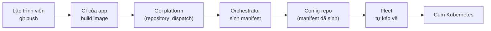

# IDP Orchestrator — Tài liệu dự án

> Môi trường sandbox chạy thật, dựng để kiểm chứng một Internal Developer Platform
> trước khi đụng vào hạ tầng công ty.
>
> Cập nhật: 31/07/2026

---

## 1. Dự án này là gì

Đây là một **Internal Developer Platform (IDP)** — hiểu đơn giản là một lớp trung gian
giữa lập trình viên và hạ tầng Kubernetes.

Vấn đề nó giải quyết: bình thường, để đưa một ứng dụng lên Kubernetes, lập trình viên phải
tự viết một đống file cấu hình hạ tầng (Deployment, Service, Ingress, Secret, PVC…). Mỗi
app một bộ, mỗi môi trường một bản khác. Kết quả là:

- Lập trình viên phải học Kubernetes dù việc chính của họ là viết nghiệp vụ.
- Mỗi team làm một kiểu, không đội nào giống đội nào.
- Muốn đổi một chuẩn chung (ví dụ: từ nay mọi app phải có resource limit) thì phải đi sửa
  hàng chục repo.

Với IDP này, lập trình viên **chỉ khai báo ứng dụng của mình CẦN GÌ**, không nói CÁCH LÀM.
Toàn bộ phần dịch "nhu cầu" thành cấu hình Kubernetes do platform lo.

### Ví dụ cụ thể

Đây là **toàn bộ** những gì một lập trình viên phải viết để có app chạy trên cụm:

```yaml
# score.yaml
apiVersion: score.dev/v1b1
metadata:
  name: helloworld
containers:
  web:
    image: .
service:
  ports:
    http: { port: 80, targetPort: 80 }
resources:
  route:                    # "tôi cần được truy cập từ ngoài"
    type: route
    params: { host: helloworld.example.com, port: 80, path: / }
```

Không có chữ "Deployment", "Service", "Ingress", "HTTPRoute" nào. Platform sinh ra hết.

Nếu app cần cơ sở dữ liệu, lập trình viên chỉ thêm:

```yaml
resources:
  db:
    type: postgres          # "tôi cần một Postgres"
```

Và platform tự lo: tạo StatefulSet, xin ổ đĩa, **sinh mật khẩu ngẫu nhiên**, đưa mật khẩu
vào cụm dưới dạng Secret, nối biến môi trường vào container. Lập trình viên không bao giờ
nhìn thấy mật khẩu đó, và nó **không bao giờ nằm trong Git**.

---

## 2. Cách hoạt động



Diễn giải từng bước:

| # | Bước | Ai làm | Chi tiết |
|---|---|---|---|
| 1 | Lập trình viên `git push` | Người | Chỉ sửa code và `score.yaml` |
| 2 | CI build image | GitHub Actions | Build Docker image, đẩy lên registry |
| 3 | CI "gọi" platform | GitHub Actions | Gửi một tín hiệu kèm tên app + mã commit |
| 4 | Orchestrator sinh manifest | Máy chủ nội bộ | Đọc `score.yaml`, áp chuẩn chung, sinh file cấu hình K8s |
| 5 | Ghi vào config repo | Orchestrator | Commit file đã sinh vào một repo riêng |
| 6 | Fleet kéo về | Fleet (trong cụm) | Cứ 15s kiểm tra config repo, thấy đổi thì apply |
| 7 | App chạy | Kubernetes | |

**Điểm quan trọng cho người đọc không chuyên:** bước 6 là *kéo* chứ không phải *đẩy*.
Cụm Kubernetes tự đi lấy cấu hình về, thay vì CI đẩy vào cụm. Nghĩa là **cụm không cần mở
cổng ra ngoài internet**, và trạng thái thật của cụm luôn khớp với những gì ghi trong Git.
Đây là mô hình gọi là **GitOps**.

---

## 3. Bản đồ hệ thống

### Ba loại repository

Dự án cố tình tách làm 3 loại repo, mỗi loại một chủ sở hữu rõ ràng:

| Loại | Ai sở hữu | Chứa gì | Ví dụ |
|---|---|---|---|
| **Platform** | Đội platform | Bộ não: script sinh manifest, chuẩn chung, thư viện resource | `idp-platform` |
| **App** | Đội sản phẩm | Code + `score.yaml` + Dockerfile | `idp-helloworld` |
| **Config** | Không ai sửa tay | Manifest do máy sinh ra | `idp-helloworld-config` |

Vì sao phải tách 3 chứ không gộp làm 1?

- **App tách khỏi Config**: lập trình viên không bao giờ phải nhìn file Kubernetes. Và khi
  máy ghi đè file cấu hình, không có nguy cơ đè lên code người viết.
- **Config tách khỏi Platform**: mỗi app có lịch sử triển khai riêng, xem được "hôm qua app
  này chạy phiên bản nào" chỉ bằng `git log`. Muốn rollback thì revert một commit.
- **Platform tách riêng**: đổi chuẩn chung một chỗ, áp cho mọi app.

### Các app đang chạy trong sandbox

| App | Mục đích kiểm chứng |
|---|---|
| `sample-nginx` | Luồng cơ bản; tên image **khác** tên app |
| `sample-pg` | App có cơ sở dữ liệu — kiểm mật khẩu và ổ đĩa có bền qua nhiều lần deploy không |
| `sample-boutique` | 11 service phụ thuộc lẫn nhau, dùng image dựng sẵn |
| `helloworld` | App tối giản; tên image **trùng** tên app |
| `boutique` | 11 service, **build thật từ Dockerfile**, 5 ngôn ngữ khác nhau |

---

## 4. Môi trường sandbox: thật ↔ thay thế

Toàn bộ được dựng trên một máy Ubuntu (WSL2), **không đụng gì tới hạ tầng công ty**:

| Thành phần thật | Thay bằng | Vì sao chấp nhận được |
|---|---|---|
| GitHub Enterprise | github.com tài khoản cá nhân | Cùng API, cùng cơ chế Actions |
| Harbor (registry ảnh) | GHCR (GitHub Container Registry) | Cùng chuẩn Docker Registry v2 |
| Cụm Kubernetes on-prem | `kind` (Kubernetes chạy trong Docker) | Cùng API Kubernetes |
| Ceph (ổ đĩa mạng) | `local-path` của kind | Cùng cơ chế PVC/StorageClass |
| Rancher | Không có, Fleet chạy chế độ đơn cụm | Fleet là thành phần thật, chỉ bỏ giao diện quản trị |

Hai cụm được dựng: `staging` và `prod`, để kiểm chứng cả luồng thăng cấp giữa hai môi trường.

---

## 5. Các quyết định kỹ thuật

### 5.1. Vì sao dùng Score làm giao diện cho lập trình viên

Score là một chuẩn mở để mô tả "ứng dụng cần gì" mà không gắn với nền tảng cụ thể. Cùng một
`score.yaml` có thể sinh ra Docker Compose (để chạy máy cá nhân) hoặc Kubernetes (để chạy
thật). Điều này giữ cho **giao diện với lập trình viên ổn định** kể cả khi hạ tầng bên dưới
thay đổi.

### 5.2. Orchestrator viết bằng Python, không phải Bash

Script sinh manifest (`orchestrate.py`) cố tình **không đọc biến môi trường của GitHub**.
Mọi thứ truyền vào qua tham số dòng lệnh.

Lý do: khi một lần triển khai lỗi, kỹ sư có thể copy đúng dòng lệnh đó từ log, chạy lại trên
máy chủ và xem chuyện gì xảy ra. Nếu script đọc biến ngầm từ GitHub thì không tái hiện được.

Bash bị loại vì nó nuốt lỗi quá dễ. Ví dụ đoạn bash cũ xử lý tạo secret dùng
`2>/dev/null || echo "đã tồn tại"` — kiểu viết này nuốt luôn cả lỗi sai mật khẩu, lỗi mất
kết nối cụm, lỗi gõ nhầm tên; báo triển khai thành công trong khi cụm không có gì.

### 5.3. Trạng thái để trong cụm, không để trong Git, không để trên máy chủ CI

Công cụ sinh manifest cần nhớ một số thứ giữa các lần chạy: định danh tài nguyên, và **mật
khẩu nó đã sinh ra**. Nếu quên, mỗi lần deploy sẽ đổi tên StatefulSet và **sinh mật khẩu
Postgres mới** — dẫn tới ổ đĩa cũ bị bỏ rơi và **mất toàn bộ dữ liệu**.

Ba lựa chọn, chọn cái thứ ba:

| Nơi lưu | Vì sao loại |
|---|---|
| Trong Git | Chứa mật khẩu dạng thô — không được phép |
| Trên đĩa máy chủ CI | Sai ngay khi có máy chủ thứ hai nhận việc |
| **Trong cụm, dạng Secret** | ✅ Đúng nơi, đúng quyền, mọi máy chủ CI đều đọc được |

### 5.4. Mật khẩu không bao giờ đi vào Git

Sau khi sinh manifest, orchestrator **tách đôi**:

- File loại `Secret` → áp thẳng vào cụm, không qua Git.
- Mọi thứ còn lại → commit vào config repo.

Manifest trong Git chỉ *tham chiếu* tới secret bằng tên. Ai đọc được config repo cũng không
thấy được mật khẩu.

Thêm một chi tiết: secret được tạo theo kiểu "chưa có thì tạo, có rồi thì để yên" — chứ không
phải ghi đè. Nghĩa là chạy lại một lần deploy **không bao giờ đổi mật khẩu của database đang
sống**.

### 5.5. `platform.lock` — ghim phiên bản chuẩn, nhưng chỉ ghim dữ liệu

Mỗi app giữ một file `platform.lock` trỏ tới một phiên bản của repo platform. Khi triển khai,
orchestrator lấy **thư viện resource và chuẩn chung tại đúng phiên bản app đã ghim**.

Nghĩa là đội platform sửa chuẩn trên nhánh chính **không làm ảnh hưởng app đang chạy**. App
nào muốn nâng thì tự sửa file lock qua một pull request — có review, có kiểm soát.

Điểm tinh tế: file lock ghim **dữ liệu** (thư viện resource, chuẩn chung), **không ghim code**
(script sinh manifest). Vì GitHub luôn chạy workflow từ nhánh chính, nếu ghim cả code thì
script sẽ lệch pha với tham số mà workflow truyền vào.

### 5.6. Staging tự động, production phải bấm nút

- Push lên nhánh chính → **chỉ** staging đổi.
- Production chỉ đổi khi có một yêu cầu thăng cấp tường minh.

Hai chế độ thăng cấp:

| Chế độ | Làm gì | Khi nào dùng |
|---|---|---|
| `from-staging` | Sao chép đúng tập ảnh staging đang chạy sang production | **Ứng dụng nhiều service** — xem mục 6.6 |
| `tag-only` | Đổi mọi ảnh sang cùng một nhãn | Ứng dụng một service |
| `re-render` | Sinh lại toàn bộ từ commit đó, theo đúng chuẩn commit đó ghim | Khi cần dựng lại chính xác lịch sử |

### 5.7. Fleet kéo, không đẩy

Cụm tự đi lấy cấu hình. Hệ quả thực tế: **cụm không cần mở cổng ra internet**, và CI không
cần giữ quyền ghi vào cụm — chỉ cần quyền ghi vào một repo Git.

---

## 6. Quá trình phát triển — những gì đã thay đổi

Phần này ghi lại các vấn đề gặp phải và cách xử lý. Đây là phần đáng đọc nhất, vì phần lớn
vấn đề **không nhìn ra được bằng cách đọc code**, chỉ lộ ra khi chạy thật.

### 6.1. Giai đoạn dựng môi trường

| Vấn đề | Biểu hiện | Xử lý |
|---|---|---|
| Giới hạn `inotify` của hệ điều hành | Cụm Kubernetes thứ 3 không khởi động được, tiến trình quản lý container chết trong vòng lặp | Nâng `fs.inotify.max_user_instances` từ 128 lên 1024 |
| **Sai lệch MTU mạng** | Mọi lần tải image từ internet đều treo rồi timeout | Đặt MTU của Docker về 1280 cho khớp mạng máy chủ |
| Thiếu công cụ test | Python 3.14 không có sẵn `pip`, lại bị khoá cài đặt | Cài `pytest` vào thư mục riêng, không đụng Python hệ thống |

Vụ MTU đáng nói: máy chủ (WSL2) có MTU 1280 trong khi Docker mặc định 1500. Gói tin lớn hơn
1280 bị rơi âm thầm. Triệu chứng rất dễ đánh lừa — **tra tên miền thì được** (gói nhỏ), nhưng
bắt tay mã hoá thì treo (gói lớn). Đây cũng là lý do một cụm thử nghiệm cũ trên máy có thành
phần ở trạng thái lỗi suốt 7 ngày mà không ai hiểu vì sao.

### 6.2. Tài liệu kế hoạch lệch với code thật

Kế hoạch ban đầu (`plan.md`) được viết theo trí nhớ nên lệch với code. Đã bám theo code:

| Kế hoạch ghi | Thực tế trong code |
|---|---|
| Tên secret `KUBECONFIG_ONPREM_*`, `HARBOR_*` | `KUBECONFIG_*`, `REGISTRY_*` |
| Nhãn máy chủ CI `idp-orchestrator` | `platform-orchestrator` |
| Namespace `platform-state` | `cluster-state` |
| Gateway API bản "standard" | Phải dùng bản "experimental" (xem 6.3) |

Ngoài ra `probe.yaml` là **file rỗng 0 byte**, không có gì tham chiếu tới — đã xoá sau khi
xác nhận với chủ dự án. Thư mục `examples/` mà bộ test cần cũng bị thiếu — đã viết lại 3 bộ
dữ liệu mẫu cho khớp yêu cầu của test.

### 6.3. Ba lần thử mới cấu hình đúng được Gateway

Đây là ví dụ điển hình của việc tài liệu nói một đằng, phần mềm cần một nẻo:

1. Cài Gateway API bản "standard" theo kế hoạch → Traefik không xử lý gì cả, đứng im ở
   trạng thái "chờ controller". Nguyên nhân: Traefik cần hai loại tài nguyên chỉ có trong
   bản "experimental".
2. Cài bản experimental v1.2.1 → vẫn lỗi. Traefik cần các tài nguyên đó ở phiên bản `v1`,
   mà v1.2.1 chỉ có `v1alpha2`. Phải nâng lên **v1.6.1**.
3. Cấu hình cổng 80 cho Gateway → báo "cổng không khả dụng". Traefik đối chiếu cổng theo
   **cổng bên trong container (8000)**, không phải cổng của Service.

Thêm một cái bẫy: bản Helm chart mới của Traefik đã đổi tên tham số cấu hình loại Service.
Tham số cũ **bị bỏ qua trong im lặng** — không báo lỗi, không cảnh báo, chỉ đơn giản là không
có tác dụng.

### 6.4. Lỗi trong chính code của dự án

Ba lỗi thật, đã sửa và đẩy lên:

**(a) Kiểm tra kết nối cụm trước khi có file cấu hình kết nối.**
Bước "kiểm tra sức khoẻ" chạy *trước* bước tạo file kubeconfig. Trên máy chủ CI mới tinh thì
lỗi ngay. Nguy hiểm hơn: trên máy chủ đã chạy vài lần, nó lặng lẽ dùng **file kubeconfig cũ
còn sót lại** — báo xanh trong khi đang kiểm tra nhầm cụm.

**(b) Mọi bundle của Fleet kẹt vĩnh viễn ở trạng thái "đã bị sửa đổi".**
Fleet triển khai qua Helm, mà Helm luôn tự đóng dấu nhãn `managed-by=Helm` lên mọi thứ nó
áp vào cụm. Trong khi manifest sinh ra mang nhãn `managed-by=score-k8s`. Lệch đúng một nhãn,
lệch mãi mãi.

Chỗ này **phải sửa hai lần**:
- Lần 1: khai báo cho Fleet bỏ qua nhãn đó khi so sánh. Chạy được cho app đơn giản.
- Lần 2: phát hiện cách trên **không tổng quát**. Tài nguyên do platform sinh ra (như Redis)
  có mã ngẫu nhiên trong tên (`redis-cart-d2eaf96b`) — không thể biết trước tên để khai báo.
  Sửa lại tận gốc: **bỏ hẳn nhãn đó khỏi manifest ngay lúc sinh**. Helm sẽ tự đóng dấu lại
  khi áp vào cụm, nên không mất gì. Kết quả: file cấu hình Fleet từ 138 dòng còn 5 dòng.

**(c) Một tham số bị khai báo sai chỗ trong cấu hình Fleet** — nếu thiếu tên và namespace thì
Fleet **bỏ qua trong im lặng**, không log, không lỗi.

> Điểm chung của cả ba: cơ chế bảo vệ *có tồn tại* nhưng *không được gọi đúng chỗ*, và khi
> sai thì hệ thống không kêu.

### 6.5. Kiểm tra khả năng chịu tải đồng thời

Đây là phần được yêu cầu riêng: "nếu hai người cùng push, nhiều commit liên tiếp thì sao?"

Tìm thấy **5 lỗ hổng**, trong đó 3 cái gây mất dữ liệu hoặc lùi phiên bản **âm thầm**:

| # | Vấn đề | Hậu quả nếu xảy ra |
|---|---|---|
| 1 | Kiểm tra thứ tự chỉ chạy **một lần**, trên bản sao lấy lúc bắt đầu | Người khác ghi xen vào → hệ thống tự động ghi đè bằng bản **cũ hơn** |
| 2 | Deploy và thăng cấp production dùng chung một hàng đợi | Một lệnh thăng cấp đang chờ bị **huỷ** bởi lần deploy kế tiếp |
| 3 | Thăng cấp production **hoàn toàn không có** kiểm tra thứ tự | Thăng cấp sai thứ tự đẩy production **lùi về phiên bản cũ**, không cảnh báo |
| 4 | Ghi trạng thái theo kiểu "ai ghi sau thắng" | Hai lần chạy chồng nhau → **mất mật khẩu Postgres** đã sinh |
| 5 | Commit mới nhất bị huỷ khi push liên tiếp | Môi trường **kẹt lại ở commit cũ**, không có gì báo lỗi |

**Lỗ hổng số 5 không đoán được bằng đọc code — chỉ lộ ra khi đo thật.** Số liệu thực tế: đẩy
4 commit liên tiếp lúc 05:36:31–05:36:52, kết quả là staging dừng ở commit áp chót trong khi
nhánh chính đã đi tiếp một bước. GitHub báo trạng thái "đã huỷ" — mà "đã huỷ" thì không ai
coi là lỗi, nên không có cảnh báo nào.

Đã sửa cả 5, và **mô phỏng lại từng cái để chứng minh đã chặn được**:

- Gửi commit cũ sau commit mới → hệ thống từ chối, ghi rõ lý do, cụm không đổi.
- Thăng cấp lùi phiên bản → bị từ chối, production giữ nguyên.
- Hai tiến trình cùng ghi trạng thái → cái ghi sau bị chặn, dữ liệu của cái trước còn nguyên.
- Đẩy 4 commit liên tiếp lần hai → gộp về commit mới nhất, triển khai đúng.

Một quan sát ngược đời từ mô phỏng: **4 người push đúng cùng một khoảnh khắc ít nguy hiểm
hơn 4 người push cách nhau vài giây.** Cùng lúc thì Git từ chối 3 người vì tranh khoá, người
thắng gộp cả 4 commit thành một lần triển khai. Cách nhau vài giây mới sinh ra 4 lần triển
khai riêng và kích hoạt cơ chế huỷ hàng đợi.

### 6.6. Một service đổi thì cả 11 service build lại và khởi động lại

Phát hiện khi rà soát: commit gần nhất của kho boutique **chỉ sửa file cấu hình CI**, không
đụng một dòng mã service nào. Kết quả đo được:

| Hiện tượng | Số đo |
|---|---|
| Số service build lại | **11/11** (~13 phút máy chủ) |
| Số ứng dụng khởi động lại | **11/11**, kể cả trên production |
| Số dòng thay đổi trong file cấu hình | 304 dòng — trong đó chỉ 22 dòng có ý nghĩa |

Nguyên nhân nằm ở một dòng: **nhãn phiên bản của ảnh (image tag) lấy theo mã commit của cả
kho**. Kho có commit mới → mọi service đổi nhãn → mọi file cấu hình đổi → Kubernetes coi như
mọi service đều đổi và khởi động lại tất cả.

Còn 304 dòng thay đổi là do **thứ tự các mục trong file không ổn định** giữa hai lần sinh —
lần này `currency` đứng đầu, lần sau `ad` đứng đầu. Không đọc nổi lần triển khai đã đổi gì.

Đã sửa ba chỗ:

**(a) Đánh nhãn theo nội dung từng service.** Git vốn đã lưu sẵn một mã băm cho mỗi thư mục,
và mã đó chỉ đổi khi nội dung bên trong thư mục đổi. Dùng nó làm nhãn:

```
                     commit này        commit trước (chỉ sửa CI)
frontend     0851cf67c90ec297...      0851cf67c90ec297...   ← giống nhau
cart         d6c7892ff616c912...      d6c7892ff616c912...   ← giống nhau
```

Nội dung không đổi → nhãn không đổi → **ảnh đã có sẵn nên khỏi build**, và **file cấu hình y
hệt nên ứng dụng không khởi động lại**.

**(b) Sắp xếp cố định** các mục trong file cấu hình, để đọc được lần triển khai đã đổi gì.

**(c) Thêm chế độ thăng cấp `from-staging`.** Khi mỗi service mang một nhãn riêng thì "đưa
production lên phiên bản X" không còn là một con số — nó là **một tập 11 nhãn**. Chế độ mới
sao chép đúng tập ảnh mà staging đang chạy sang production. Chế độ cũ vẫn giữ cho ứng dụng
một service.

Một chi tiết về cách triển khai đáng ghi lại: quy tắc đặt tên ảnh **chỉ được viết ở một chỗ**
(trong bộ não platform). CI của ứng dụng *hỏi* platform xem phải build ảnh tên gì, thay vì tự
tính lại. Nếu hai bên tự tính riêng rồi lệch nhau, hệ thống sẽ triển khai một cấu hình trỏ tới
ảnh chưa ai xây — và chỉ phát hiện được khi ứng dụng chết trên cụm.

### 6.7. Xây bản OnlineBoutique từ mã nguồn

Yêu cầu cuối: mỗi service một Dockerfile, một `score.yaml`, và **build thật** chứ không dùng
image dựng sẵn.

Thực tế gặp phải:

- Kho ví dụ chính thức của Score **chỉ có file `score.yaml`**, không có mã nguồn cũng không
  có Dockerfile. Mã nguồn nằm ở kho khác của Google. Đã đưa 6.1MB mã nguồn của 11 service
  vào kho app để nó tự chứa, build lại được kể cả khi kho gốc biến mất.
- Service `cartservice` có Dockerfile nằm sâu hơn một cấp so với các service khác.
- Kiểm thử 2 service ở máy cá nhân trước khi chạy CI: đều build được.
- **Lần chạy CI đầu tiên hỏng đúng 1 trong 11 service**: Docker Hub trả lỗi `502 Bad Gateway`
  khi tải image nền. Chính service đó vừa build sạch ở máy cá nhân vài phút trước → lỗi hạ
  tầng bên ngoài, không phải lỗi cấu hình.

  Hậu quả không nhẹ: bước triển khai phụ thuộc **tất cả** các bước build, nên một service
  hỏng là cả lần triển khai bị bỏ qua. Đây thực ra là **hành vi đúng** — không triển khai khi
  thiếu image — nhưng cho thấy cần cơ chế thử lại. Đã bổ sung: thử lại 3 lần, giãn 20 giây.

Kết quả cuối: 11 service viết bằng **5 ngôn ngữ khác nhau** (Go, C#/.NET, Java/Gradle,
Python, Node.js) build song song, đẩy lên registry, triển khai và chạy thật trên cả hai môi
trường.

---

### 6.8. Gom toàn bộ cấu hình môi trường về một file

Mục tiêu: mang platform sang môi trường khác chỉ cần **đưa file cấu hình**, không sửa code.

Trước khi làm, giá trị phụ thuộc hạ tầng nằm rải ở **5 file, 3 cú pháp khác nhau**:

| File | Cú pháp | Chứa gì |
|---|---|---|
| workflow của orchestrator | YAML | tổ chức git, tiền tố repo, registry, nhãn máy chủ CI |
| bộ sinh manifest | Python | namespace lưu trạng thái, tên secret, thư mục ghi nhận |
| thư viện resource | Go template | tên miền, tên Gateway, StorageClass, ảnh Postgres |
| chuẩn chung ×2 | Go template | tên pull secret, số bản sao, hạn mức tài nguyên |

Chuyển môi trường nghĩa là sửa 5 file bằng 3 cú pháp, và sai một chỗ thì hỏng im lặng.

**Sau khi làm: một file `platform.env.yaml`.** Thư viện resource và chuẩn chung dùng ô trống
dạng `%%khoá%%`; bộ sinh manifest điền giá trị vào một **bản sao** trong thư mục tạm trước
khi công cụ bên ngoài nhìn thấy — bản gốc không bị đụng, và khi lỗi thì file thật đã dùng
vẫn nằm đó để xem.

Ba quyết định đáng ghi lại:

**File này KHÔNG bị ghim phiên bản theo ứng dụng.** Ứng dụng ghim *thư viện resource* (cách
một thứ được hiện thực hoá). File này là *toạ độ hạ tầng đang chạy*. Nếu ghim nó, một ứng
dụng dùng thư viện cũ sẽ triển khai vào tên Gateway đã bị đổi từ lâu — mà lỗi đó không báo
gì cả.

**Ô trống sai tên là lỗi ngay, kèm danh sách khoá hợp lệ.** Không render thành chuỗi rỗng.
Mọi lỗi hạ tầng trong dự án này đều hỏng theo kiểu im lặng; cái này không được vào danh sách đó.

**Một ngoại lệ không thể đưa vào file:** nhãn chọn máy chủ CI. GitHub quyết định chạy trên
máy nào *trước khi* thực thi bước đầu tiên, nên không đọc được từ file. Nó lấy từ một biến
cấu hình của repo — vẫn là cấu hình chứ không phải code, nhưng là **chỗ thứ hai** phải sửa.

Kiểm chứng sau khi đổi: triển khai lại cùng một phiên bản cho ra `no manifest changes` —
không tạo commit thừa, tức kết quả sinh ra đã tất định.

### 6.9. Nhánh được bảo vệ: production phải qua duyệt

Công ty bật branch protection ở mọi nhánh, merge bắt buộc qua pull request, và quy tắc là
**production cần duyệt, staging thì không**. Orchestrator trước đó push thẳng, nên sẽ bị
chặn — đây là thay đổi code chứ không phải cấu hình.

Cách tổ chức đã chọn: **repo cấu hình dùng hai nhánh**, trùng đúng mô hình nhánh của
repo ứng dụng.

| Nhánh | Môi trường | Cách máy ghi vào |
|---|---|---|
| `dev` | staging | ghi thẳng, không cần duyệt |
| `main` | production | mở pull request, người đọc diff rồi merge |

Vì sao hai nhánh thay vì một nhánh hai thư mục: quy tắc "chỉ duyệt production" diễn đạt
được bằng branch protection thuần, không cần cấu hình quyền theo đường dẫn.

**Hai nhánh này KHÔNG bao giờ merge vào nhau.** Cấu hình hai môi trường khác nhau thật —
số bản sao, hạn mức, tên miền. Merge `dev` sang `main` sẽ kéo số bản sao của staging sang
production. Mỗi nhánh do máy sinh độc lập với giá trị đúng của môi trường đó.

**Máy cố ý KHÔNG tự merge pull request của chính nó.** Mục đích của việc duyệt là có người
đọc diff trước khi production đổi; máy tự merge là vô hiệu hoá điều đó. (GitHub cũng chặn
cứng việc tự duyệt pull request của chính mình — đã kiểm bằng thực nghiệm.)

Đã kiểm chứng đầy đủ trên một repo bật branch protection thật:

| Bước | Kết quả |
|---|---|
| Push thẳng vào nhánh production | **Bị GitHub từ chối** — "Changes must be made through a pull request" |
| Triển khai staging | ghi thẳng vào `dev`, **không** tạo pull request |
| Triển khai production | mở pull request, nhánh production **không nhúc nhích** |
| Sau khi người merge | Fleet nhặt đúng phiên bản mới và áp lên cụm production |

Bước cuối là thứ trước đó chưa ai kiểm bao giờ.

**Hai lỗi lộ ra khi chạy thật, không nhìn ra được bằng đọc code:**

- Lệnh đẩy code không ghi rõ nhánh đích thì phụ thuộc cấu hình theo dõi nhánh. Nhánh mới
  chưa thiết lập theo dõi sẽ báo lỗi, và vòng thử lại **hiểu nhầm** thành "có người đẩy
  trước" rồi đi hợp nhất — báo lỗi lạc đề hoàn toàn.
- Sau một lần đẩy hỏng, thay đổi nằm lại trên máy. Lần chạy lại không thấy gì mới nên
  **thoát sớm** và không đẩy phần còn sót — nghĩa là chạy lại một lần triển khai hỏng
  không sửa được gì.

### 6.10. Hai service ở hai kho mã khác nhau

Câu hỏi: backend một kho, frontend một kho — platform có chạy đúng không? **Không**, và
lỗi rất rõ:

```
resource 'service.default#frontend.backend': unknown workload
```

Cơ chế tham chiếu chéo sẵn có chỉ nhìn thấy các thành phần được sinh **trong cùng một
lần**. Hai kho là hai lần sinh tách biệt. Đây là giới hạn cố hữu chứ không phải lỗi: lúc
dựng cấu hình cho frontend, platform không biết backend tồn tại — và cũng không nên biết,
vì hai ứng dụng triển khai độc lập nhau.

Đã thêm loại phụ thuộc mới: **không tra cứu gì cả**, ráp thẳng địa chỉ nội bộ mà Kubernetes
vốn đã cấp cho mọi service, theo đúng quy ước đặt tên nằm trong file cấu hình môi trường.

```
staging → backend.backend-staging.svc.cluster.local:8080
prod    → backend.backend-prod.svc.cluster.local:8080
```

**Đánh đổi đã ghi rõ:** không có kiểm tra tồn tại. Gõ sai tên ứng dụng thì cấu hình vẫn
sinh ra bình thường, chỉ hỏng lúc chạy. Cách cũ bắt lỗi ngay nhưng chỉ dùng được trong
cùng một kho. Đó là cái giá của việc hai ứng dụng triển khai độc lập — không có cách nào
vừa độc lập vừa kiểm tra chéo được.

### 6.11. Bí mật của riêng ứng dụng

Platform vốn đã lo được bí mật do **nó** sinh ra: mật khẩu cơ sở dữ liệu không bao giờ vào
Git, chỉ có tham chiếu. Nhưng bí mật của **riêng ứng dụng** — khoá API bên thứ ba — thì
không có đường nào, nên cách duy nhất là viết thẳng vào file khai báo. Khi đó khoá đi vào
Git của ứng dụng **lẫn** vào kho cấu hình dưới dạng đọc được.

Đã thêm loại tài nguyên `secret`: lập trình viên chỉ khai **tên** và **khoá**, không khai
giá trị.

Kiểm chứng thật trên cụm, không chỉ trên giấy:

| Nơi | Nội dung |
|---|---|
| Bên trong container | `STRIPE_API_KEY=sk_live_...` — giá trị thật |
| Trong Git | `valueFrom.secretKeyRef {name, key}` — **chỉ có tham chiếu** |

**Cố ý không nói bí mật đó từ đâu ra.** Platform không bao giờ nhìn thấy giá trị; Secret do
bên sở hữu đưa vào. Nhờ vậy khi sau này thêm cổng tự khai báo bí mật, **file khai báo của
mọi ứng dụng không phải sửa dòng nào** — chỉ đổi cơ chế bơm giá trị.

### 6.12. Commit triển khai đang ghi công cho một người lạ

Phát hiện khi trả lời câu hỏi "máy dùng để làm gì". Địa chỉ thư dùng cho commit tự động
được gắn cứng theo định dạng mà GitHub dùng để **ánh xạ về một tài khoản**. Vì tài khoản
trùng tên đó tồn tại thật, mọi commit triển khai đang được ghi công cho một người dùng
không liên quan gì tới dự án — làm hỏng đúng thứ mà lịch sử kho cấu hình sinh ra để phục
vụ: truy vết ai triển khai cái gì.

Đã đưa danh tính vào file cấu hình, mặc định dùng địa chỉ không thể ánh xạ về tài khoản
nào, kèm một kiểm thử chặn hẳn việc dùng lại định dạng cũ.

### 6.13. Chuyển sang GitHub App

Trước đó **năm** chỗ dùng credential khác nhau — đọc kho ứng dụng, ghi kho cấu hình, gọi
platform từ CI, đẩy ảnh, và Fleet đọc kho cấu hình — **đều là cùng một token cá nhân** có
quyền quản trị tổ chức và xoá kho mã. Nghĩa là token cho phép CI của một ứng dụng gọi sang
platform cũng xoá được mọi kho mã trong tài khoản.

Đã thay bằng một GitHub App với **đúng ba quyền**: đọc/ghi nội dung, đọc/ghi pull request,
đọc metadata. Token được cấp mới cho từng lần chạy và tự hết hạn sau một giờ.

**Lý do quan trọng nhất không phải bảo mật, mà là cổng duyệt production tự khoá.** GitHub
chặn cứng việc tự duyệt pull request của chính mình. Khi pull request triển khai do token
của một người tạo ra, và người đó cũng là người duyệt, thì **không ai duyệt được**. Đã kiểm
cả hai chiều:

| Ai tạo pull request | Người duyệt | Kết quả |
|---|---|---|
| Token cá nhân | chính người đó | **Bị từ chối** — "Can not approve your own pull request" |
| GitHub App | người đó | **Duyệt được**, merge được, Fleet áp lên cụm |

Nhân đó phát hiện một lỗ hổng lặng lẽ: bước tạo pull request **không** truyền thông tin
xác thực, nên nó âm thầm dùng phiên đăng nhập sẵn có trên máy chủ CI — tức tài khoản
người. Pull request triển khai mang tên người thay vì máy, và chính điều đó làm cổng duyệt
tự khoá. Nay truyền tường minh.

**Ba loại credential, không phải một** — App không thay thế được tất cả:

| Việc | Dùng gì |
|---|---|
| Đọc/ghi kho mã, mở pull request | GitHub App |
| Fleet đọc kho cấu hình | **Khoá triển khai chỉ-đọc** — token App hết hạn sau một giờ mà Fleet kiểm tra 15 giây một lần và không tự làm mới được |
| Đẩy/kéo ảnh | Tài khoản máy của kho ảnh |

## 7. Đã kiểm chứng những gì

### Bộ test tự động
**54/54 test đạt.** Bao gồm các tình huống đua (6.5), đánh nhãn theo nội dung (6.6), luồng
pull request cho production (6.9), phụ thuộc xuyên kho mã (6.10) và bí mật của ứng dụng (6.11).

### Kiểm chứng chạy thật

| Hạng mục | Kết quả |
|---|---|
| Triển khai từ đầu đến cuối | Push code → app chạy trên cụm, không thao tác tay |
| App có cơ sở dữ liệu | Ổ đĩa được cấp, database chạy |
| **Dữ liệu bền qua nhiều lần deploy** | Deploy lần 2: mật khẩu **không đổi**, ổ đĩa **giữ nguyên**, chỉ image lên phiên bản mới |
| Thăng cấp production | Production đổi phiên bản, staging không bị ảnh hưởng |
| Cách ly hai môi trường | Push vào nhánh chính chỉ đổi staging, production đứng yên |
| App nhiều service | 11 service, tham chiếu chéo nhau đều đúng địa chỉ |
| Luồng nghiệp vụ thật | Vào trang, xem sản phẩm, thêm giỏ hàng, tính tiền — có dùng Redis thật |
| Các tình huống đua | 4 kịch bản mô phỏng, đều bị chặn đúng như thiết kế |
| Nhánh được bảo vệ | Push thẳng bị GitHub từ chối; production đi qua pull request; sau khi merge Fleet áp lên cụm |
| Bí mật của ứng dụng | Giá trị thật vào được container, trong Git chỉ có tham chiếu |
| Phụ thuộc xuyên kho mã | Địa chỉ tự đổi theo môi trường, không cần hai ứng dụng biết nhau |

### Quy mô hiện tại

- **2 cụm** Kubernetes (staging, prod)
- **5 ứng dụng**, **12/12** bundle ở trạng thái khoẻ mạnh
- **134 pod** đang chạy (42 staging + 92 prod)

---

## 8. Giới hạn hiện tại

Những điểm cần biết trước khi đưa lên môi trường thật:

| Vấn đề | Ảnh hưởng | Ghi chú |
|---|---|---|
| ~~Tên miền production mang chữ "staging"~~ | ~~Sai tên miền trên production~~ | ✅ **Đã sửa ở mục 6.8** — tên miền lấy theo môi trường từ file cấu hình. Kiểm chứng: staging ra `*.staging.internal.dev`, prod ra `*.prod.internal.dev` |
| Hai ứng dụng cùng có workload tên `frontend` sẽ trùng tên miền | Cổng vào chỉ trỏ được tới một trong hai | Tên miền suy ra từ tên workload, chưa tính tên ứng dụng. Cần đổi quy tắc thành `<app>-<workload>` hoặc để ứng dụng tự khai |
| Hàng đợi triển khai vẫn có thể bỏ sót | Đã giảm mạnh và **đã có cảnh báo**, nhưng chưa loại trừ tuyệt đối | Cảnh báo hiện ra ở phần tóm tắt của lần chạy |
| Commit trung gian không có image | Do gộp các lần push liên tiếp | Muốn thăng cấp đúng commit đó phải build lại |
| **Không kiểm tra quyền sở hữu ứng dụng** | Tên ứng dụng và kho mã do bên gọi **tự khai**, không có bước xác thực nào. Bất kỳ ai gọi được vào platform đều có thể triển khai thay ứng dụng của đội khác | **Đã cân nhắc và tạm chấp nhận**: sandbox một người dùng, chưa có nhiều đội. Phải xử lý trước khi nhiều đội dùng chung |
| Sandbox chưa có phân quyền | Mọi thứ dùng chung một token toàn quyền | Môi trường thật cần tách quyền theo từng repo |
| Một kho cấu hình đang để công khai | `helloworld-config` được chuyển sang công khai để bật branch protection (bản miễn phí chỉ hỗ trợ kho công khai) | Đã soát toàn bộ lịch sử trước khi chuyển: **0 bí mật**, không có Secret nào. Kho mã ứng dụng vẫn riêng tư |

---

## 9. Phụ lục

### Danh sách repository

| Repo | Vai trò |
|---|---|
| `idp-platform` | Bộ não của platform |
| `idp-helloworld` + `-config` | App nginx tối giản |
| `idp-sample-nginx` + `-config` | App cơ bản, tên image khác tên app |
| `idp-sample-pg` + `-config` | App có Postgres |
| `idp-sample-boutique` + `-config` | 11 service, image dựng sẵn |
| `idp-boutique` + `-config` | 11 service, build từ mã nguồn |

### Đường dẫn thử

| Môi trường | Đường dẫn |
|---|---|
| helloworld — staging | http://helloworld.127.0.0.1.nip.io:18080 |
| helloworld — prod | http://helloworld.127.0.0.1.nip.io:19080 |
| OnlineBoutique — staging | http://boutique.127.0.0.1.nip.io:18080 |
| OnlineBoutique — prod | http://boutique.127.0.0.1.nip.io:19080 |

> `nip.io` là dịch vụ DNS công cộng trả về đúng địa chỉ IP nằm trong tên miền, nên
> `boutique.127.0.0.1.nip.io` luôn trỏ về máy của bạn. Nhờ vậy mở bằng trình duyệt được ngay
> mà không phải sửa file `hosts`.

### Lệnh hay dùng

```bash
# Chạy bộ test
cd idp && PYTHONPATH=<đường-dẫn-pytest> python3 -m pytest test_orchestrate.py -q

# Xem tình trạng các app trên cụm
kubectl --kubeconfig <file> get bundle -n fleet-local

# Xem app đang chạy phiên bản nào
kubectl --kubeconfig <file> get deploy <app> -n <app>-staging \
  -o jsonpath='{.spec.template.spec.containers[0].image}'

# Thăng cấp lên production
gh api -X POST /repos/<org>/idp-platform/dispatches --input promote.json
```

### Thay đổi ở mức hệ điều hành

Hai thay đổi đã thực hiện trên máy chủ, đều tồn tại qua khởi động lại:

| File | Nội dung | Vì sao |
|---|---|---|
| `/etc/sysctl.d/99-kind-inotify.conf` | `fs.inotify.max_user_instances = 1024` | Mặc định 128 không đủ cho 3 cụm |
| `/etc/docker/daemon.json` | `{"mtu": 1280}` | Khớp MTU của mạng máy chủ, nếu không thì mọi lần tải image đều treo |
